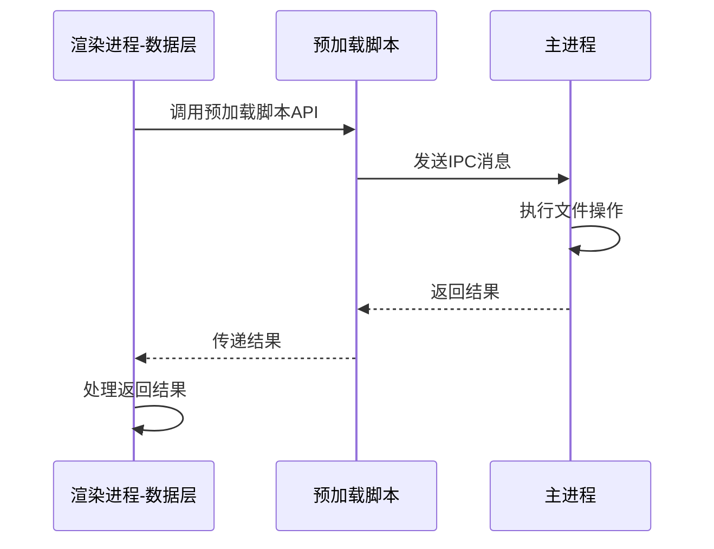

# Trae Image Marker 技术设计文档

## 1. 项目概述

### 1.1 项目背景

Trae Image Marker 是一个基于 Electron 的跨平台桌面应用程序，专为建模师设计的图片标注和比例测量工具。

### 1.2 项目目标

- 为建模师提供直观、高效的图片标注和比例测量界面
- 支持多种标注类型，满足建模师测量参考图比例关系的需求
- 实现标注数据的持久化存储，方便建模师保存和复用测量数据
- 支持跨平台运行（Windows、macOS、Linux）
- 提供良好的用户体验和操作便捷性，提高建模师的工作效率

### 1.3 目标用户

主要用户群体为建模师，包括角色建模师、场景建模师、道具建模师和动画建模师。

## 2. 产品需求

本技术设计文档是对 [需求文档](./需求.md) 的详细技术实现说明。需求文档详细描述了 Trae Image Marker 应用的功能需求、非功能需求和用户界面需求，包括：

- **项目概述**：应用背景、目标和用户群体
- **术语定义**：图片、标注（水平线段、垂直线段、量角器等）、标记文件
- **功能需求**：图片管理、标注功能、编辑功能、文件管理、视图功能
- **非功能需求**：性能、可用性、可靠性、可维护性、可扩展性
- **用户界面需求**：采用 VSCode Dark+ 主题风格的界面设计

本技术设计文档将基于上述需求，详细说明技术实现方案。

## 3. 整体设计

### 3.1 整体架构

采用 Electron 多进程架构，分为主进程、预加载脚本和渲染进程。

### 3.2 渲染进程分层

- 表现层：使用Ant Design和自制react组件开发用户界面，使用PixiJS绘制图片和标注
- 业务逻辑层：使用react redux管理状态，处理标注数据创建、编辑、删除、缩放、旋转、撤销、重做等业务逻辑逻辑
- 数据层：与electron通信，完成文件读写、标记文件序列化/反序列化、图片加载等任务

### 3.3 设计原则

1. **单一职责原则**：每个服务只负责一类数据操作
2. **接口隔离原则**：提供最小化的接口，避免不必要的依赖
3. **依赖倒置原则**：依赖抽象接口而非具体实现
4. **开闭原则**：对扩展开放，对修改关闭
5. **里氏替换原则**：子类可以替换父类而不影响程序正确性

## 4. 技术选型

| 技术           | 版本   | 用途               | 技术分层   |
| -------------- | ------ | ------------------ | ---------- |
| Electron       | 40.4.1 | 跨平台桌面应用框架 | 基础设施   |
| Electron Forge | 7.11.1 | 应用构建和打包工具 | 构建工具   |
| React          | 19.2.4 | 用户界面库         | 表现层     |
| React DOM      | 19.2.4 | React DOM 渲染器   | 表现层     |
| React Redux    | 9.2.0  | 状态管理           | 业务逻辑层 |
| Ant Design     | 6.3.0  | UI 组件库          | 表现层     |
| PixiJS         | 8.16.0 | 2D WebGL 渲染引擎  | 表现层     |
| TypeScript     | 5.9.3  | 开发语言           | 开发语言   |
| Vite           | 5.4.21 | 构建工具           | 构建工具   |

## 5. 技术约定

- 所有组件使用 Class 组件开发，不使用hooks

## 6. 详细设计

### 6.1 表现层设计

#### 6.1.1 组件结构概览

根据需求文档，Trae Image Marker 应用采用上中下三部分垂直布局，表现层组件结构如下：

```
App
├── ThemeProvider (主题提供者)
│   ├── StoreProvider (状态管理提供者)
│   │   ├── MenuBar (顶部菜单栏)
│   │   ├── TabsBar (标签页栏)
│   │   │   └── WorkSpace (工作区)
│   │   │       ├── Toolbar (工具栏)
│   │   │       │   ├── AnnotationTools (标注工具)
│   │   │       │   ├── ImageTools (图片操作工具)
│   │   │       │   └── AuxiliaryTools (辅助线工具)
│   │   │       └── PixiCanvas (画布区域)
│   │   │           ├── ImageContainer (图片容器)
│   │   │           └── Annotations (标注层)
│   │   └── Footer (底部状态栏)
```

#### 6.1.2 详细组件设计

##### 6.1.2.1 ThemeProvider 组件

**功能**：用于定制 Ant Design 主题，确保整个应用使用一致的类似【VSCode Dark+】主题样式。

**主题配置**：

```typescript
const theme: ThemeConfig = {
  algorithm: theme.darkAlgorithm,
  token: {
    colorPrimary: '#007acc',
    colorBgContainer: '#1e1e1e',
    colorBgElevated: '#252526',
    colorBgTextHover: '#2a2d2e',
    colorBorder: '#454545',
    colorText: '#cccccc',
    colorTextSecondary: '#969696',
    colorTextTertiary: '#ffffff',
    colorWarning: '#cca700',
    colorError: '#f14c4c',
    colorSuccess: '#4ec9b0',
  },
};

export default theme;
```

##### 6.1.2.2 StoreProvider 组件

**功能**：提供应用的状态管理，使用 Redux 或其他状态管理库管理全局状态。详细设计见：[6.2](#62-业务逻辑层设计)。

##### 6.1.2.3 MenuBar 组件

**功能**：提供应用的顶部菜单，包含文件、编辑、标注、图片和帮助等菜单选项。

**菜单项与逻辑层 Action 对应关系**：

| 菜单 | 菜单项       | 逻辑层 Action                            | 所属模块     |
| ---- | ------------ | ---------------------------------------- | ------------ |
| 文件 | 新建         | `newMarkerFile()`                        | 文件模块     |
| 文件 | 打开         | `openMarkerFile()`                       | 文件模块     |
| 文件 | 保存         | `saveMarkerFile()`                       | 文件模块     |
| 文件 | 另存为       | `saveMarkerFileAs()`                     | 文件模块     |
| 文件 | 添加图片     | `addImageToFile()`                       | 文件模块     |
| 文件 | 删除图片     | `removeImageFromFile(imageId)`           | 文件模块     |
| 文件 | 导出为PNG    | `exportImageFromFile(imageId)`           | 文件模块     |
| 编辑 | 撤销         | `undo(imageId)`                          | 历史记录模块 |
| 编辑 | 重做         | `redo(imageId)`                          | 历史记录模块 |
| 编辑 | 清除所有标注 | `clearAllAnnotations(imageId)`           | 标注模块     |
| 编辑 | 删除选中标注 | `deleteSelectedAnnotations(imageId)`     | 标注模块     |
| 标注 | 水平线段     | `setActiveTool('horizontal-line')`       | 工具模块     |
| 标注 | 垂直线段     | `setActiveTool('vertical-line')`         | 工具模块     |
| 标注 | 普通量角器   | `setActiveTool('normal-protractor')`     | 工具模块     |
| 标注 | 水平量角器   | `setActiveTool('horizontal-protractor')` | 工具模块     |
| 标注 | 垂直量角器   | `setActiveTool('vertical-protractor')`   | 工具模块     |
| 图片 | 放大         | `zoomIn(imageId)`                        | 画布模块     |
| 图片 | 缩小         | `zoomOut(imageId)`                       | 画布模块     |
| 图片 | 适应窗口     | `fitWindow(imageId)`                     | 画布模块     |
| 图片 | 实际大小     | `actualSize(imageId)`                    | 画布模块     |
| 图片 | 旋转         | `setRotation(imageId, angle)`            | 画布模块     |

##### 6.1.2.4 TabsBar 组件

**功能**：显示标记文件内的所有图片标签，支持标签切换和删除。

**结构**：

- 标签列表：每个标签对应一张图片
- 标签操作：切换标签、删除标签
- WorkSpace：当前激活标签页对应的工作区

##### 6.1.2.5 WorkSpace 组件

**功能**：作为工作区容器，包含工具栏和画布区域，管理当前标签页的编辑区域。

**结构**：

- Toolbar：工具栏
- PixiCanvas：画布区域

##### 6.1.2.6 Toolbar 组件

**功能**：提供常用工具的快速访问，包括标注工具、图片操作工具和辅助线工具。

**结构**：

- AnnotationTools：标注类型创建工具
  - 水平线段
  - 垂直线段
  - 普通量角器
  - 水平量角器
  - 垂直量角器
- ImageTools：图片操作工具
  - 旋转
  - 重置旋转
  - 放大
  - 缩小
  - 适应窗口
  - 实际大小
- AuxiliaryTools：辅助线工具
  - 显示/隐藏辅助线

##### 6.1.2.7 PixiCanvas 组件

**功能**：显示图像和标注，提供标注编辑和图片操作功能。

**结构**：

- ImageContainer：图片容器，处理图片的显示、缩放和旋转
- Annotations：标注层，显示和编辑各种类型的标注

##### 6.1.2.8 AnnotationTools 组件

**功能**：提供各种标注类型的创建工具。

**结构**：

- 水平线段工具
- 垂直线段工具
- 普通量角器工具
- 水平量角器工具
- 垂直量角器工具

##### 6.1.2.9 ImageTools 组件

**功能**：提供图片操作工具，包括旋转、缩放等。

**结构**：

- 旋转工具
- 重置旋转工具
- 放大工具
- 缩小工具
- 适应窗口工具
- 实际大小工具

##### 6.1.2.10 AuxiliaryTools 组件

**功能**：提供辅助线工具，用于显示标注间的距离。

**结构**：

- 显示/隐藏辅助线开关

##### 6.1.2.11 ImageContainer 组件

**功能**：处理图片的显示、缩放和旋转。

**结构**：

- 图片显示区域
- 缩放控制
- 旋转控制

##### 6.1.2.12 Annotations 组件

**功能**：显示和编辑各种类型的标注。

**结构**：

- 水平线段标注
- 垂直线段标注
- 普通量角器标注
- 水平量角器标注
- 垂直量角器标注
- 标注编辑功能（选择、移动、调整、删除）

##### 6.1.2.13 Footer 组件

**功能**：显示应用的状态信息，包括标注文件名、当前图片缩放比率、旋转角度和原始尺寸。

**结构**：

- 标注文件名显示
- 图片缩放比率显示
- 图片旋转角度显示
- 图片原始尺寸显示

#### 6.1.3 组件交互流程

##### 6.1.3.1 标注创建流程

1. 用户从顶部菜单或悬浮工具栏选择标注类型
2. 系统进入标注创建模式
3. 用户在画布上点击确定起点
4. 用户移动鼠标确定终点
5. 用户再次点击完成标注创建
6. 系统将标注添加到标注层

##### 6.1.3.2 标注编辑流程

1. 用户点击标注进行选择
2. 系统显示标注的选中状态和控制点
3. 用户拖拽标注整体移动或拖拽控制点调整标注
4. 用户按 Delete 键或通过右键菜单删除标注

##### 6.1.3.3 图片操作流程

1. 用户从顶部菜单或悬浮工具栏选择图片操作
2. 系统执行相应的图片操作（缩放、旋转等）
3. 系统更新图片显示和底部状态栏信息

##### 6.1.3.4 文件操作流程

1. 用户从顶部菜单选择文件操作
2. 系统弹出相应的对话框（如打开文件对话框）
3. 用户完成操作后，系统执行相应的文件操作
4. 系统更新应用状态和界面显示

#### 6.1.4 组件状态管理

##### 6.1.4.1 StoreProvider 状态管理

**全局状态**：

- 当前打开的标记文件路径
- 当前激活的标签页
- 所有标签页的图片和标注数据
- 撤销/重做历史
- 应用配置信息

**状态管理方案**：

- 使用 Redux 或 Zustand 管理全局状态
- 定义清晰的 action 和 reducer
- 支持状态持久化到本地存储

##### 6.1.4.2 组件局部状态

**画布状态**：

- 当前图片的缩放比率
- 当前图片的旋转角度
- 当前选中的标注
- 当前正在创建的标注
- 辅助线显示状态

**标注状态**：

- 标注的几何信息（坐标、尺寸、角度等）
- 标注的样式（颜色、线宽、字体等）
- 标注的选中状态

#### 6.1.5 组件实现要点

##### 6.1.5.1 性能优化

- 使用 React.memo 优化组件渲染
- 使用 useCallback 和 useMemo 优化函数和计算值
- 标注渲染使用 Canvas API 提高性能
- 图片缩放和旋转使用 CSS transform 提高性能

##### 6.1.5.2 可扩展性

- 组件设计遵循模块化原则，便于添加新功能
- 标注类型设计为可扩展的，便于添加新的标注类型
- 工具类设计为可扩展的，便于添加新的工具

##### 6.1.5.3 用户体验

- 提供直观的工具提示
- 支持键盘快捷键
- 提供流畅的动画效果
- 确保操作响应迅速

### 6.2 业务逻辑层设计

#### 6.2.1 整体架构

业务逻辑层采用 React Redux 进行状态管理，实现状态的集中化管理和可预测性。整体架构分为以下几个核心模块：

```
src/store/
├── index.ts                    # Store 配置中心
├── middleware/                 # 中间件
│   └── historyMiddleware.ts    # 历史记录中间件
├── actions/                    # Action 定义
├── reducers/                   # Reducer 定义
├── selectors/                  # 选择器
├── types/                      # 类型定义
├── slices/                     # Redux Toolkit 切片
│   ├── toolSlice.ts            # 工具模块
│   ├── imageSlice.ts           # 图片管理模块
│   ├── annotationSlice.ts      # 标注模块
│   ├── historySlice.ts         # 历史记录模块
│   └── canvasSlice.ts          # 画布模块
└── serializers/                # 序列化器
    ├── markerFileSerializer.ts # 标记文件序列化器
    └── annotationSerializer.ts # 标注序列化器
```

#### 6.2.2 核心模块设计

##### 6.2.2.1 工具模块 (Tool Module)

**职责**：管理当前激活的工具类型，支持工具切换和重置。

**核心功能**：

- 保存当前激活的工具类型
- 提供工具切换的 Action
- 支持工具状态的查询
- 管理工具的状态和生命周期

**支持的工具类型**：

- 无工具 (none)
- 水平线段 (horizontal-line)
- 垂直线段 (vertical-line)
- 普通量角器 (normal-protractor)
- 水平量角器 (horizontal-protractor)
- 垂直量角器 (vertical-protractor)

**工具状态管理流程**：

1. 用户选择工具类型
2. 组件 dispatch setActiveTool Action
3. Redux 更新当前激活的工具类型
4. 工具状态变化触发 UI 更新
5. 用户使用工具进行标注操作
6. 操作完成后自动重置工具状态

**主要 Action**：

- `setActiveTool(toolType)`: 设置当前激活的工具
- `resetTool()`: 重置工具为无工具状态
- `getActiveTool()`: 获取当前激活的工具类型
- `isToolActive(toolType)`: 检查指定工具是否激活

##### 6.2.2.2 图片管理模块 (Image Module)

**职责**：管理多张图片的信息，支持图片的添加、切换和删除。

**核心功能**：

- 管理图片列表
- 管理当前激活的图片
- 支持图片的添加、删除和切换
- 保存图片的基本信息（路径、名称等）

**图片数据结构**：

- `id`: 图片唯一标识符
- `name`: 图片文件名
- `path`: 图片文件路径
- `width`: 图片宽度
- `height`: 图片高度
- `createdAt`: 创建时间

**主要 Action**：

- `addImage(image)`: 添加新图片
- `removeImage(imageId)`: 删除图片
- `setActiveImage(imageId)`: 设置当前激活的图片
- `updateImage(imageId, updates)`: 更新图片信息

##### 6.2.2.3 标注模块 (Annotation Module)

**职责**：管理所有图片的标注数据和选中状态，支持多种标注类型的创建、编辑、删除操作。

**核心功能**：

- 按图片 ID 组织标注数据
- 支持多种标注类型的创建
- 管理标注的选中状态
- 支持标注的编辑和删除
- 提供标注数据的查询
- 支持辅助线功能，显示标注间距离

**辅助线功能**：

- 标注距离显示：选中标注后，鼠标悬停在其他同类标注上时，显示两者的距离
- 支持同时显示所有同类标注间的距离

**标注类型**：

1. **水平线段**：标记水平位置，测量垂直比例
2. **垂直线段**：标记垂直位置，测量水平比例
3. **普通量角器**：测量任意角度
4. **水平量角器**：测量相对于水平线的角度
5. **垂直量角器**：测量相对于垂直线的角度

**标注数据结构**：

- 以图片 ID 为键，存储该图片的所有标注
- 每个标注包含：
  - `id`: 唯一标识符
  - `type`: 标注类型
  - 几何信息（坐标、角度等）
  - `createdAt`: 创建时间
  - `updatedAt`: 更新时间

**具体标注类型数据结构**：

- **水平线段**：
  - `startX`: 起点 X 坐标
  - `startY`: 起点 Y 坐标
  - `endX`: 终点 X 坐标
  - `endY`: 终点 Y 坐标（与 startY 相同）

- **垂直线段**：
  - `startX`: 起点 X 坐标
  - `startY`: 起点 Y 坐标
  - `endX`: 终点 X 坐标（与 startX 相同）
  - `endY`: 终点 Y 坐标

- **普通量角器**：
  - `vertexX`: 顶点 X 坐标
  - `vertexY`: 顶点 Y 坐标
  - `startX`: 第一条边终点 X 坐标
  - `startY`: 第一条边终点 Y 坐标
  - `endX`: 第二条边终点 X 坐标
  - `endY`: 第二条边终点 Y 坐标
  - `angle`: 测量角度

- **水平量角器**：
  - `vertexX`: 顶点 X 坐标
  - `vertexY`: 顶点 Y 坐标
  - `startX`: 第一条边终点 X 坐标（水平方向）
  - `startY`: 第一条边终点 Y 坐标（与 vertexY 相同）
  - `endX`: 第二条边终点 X 坐标
  - `endY`: 第二条边终点 Y 坐标
  - `angle`: 测量角度

- **垂直量角器**：
  - `vertexX`: 顶点 X 坐标
  - `vertexY`: 顶点 Y 坐标
  - `startX`: 第一条边终点 X 坐标（与 vertexX 相同）
  - `startY`: 第一条边终点 Y 坐标（垂直方向）
  - `endX`: 第二条边终点 X 坐标
  - `endY`: 第二条边终点 Y 坐标
  - `angle`: 测量角度

**主要 Action**：

- `addHorizontalLine(imageId, ...)`: 为指定图片添加水平线段
- `addVerticalLine(imageId, ...)`: 为指定图片添加垂直线段
- `addNormalProtractor(imageId, ...)`: 为指定图片添加普通量角器
- `addHorizontalProtractor(imageId, ...)`: 为指定图片添加水平量角器
- `addVerticalProtractor(imageId, ...)`: 为指定图片添加垂直量角器
- `selectAnnotation(imageId, id)`: 选中标注
- `deselectAnnotation(imageId, id)`: 取消选中标注
- `deleteSelectedAnnotations(imageId)`: 删除选中标注
- `updateAnnotation(imageId, id, updates)`: 更新标注
- `clearAllAnnotations(imageId)`: 清除指定图片的所有标注

**标注编辑流程**：

- **选择标注**：
  - 点击标注进行选择
  - 显示选中状态（高亮、控制点）
- **移动标注**：
  - 拖拽标注整体移动
- **调整标注**：
  - 拖拽控制点调整标注尺寸或角度
- **删除标注**：
  - 选中标注后按 Delete 键删除
  - 右键菜单删除标注

**标注创建流程**：

- **水平线段标注**：
  - 点击画布确定起点
  - 移动鼠标确定终点
  - 再次点击完成标注
- **垂直线段标注**：
  - 点击画布确定起点
  - 移动鼠标确定终点
  - 再次点击完成标注
- **普通量角器标注**：
  - 点击画布确定顶点1
  - 移动鼠标（可自由移动），实时绘制边1（顶点1为起点，鼠标为终点），然后点击确定顶点2
  - 移动鼠标（可自由移动），实时绘制边2（顶点2为起点，鼠标为终点），最后点击鼠标，确定顶点3，创建结束
- **水平量角器标注**：
  - 点击画布确定顶点1
  - 移动鼠标（只能水平移动），实时绘制边1（顶点1为起点，鼠标为终点），然后点击确定顶点2
  - 移动鼠标（可自由移动），实时绘制边2（顶点2为起点，鼠标为终点），最后点击鼠标，确定顶点3，创建结束
- **垂直量角器标注**：
  - 点击画布确定顶点1
  - 移动鼠标（只能垂直移动），实时绘制边1（顶点1为起点，鼠标为终点），然后点击确定顶点2
  - 移动鼠标（可自由移动），实时绘制边2（顶点2为起点，鼠标为终点），最后点击鼠标，确定顶点3，创建结束

##### 6.2.2.4 历史记录模块 (History Module)

**职责**：实现撤销/重做功能，管理操作历史记录，支持多图片的历史管理。

**核心功能**：

- 按图片 ID 组织历史记录
- 记录标注操作的历史
- 支持撤销上一步操作
- 支持重做已撤销的操作
- 管理历史记录的大小限制（最多保存20次操作）

**设计原理**：

- 为每张图片维护独立的历史栈
- 使用两个栈（past 和 future）实现撤销/重做
- past 栈：保存已执行的操作，支持撤销
- future 栈：保存已撤销的操作，支持重做
- 每个历史条目是某时刻的状态快照

**主要 Action**：

- `undo(imageId)`: 撤销指定图片的上一步操作
- `redo(imageId)`: 重做指定图片的上一步撤销操作
- `canUndo(imageId)`: 检查指定图片是否可以撤销
- `canRedo(imageId)`: 检查指定图片是否可以重做
- `clearHistory(imageId)`: 清除指定图片的历史记录

##### 6.2.2.5 画布模块 (Canvas Module)

**职责**：管理画布的视图状态，包括缩放、旋转等，支持多图片的视图状态管理。

**核心功能**：

- 按图片 ID 组织画布状态
- 管理画布的缩放比例（范围：10% - 800%）
- 管理画布的旋转角度（范围：-180° - 180°）
- 提供缩放控制 Action

**画布状态数据结构**：

- 以图片 ID 为键，存储该图片的画布状态
- 每个画布状态包含：
  - `zoom`: 缩放比例
  - `rotation`: 旋转角度
  - `panX`: 平移 X 坐标
  - `panY`: 平移 Y 坐标

**主要 Action**：

- `zoomIn(imageId)`: 放大指定图片的画布
- `zoomOut(imageId)`: 缩小指定图片的画布
- `fitWindow(imageId)`: 使指定图片适应窗口
- `actualSize(imageId)`: 显示指定图片的实际大小
- `setRotation(imageId, angle)`: 设置指定图片的旋转角度
- `setPan(imageId, panX, panY)`: 设置指定图片的平移位置
- `exportImage(imageId)`: 导出指定图片及其标注为PNG格式

**导出图片功能**：

- 将当前标签页的图片和标注导出为PNG格式
- 导出时将原始图片和所有标注合并到一张PNG图片中
- 导出尺寸取标注和图片两者间的最大值
- 标注超出图片时，背景为透明

##### 6.2.2.6 样式模块 (Style Module)

**职责**：管理标注的样式设置，支持修改线条颜色、线条宽度、标注文字字体、文字大小和文字颜色。

**核心功能**：

- 管理全局样式设置
- 支持样式的修改和重置
- 提供样式查询接口

**样式数据结构**：

- `lineColor`: 线条颜色
- `lineWidth`: 线条宽度
- `fontColor`: 标注文字颜色
- `fontSize`: 标注文字大小
- `fontFamily`: 标注文字字体

**主要 Action**：

- `setLineColor(color)`: 设置线条颜色
- `setLineWidth(width)`: 设置线条宽度
- `setFontColor(color)`: 设置标注文字颜色
- `setFontSize(size)`: 设置标注文字大小
- `setFontFamily(family)`: 设置标注文字字体
- `resetStyle()`: 重置样式为默认值

##### 6.2.2.7 文件模块 (File Module)

**职责**：管理标记文件的操作，包括新建、打开、保存、另存为等功能。

**核心功能**：

- 管理当前打开的标记文件
- 支持标记文件的新建、打开、保存、另存为操作
- 支持图片的添加和删除
- 管理文件路径和状态

**文件状态数据结构**：

- `currentFile`: 当前打开的标记文件路径
- `isFileOpened`: 是否有文件打开
- `isModified`: 文件是否被修改

**主要 Action**：

- `newMarkerFile()`: 新建标记文件
- `openMarkerFile()`: 打开标记文件
- `saveMarkerFile()`: 保存当前标记文件
- `saveMarkerFileAs()`: 另存为新的标记文件
- `addImageToFile()`: 向当前标记文件添加图片
- `removeImageFromFile(imageId)`: 从当前标记文件删除图片
- `exportImageFromFile(imageId)`: 导出当前标记文件中的图片及其标注

##### 6.2.2.8 快捷键模块 (Keyboard Module)

**职责**：管理应用的快捷键支持，提供键盘操作的映射和处理。

**核心功能**：

- 定义和管理应用的快捷键映射
- 处理键盘事件
- 支持快捷键的启用和禁用

**支持的快捷键**：

- 撤销：Ctrl+Z
- 重做：Ctrl+Y
- 放大：Ctrl++
- 缩小：Ctrl+-
- 适应窗口：Ctrl+0
- 实际大小：Ctrl+1
- 顺时针旋转：Ctrl+R
- 逆时针旋转：Ctrl+Shift+R
- 重置旋转：Ctrl+Shift+0
- 删除标注：Delete

**主要 Action**：

- `registerShortcuts()`: 注册所有快捷键
- `handleKeyboardEvent(event)`: 处理键盘事件
- `enableShortcuts()`: 启用快捷键
- `disableShortcuts()`: 禁用快捷键

#### 6.2.3 中间件设计

**历史记录中间件**：

- 自动捕获标注相关的操作
- 为每个标注操作生成历史记录
- 按图片 ID 组织历史记录
- 无需在每个 Action 中手动调用历史记录

**工作流程**：

1. 拦截标注相关的 Action
2. 提取当前图片 ID 和状态
3. 创建历史快照
4. 推入对应图片的历史栈
5. 继续执行原始 Action

#### 6.2.4 数据流设计

**图片操作流程**：

1. 用户打开图片
2. 组件 dispatch addImage Action
3. 图片添加到图片列表
4. 自动设置为当前激活图片
5. UI 更新显示新图片

**标注操作流程**：

1. 用户在当前图片上触发标注操作
2. 组件 dispatch 对应 Action（包含图片 ID）
3. 历史记录中间件拦截 Action
4. 提取当前图片的状态并创建历史记录
5. 推入对应图片的历史栈
6. Reducer 更新指定图片的标注数据
7. 组件通过 connect 方法订阅状态变化
8. UI 自动更新

**图片切换流程**：

1. 用户切换图片标签页
2. 组件 dispatch setActiveImage Action
3. Redux 更新当前激活的图片 ID
4. 组件通过 connect 方法订阅状态变化
5. UI 切换显示对应图片及其标注

**撤销/重做流程**：

1. 用户在当前图片上触发撤销/重做
2. 组件 dispatch undo/redo Action（包含图片 ID）
3. 从对应图片的 past/future 栈弹出历史记录
4. 交换 past 和 future 栈
5. 恢复历史记录的状态
6. UI 自动更新

#### 6.2.5 设计原则

1. **模块化设计**：
   - 每个模块职责单一
   - 模块之间松耦合
   - 便于测试和维护

2. **不可变性**：
   - 状态不可直接修改
   - 每次操作返回新状态
   - 便于追踪状态变化

3. **单一数据源**：
   - 所有状态存储在 Store 中
   - 组件通过 dispatch Action 修改状态
   - 保证数据的一致性

4. **可预测性**：
   - Reducer 是纯函数
   - 相同的输入产生相同的输出
   - 便于调试和测试

5. **扩展性**：
   - 新增标注类型只需添加新的 Action
   - 新增工具类型只需修改工具模块
   - 便于功能扩展

6. **多图片支持**：
   - 按图片 ID 组织数据
   - 每张图片独立管理标注和历史
   - 支持同时处理多张图片

#### 6.2.6 序列化模块 (Serialization Module)

**职责**：负责标记文件和标注数据的序列化与反序列化操作，将业务数据转换为可存储的格式。

**核心功能**：

- 将标记文件对象序列化为 JSON 字符串
- 将 JSON 字符串反序列化为标记文件对象
- 将标注对象序列化为 JSON 格式
- 将 JSON 格式反序列化为标注对象
- 数据格式验证
- 版本兼容性处理

**标记文件序列化器 (Marker File Serializer)**：

**主要接口**：

- `serialize(markerFile: MarkerFile): string` - 序列化标记文件为 JSON 字符串
- `deserialize(jsonString: string): MarkerFile` - 反序列化 JSON 字符串为标记文件对象
- `validate(jsonString: string): boolean` - 验证 JSON 字符串是否符合标记文件格式
- `migrate(version: string, data: any): MarkerFile` - 版本迁移

**序列化格式**：

```json
{
  "version": "1.0.0",
  "createdAt": "2024-01-01T00:00:00.000Z",
  "updatedAt": "2024-01-01T00:00:00.000Z",
  "images": [
    {
      "id": "uuid",
      "name": "image.jpg",
      "path": "/path/to/image.jpg",
      "width": 1920,
      "height": 1080,
      "annotations": [
        {
          "id": "uuid",
          "type": "horizontal-line",
          "data": { ... },
          "createdAt": "2024-01-01T00:00:00.000Z",
          "updatedAt": "2024-01-01T00:00:00.000Z"
        }
      ]
    }
  ],
  "settings": {
    "lineColor": "#4fc1ff",
    "lineWidth": 2,
    "fontColor": "#d4d4d4",
    "fontSize": 14
  }
}
```

**标注序列化器 (Annotation Serializer)**：

**主要接口**：

- `serializeAnnotation(annotation: Annotation): any` - 序列化单个标注
- `deserializeAnnotation(data: any): Annotation` - 反序列化单个标注
- `serializeAnnotations(annotations: Annotation[]): any[]` - 序列化标注数组
- `deserializeAnnotations(data: any[]): Annotation[]` - 反序列化标注数组
- `validateAnnotationType(type: string): boolean` - 验证标注类型

**标注类型映射**：

- `horizontal-line`: 水平线段
- `vertical-line`: 垂直线段
- `normal-protractor`: 普通量角器
- `horizontal-protractor`: 水平量角器
- `vertical-protractor`: 垂直量角器

#### 6.2.7 类型系统

**TypeScript 类型**：

- 为所有状态和 Action 定义明确的类型
- 提供编译时类型检查
- 增强代码的可读性和可维护性

**主要类型**：

- `ToolState`: 工具状态类型
- `ImageState`: 图片管理状态类型
- `AnnotationState`: 标注状态类型
- `HistoryState`: 历史记录状态类型
- `CanvasState`: 画布状态类型
- `RootState`: 全局状态类型
- `MarkerFile`: 标记文件类型
- `Image`: 图片类型
- `Annotation`: 标注基类型
- `HorizontalLine`: 水平线段类型
- `VerticalLine`: 垂直线段类型
- `NormalProtractor`: 普通量角器类型
- `HorizontalProtractor`: 水平量角器类型
- `VerticalProtractor`: 垂直量角器类型

**多图片数据结构**：

- 图片列表：`Image[]`
- 标注数据：`Record<string, Annotation[]>`（以图片 ID 为键）
- 历史记录：`Record<string, HistoryStack>`（以图片 ID 为键）
- 画布状态：`Record<string, CanvasViewState>`（以图片 ID 为键）

**标记文件数据结构**：

- `version`: 标记文件版本号
- `createdAt`: 创建时间
- `updatedAt`: 更新时间
- `images`: 图片列表
- `settings`: 全局设置

**图片数据结构**：

- `id`: 图片唯一标识符
- `name`: 图片文件名
- `path`: 图片文件路径
- `width`: 图片宽度
- `height`: 图片高度
- `annotations`: 标注列表
- `createdAt`: 创建时间

**标注基类数据结构**：

- `id`: 标注唯一标识符
- `type`: 标注类型
- `createdAt`: 创建时间
- `updatedAt`: 更新时间

### 6.3 数据层设计

数据层负责与 Electron 主进程通信，完成文件读写、图片加载等底层 I/O 任务。

#### 6.3.1 整体结构

```
src/data/
├── index.ts                    # 数据层入口
├── services/                   # 数据服务层
│   └── fileSystemService.ts    # 文件系统服务
└── types/                      # 类型定义
    └── apiTypes.ts              # API 类型定义
```

#### 6.3.2 核心模块设计

##### 6.3.2.1 文件系统服务 (File System Service)

**职责**：提供统一的文件系统操作接口，包括文件和图片的读写、对话框操作等，通过 Electron API 与主进程通信。

**核心功能**：

- 文件读取和写入
- 图片加载和处理
- 文件对话框操作
- 文件格式验证

**主要接口**：

**对话框操作接口**：

- `dialogReadFile(): Promise<{ path: string; content: string }>` - 通过对话框读取文件（JSON）
- `dialogWriteFile(content: string): Promise<string>` - 通过对话框写入文件（JSON）
- `dialogReadImage(): Promise<{ path: string; width: number; height: number; dataUrl: string }>` - 通过对话框读取图片
- `dialogWriteImage(data: Buffer): Promise<string>` - 通过对话框写入图片

**直接文件操作接口**：

- `writeFile(filePath: string, data: string | Buffer): Promise<void>` - 直接写入文件
- `writeImage(filePath: string, data: Buffer): Promise<void>` - 直接写入图片

**支持的文件格式**：

- 文件：JSON
- 图片：JPG/JPEG、PNG、BMP、WebP

#### 6.3.3 与 Electron 交互设计

##### 6.3.3.1 IPC 通信架构

数据层通过 Electron 的 IPC (Inter-Process Communication) 机制与主进程通信。采用预加载脚本暴露安全的 API 给渲染进程。

**通信流程**：



##### 6.3.3.2 预加载脚本 API

**暴露的接口**：

- `ipcRenderer.invoke(channel: string, ...args: any[]): Promise<any>` - 发送异步消息
- `ipcRenderer.send(channel: string, ...args: any[]): void` - 发送同步消息
- `ipcRenderer.on(channel: string, listener: Function): void` - 监听消息
- `ipcRenderer.removeListener(channel: string, listener: Function): void` - 移除监听器

**IPC 通道定义**：

- `dialog:open-file` - 打开文件对话框
- `dialog:save-file` - 保存文件对话框
- `dialog:open-image` - 打开图片对话框
- `dialog:save-image` - 保存图片对话框
- `file:write` - 直接写入文件
- `file:write-image` - 直接写入图片

##### 6.3.3.3 主进程处理器

**处理器职责**：

- 接收来自渲染进程的 IPC 消息
- 执行文件系统操作
- 处理图片加载和元数据提取
- 管理文件对话框
- 返回操作结果

**安全考虑**：

- 验证文件路径，防止路径遍历攻击
- 限制文件大小，防止内存溢出
- 验证文件类型，防止恶意文件
- 错误处理和日志记录

#### 6.3.4 数据流设计

##### 6.3.4.1 打开标记文件流程

1. 用户点击"打开标记文件"菜单项
2. 组件 dispatch 打开文件的 Action
3. 业务逻辑层调用文件系统服务的 `dialogReadFile` 方法
4. 文件系统服务通过 IPC 调用主进程的 `dialog:open-file` 通道打开文件选择对话框
5. 用户选择文件后，主进程读取文件内容并返回
6. 业务逻辑层反序列化 JSON 数据为标记文件对象
7. 业务逻辑层更新 Redux Store
8. UI 更新显示图片和标注

##### 6.3.4.2 保存标记文件流程

1. 用户点击"保存标记文件"菜单项
2. 组件 dispatch 保存文件的 Action
3. 业务逻辑层从 Redux Store 获取当前状态
4. 业务逻辑层序列化数据为 JSON 字符串
5. 业务逻辑层调用文件系统服务的 `dialogWriteFile` 方法
6. 文件系统服务通过 IPC 调用主进程的 `dialog:save-file` 通道打开保存文件对话框
7. 用户选择路径后，主进程写入文件并返回结果
8. 业务逻辑层更新保存状态
9. 显示保存成功提示

##### 6.3.4.3 添加图片流程

1. 用户点击"添加图片"菜单项
2. 组件 dispatch 添加图片的 Action
3. 业务逻辑层调用文件系统服务的 `dialogReadImage` 方法
4. 文件系统服务通过 IPC 调用主进程的 `dialog:open-image` 通道打开图片选择对话框
5. 用户选择图片后，主进程加载图片并提取元数据
6. 业务逻辑层创建图片信息对象
7. 业务逻辑层更新 Redux Store
8. UI 更新显示新标签页

##### 6.3.4.4 导出图片流程

1. 用户点击"导出为图片"菜单项
2. 组件 dispatch 导出图片的 Action
3. 业务逻辑层调用文件系统服务的 `dialogWriteImage` 方法
4. 文件系统服务通过 IPC 调用主进程的 `dialog:save-image` 通道打开保存图片对话框
5. 用户选择路径后，主进程合并图片和标注为 PNG 并保存
6. 业务逻辑层更新导出状态
7. 显示导出成功提示

#### 6.3.5 安全性设计

**安全考虑**：

- 路径验证：验证所有文件路径，防止路径遍历攻击
- 文件类型验证：验证文件类型，防止恶意文件
- 大小限制：限制文件大小，防止内存溢出
- 权限检查：检查文件读写权限
- 数据验证：验证所有输入数据

**安全接口**：

- `validatePath(path: string): boolean` - 验证文件路径
- `validateFileType(filePath: string, allowedTypes: string[]): boolean` - 验证文件类型
- `validateFileSize(filePath: string, maxSize: number): boolean` - 验证文件大小
