# 表现层设计

## 组件结构概览

根据需求文档，Trae Image Marker 应用采用上中下三部分垂直布局，表现层组件结构如下：

```
App
├── Provider (redux store)
│   └── Layout
│       ├── MenuBar (顶部菜单栏)
│       ├── MainContent (主内容区)
│       │   ├── TabsBar (标签页栏)
│       │   │   └── WorkSpace (单图工作区)
│       │   │       ├── Toolbar (工具栏)
│       │   │       └── PixiCanvas (画布区域)
│       │   │           ├── ImageContainer (图片容器)
│       │   │           └── Annotations (标注层)
│       │   └── EmptyPlaceholder (空状态占位)
│       └── Footer (底部状态栏)
```

## 详细组件设计

### StoreProvider 组件

#### 组件概述

提供应用的 Redux 状态管理上下文，使子组件可以通过 `connect` 访问全局状态。详细设计见：[业务逻辑层设计](./04-业务逻辑层.md)。

#### 组件示例

```jsx
<Provider store={store}>
  <App />
</Provider>
```

#### 组件结构

```
StoreProvider
└── react-redux Provider (store=reduxStore)
    └── children
```

---

### MenuBar 组件

#### 组件概述

提供应用的顶部菜单栏，包含文件、编辑、标注、图片和帮助 5 个下拉菜单入口。MenuBar 本身只负责横向排列各 Dropdown 子组件，不直接处理任何菜单项点击逻辑。

#### 组件示例

```jsx
<MenuBar />
```

#### 组件结构

```
MenuBar
├── FileDropdown
├── EditDropdown
├── AnnotationDropdown
├── ImageDropdown
└── HelpDropdown
```

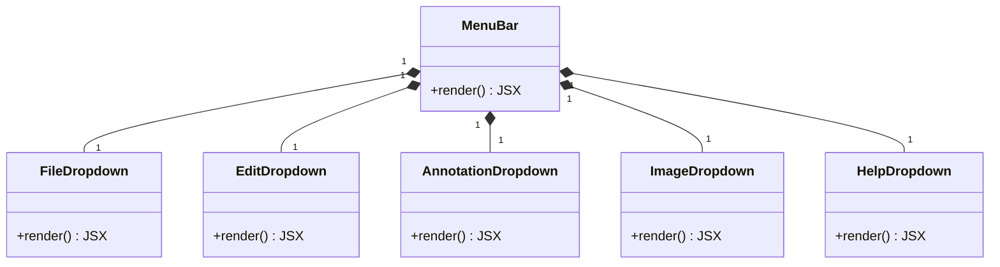

#### 子组件

##### FileDropdown 子组件

###### 组件概述

文件菜单下拉组件，提供新建、打开、保存、另存为、添加图片、删除图片、导出 PNG 等文件操作入口。菜单项的可用性根据文件打开状态和当前激活图片动态计算。

###### 组件示例

```jsx
// 由 MenuBar 内部渲染
<FileDropdown />
```

###### 组件结构

```
FileDropdown
└── antd Dropdown
    └── antd Menu
        ├── MenuItem: 新建        (file-new)
        ├── MenuItem: 打开        (file-open)
        ├── MenuItem: 保存        (file-save)         Ctrl+S
        ├── MenuItem: 另存为      (file-save-as)      Ctrl+Shift+S
        ├── Divider
        ├── MenuItem: 添加图片    (file-add-image)
        ├── MenuItem: 删除图片    (file-remove-image)
        ├── Divider
        └── MenuItem: 导出PNG     (file-export-png)
```

###### 组件 Action

| 菜单项   | Action 名                   | 调用时机         | 可用条件                                                   | 业务逻辑层定义                                             |
| -------- | --------------------------- | ---------------- | ---------------------------------------------------------- | ---------------------------------------------------------- |
| 新建     | `createNewFile()`           | 点击「新建」     | 始终可用；当前文件存在未保存修改时，执行前需弹出确认对话框 | [`createNewFile()`](./04-业务逻辑层.md#232-异步-thunks)    |
| 打开     | `openFile()`                | 点击「打开」     | 始终可用                                                   | [`openFile()`](./04-业务逻辑层.md#232-异步-thunks)         |
| 保存     | `saveFile()`                | 点击「保存」     | 已打开文件且存在未保存修改时可用                           | [`saveFile()`](./04-业务逻辑层.md#232-异步-thunks)         |
| 另存为   | `saveFileAs()`              | 点击「另存为」   | 已打开文件时可用                                           | [`saveFileAs()`](./04-业务逻辑层.md#232-异步-thunks)       |
| 添加图片 | `addImage(imageInfo)`       | 点击「添加图片」 | 已打开标注文件时可用                                       | [`addImage()`](./04-业务逻辑层.md#33-actions)              |
| 删除图片 | `removeImage(imageId)`      | 点击「删除图片」 | 已打开标注文件且存在激活图片时可用                         | [`removeImage()`](./04-业务逻辑层.md#33-actions)           |
| 导出 PNG | `exportImageAsPng(imageId)` | 点击「导出 PNG」 | 已打开标注文件且存在激活图片时可用                         | [`exportImageAsPng()`](./04-业务逻辑层.md#232-异步-thunks) |

###### 组件交互

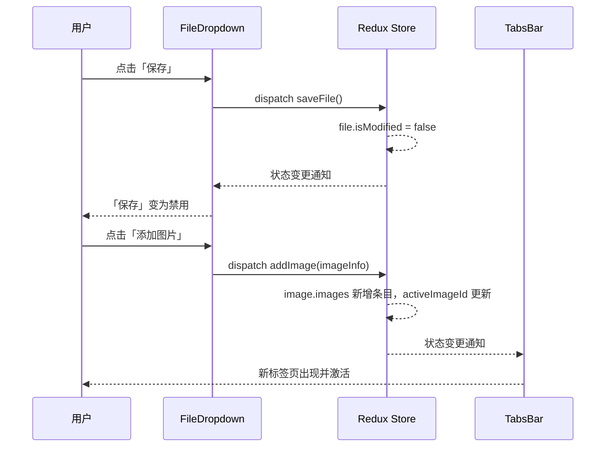

---

##### EditDropdown 子组件

###### 组件概述

编辑菜单下拉组件，提供撤销、重做、清除所有标注、删除选中标注等编辑操作入口。菜单项可用性依赖当前激活图片的历史记录状态和标注选中状态。

###### 组件示例

```jsx
<EditDropdown />
```

###### 组件结构

```
EditDropdown
└── antd Dropdown
    └── antd Menu
        ├── MenuItem: 撤销          (edit-undo)             Ctrl+Z
        ├── MenuItem: 重做          (edit-redo)             Ctrl+Y
        ├── Divider
        ├── MenuItem: 清除所有标注  (edit-clear-all)
        └── MenuItem: 删除选中标注  (edit-delete-selected)  Delete
```

###### 组件 Action

| 菜单项       | Action 名                            | 调用时机             | 可用条件                                       | 业务逻辑层定义                                |
| ------------ | ------------------------------------ | -------------------- | ---------------------------------------------- | --------------------------------------------- |
| 撤销         | `undo(imageId)`                      | 点击「撤销」         | 存在激活图片且该图片存在可撤销的历史记录时可用 | [历史记录模块](./04-业务逻辑层.md#53-actions) |
| 重做         | `redo(imageId)`                      | 点击「重做」         | 存在激活图片且该图片存在可重做的历史记录时可用 | [历史记录模块](./04-业务逻辑层.md#53-actions) |
| 清除所有标注 | `clearAllAnnotations(imageId)`       | 点击「清除所有标注」 | 存在激活图片且该图片至少包含一个标注时可用     | [标注模块](./04-业务逻辑层.md#43-actions)     |
| 删除选中标注 | `deleteSelectedAnnotations(imageId)` | 点击「删除选中标注」 | 存在激活图片且该图片至少选中一个标注时可用     | [标注模块](./04-业务逻辑层.md#43-actions)     |

###### 组件交互

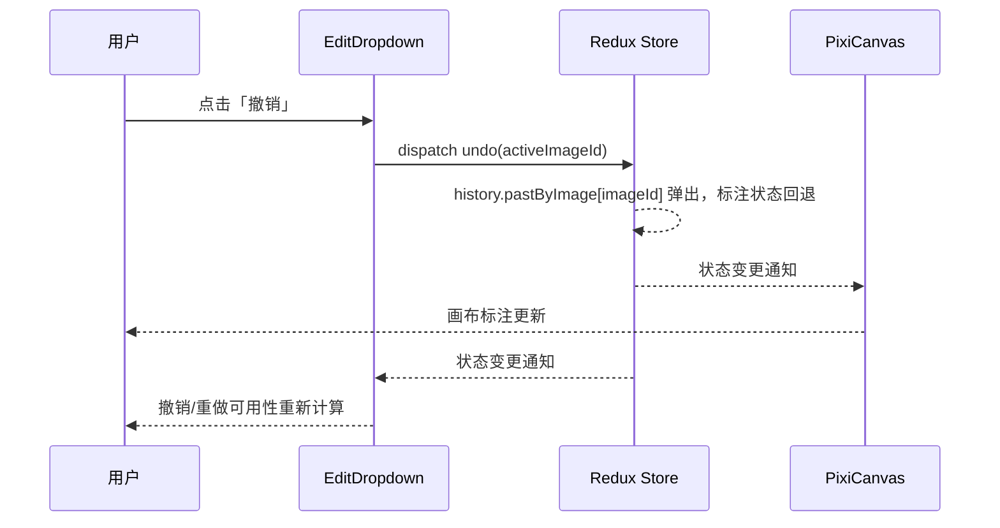

---

##### AnnotationDropdown 子组件

###### 组件概述

标注菜单下拉组件，提供各类标注工具的选择入口。菜单项在无文件打开或无激活图片时禁用。

###### 组件示例

```jsx
<AnnotationDropdown />
```

###### 组件结构

```
AnnotationDropdown
└── antd Dropdown
    └── antd Menu
        ├── MenuItem: 水平线段      (tool-horizontal-line)
        ├── MenuItem: 垂直线段      (tool-vertical-line)
        ├── Divider
        ├── MenuItem: 普通量角器    (tool-normal-protractor)
        ├── MenuItem: 水平量角器    (tool-horizontal-protractor)
        └── MenuItem: 垂直量角器    (tool-vertical-protractor)
```

###### 组件 Action

| 菜单项     | Action 名                                | 调用时机           | 可用条件                           | 业务逻辑层定义                            |
| ---------- | ---------------------------------------- | ------------------ | ---------------------------------- | ----------------------------------------- |
| 水平线段   | `setActiveTool('horizontal-line')`       | 点击「水平线段」   | 已打开标注文件且存在激活图片时可用 | [工具模块](./04-业务逻辑层.md#13-actions) |
| 垂直线段   | `setActiveTool('vertical-line')`         | 点击「垂直线段」   | 已打开标注文件且存在激活图片时可用 | [工具模块](./04-业务逻辑层.md#13-actions) |
| 普通量角器 | `setActiveTool('normal-protractor')`     | 点击「普通量角器」 | 已打开标注文件且存在激活图片时可用 | [工具模块](./04-业务逻辑层.md#13-actions) |
| 水平量角器 | `setActiveTool('horizontal-protractor')` | 点击「水平量角器」 | 已打开标注文件且存在激活图片时可用 | [工具模块](./04-业务逻辑层.md#13-actions) |
| 垂直量角器 | `setActiveTool('vertical-protractor')`   | 点击「垂直量角器」 | 已打开标注文件且存在激活图片时可用 | [工具模块](./04-业务逻辑层.md#13-actions) |

###### 组件交互

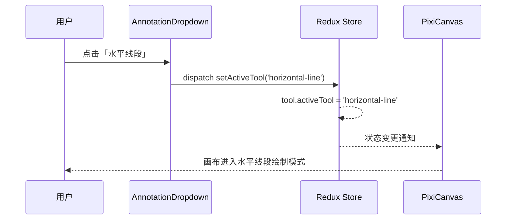

---

##### ImageDropdown 子组件

###### 组件概述

图片菜单下拉组件，提供放大、缩小、适应窗口、实际大小、顺时针旋转、逆时针旋转、重置旋转等图片视图操作入口。放大/缩小在达到缩放边界时自动禁用。

###### 组件示例

```jsx
<ImageDropdown />
```

###### 组件结构

```
ImageDropdown
└── antd Dropdown
    └── antd Menu
        ├── MenuItem: 放大          (image-zoom-in)           Ctrl++
        ├── MenuItem: 缩小          (image-zoom-out)          Ctrl+-
        ├── Divider
        ├── MenuItem: 适应窗口      (image-fit-window)        Ctrl+0
        ├── MenuItem: 实际大小      (image-actual-size)       Ctrl+1
        ├── Divider
        ├── MenuItem: 顺时针旋转    (image-rotate)            Ctrl+R
        ├── MenuItem: 逆时针旋转    (image-rotate-counter)    Ctrl+Shift+R
        └── MenuItem: 重置旋转      (image-reset-rotation)    Ctrl+Shift+0
```

###### 组件 Action

| 菜单项     | Action 名                              | 调用时机           | 可用条件                                   | 业务逻辑层定义                            |
| ---------- | -------------------------------------- | ------------------ | ------------------------------------------ | ----------------------------------------- |
| 放大       | `zoomIn(imageId)`                      | 点击「放大」       | 存在激活图片且当前缩放比例小于 800% 时可用 | [画布模块](./04-业务逻辑层.md#63-actions) |
| 缩小       | `zoomOut(imageId)`                     | 点击「缩小」       | 存在激活图片且当前缩放比例大于 10% 时可用  | [画布模块](./04-业务逻辑层.md#63-actions) |
| 适应窗口   | `fitWindow(imageId)`                   | 点击「适应窗口」   | 存在激活图片时可用                         | [画布模块](./04-业务逻辑层.md#63-actions) |
| 实际大小   | `actualSize(imageId)`                  | 点击「实际大小」   | 存在激活图片时可用                         | [画布模块](./04-业务逻辑层.md#63-actions) |
| 顺时针旋转 | `addRotation({ imageId, delta: 90 })`  | 点击「顺时针旋转」 | 存在激活图片时可用                         | [画布模块](./04-业务逻辑层.md#63-actions) |
| 逆时针旋转 | `addRotation({ imageId, delta: -90 })` | 点击「逆时针旋转」 | 存在激活图片时可用                         | [画布模块](./04-业务逻辑层.md#63-actions) |
| 重置旋转   | `addRotation({ imageId, delta: 0 })`   | 点击「重置旋转」   | 存在激活图片时可用                         | [画布模块](./04-业务逻辑层.md#63-actions) |

###### 组件交互

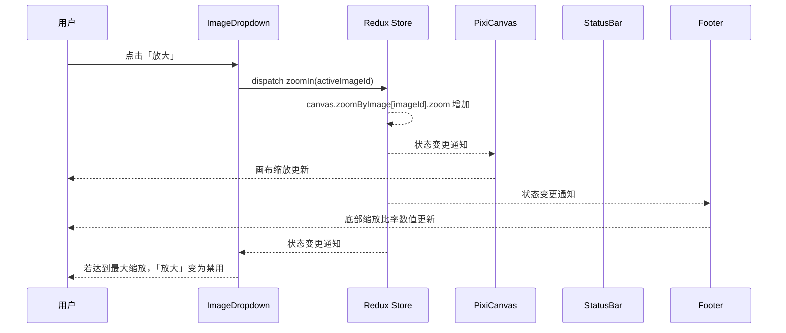

---

##### HelpDropdown 子组件

###### 组件概述

帮助菜单下拉组件，提供开发者工具入口。菜单项始终可用。

###### 组件示例

```jsx
<HelpDropdown />
```

###### 组件结构

```
HelpDropdown
└── antd Dropdown
    └── antd Menu
        └── MenuItem: 开发者工具 (help-dev-tools)
```

###### 组件 Action

| 菜单项     | Action 名        | 调用时机           | 可用条件 | 业务逻辑层定义                            |
| ---------- | ---------------- | ------------------ | -------- | ----------------------------------------- |
| 开发者工具 | `openDevTools()` | 点击「开发者工具」 | 始终可用 | Electron IPC：打开 Chromium DevTools 面板 |

###### 组件交互

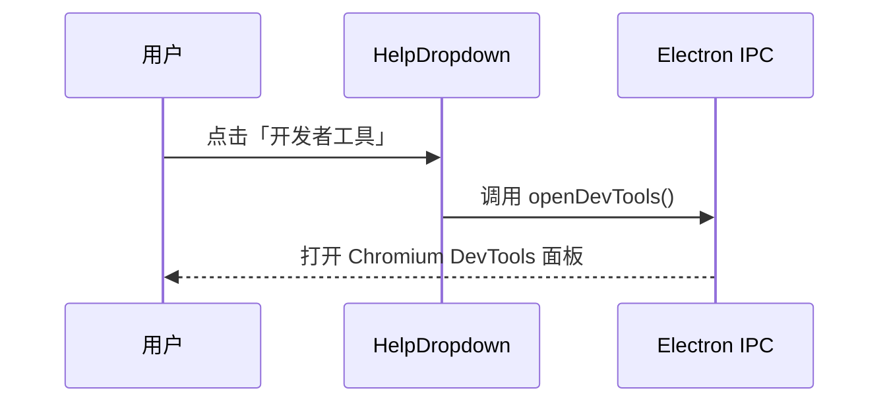

---

### MainContent 组件

#### 组件概述

主内容区组件，作为 MenuBar 与 Footer 之间的核心内容区域。根据当前是否存在已打开的标注文件，自动切换显示内容：

- 存在已打开文件 → 渲染 `TabsBar` 标签页栏
- 不存在已打开文件 → 渲染 `EmptyPlaceholder` 空状态占位组件

MainContent 组件本身不持有业务状态，仅通过 Redux 读取文件打开状态并做条件渲染，是连接布局框架与业务内容的路由性组件。

#### 组件示例

```jsx
<MainContent />
```

#### 组件 Props

| 属性名 | 类型 | 必填 | 默认值 | 来源 | 说明                                           |
| ------ | ---- | ---- | ------ | ---- | ---------------------------------------------- |
| 无     | -    | -    | -      | -    | 组件所需数据全部来自 Redux，无需外部传入 Props |

#### 组件 State

| 名称 | 类型 | 默认值 | 说明                       |
| ---- | ---- | ------ | -------------------------- |
| 无   | -    | -      | 组件为纯展示型，无内部状态 |

#### 组件结构

```
MainContent
├── TabsBar           (hasFile === true 时渲染)
└── EmptyPlaceholder  (hasFile === false 时渲染)
```

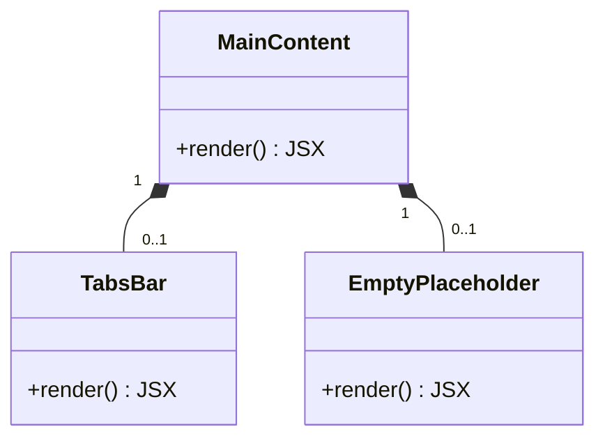

#### 选择器依赖

| 选择器名             | 来源                                               | 说明                             |
| -------------------- | -------------------------------------------------- | -------------------------------- |
| `selectIsFileOpened` | Redux：[文件模块](./04-业务逻辑层.md#24-selectors) | 判断当前是否存在已打开的标注文件 |

#### 渲染逻辑

- 当 `selectIsFileOpened` 返回 `true` 时，渲染 `<TabsBar />`
- 当 `selectIsFileOpened` 返回 `false` 时，渲染 `<EmptyPlaceholder />`

#### 组件交互

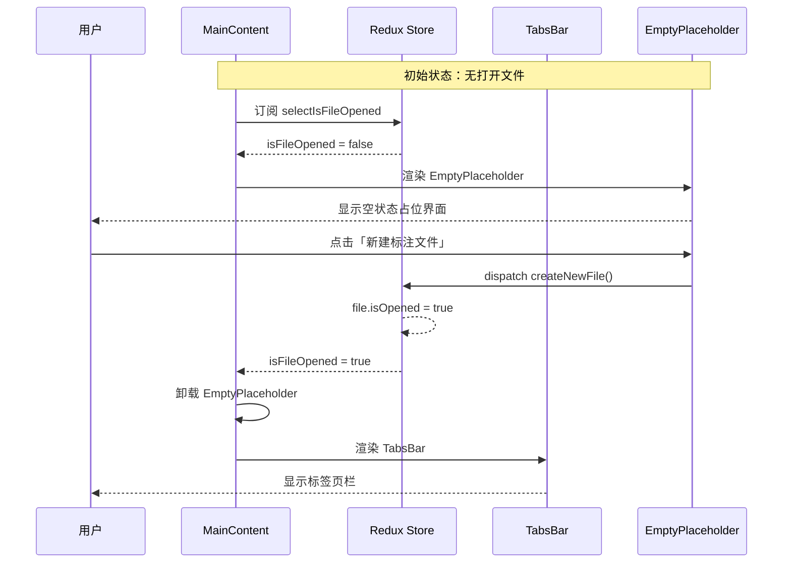

---

### EmptyPlaceholder 组件

#### 组件概述

空状态占位组件，在未打开任何标注文件时显示。提供「新建标注文件」和「打开标注文件」两个快捷操作入口，引导用户开始使用应用。

#### 组件示例

```jsx
<EmptyPlaceholder />
```

#### 组件 Props

| 属性名 | 类型 | 必填 | 默认值 | 来源 | 说明                  |
| ------ | ---- | ---- | ------ | ---- | --------------------- |
| 无     | -    | -    | -      | -    | 组件无外部 Props 依赖 |

#### 组件 State

| 名称 | 类型 | 默认值 | 说明                       |
| ---- | ---- | ------ | -------------------------- |
| 无   | -    | -      | 组件为纯展示型，无内部状态 |

#### 组件结构

```
EmptyPlaceholder
├── div: 图标 / 插图
├── h2: 欢迎标题
├── p:  描述文案
└── div: 操作按钮组
    ├── Button: 新建标注文件 (new-file)
    └── Button: 打开标注文件 (open-file)
```

#### 组件 Action

| Action 名         | 调用时机             | 业务逻辑层定义                                          |
| ----------------- | -------------------- | ------------------------------------------------------- |
| `createNewFile()` | 点击「新建标注文件」 | [`createNewFile()`](./04-业务逻辑层.md#232-异步-thunks) |
| `openFile()`      | 点击「打开标注文件」 | [`openFile()`](./04-业务逻辑层.md#232-异步-thunks)      |

#### 组件交互

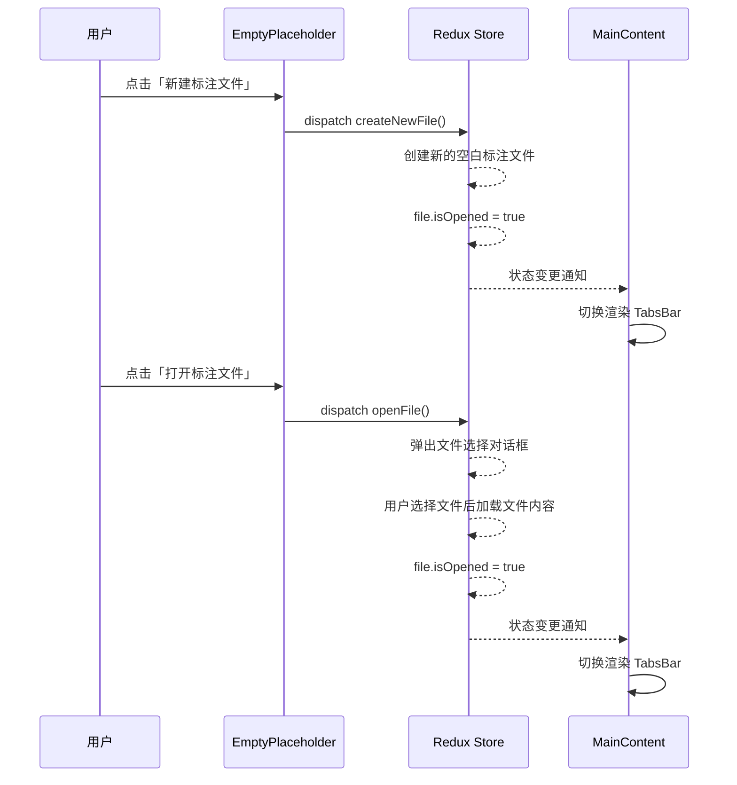

---

### TabsBar 组件

#### 组件概述

显示标记文件内的所有图片标签，支持标签切换和删除操作，是连接用户与工作区的桥梁组件。

#### 组件示例

```jsx
<TabsBar />
```

#### 组件 Props

| 属性名          | 类型             | 必填 | 默认值 | 来源                                                            | 说明                                                     |
| --------------- | ---------------- | ---- | ------ | --------------------------------------------------------------- | -------------------------------------------------------- |
| `images`        | `ImageInfo[]`    | 是   | -      | Redux：[`selectImages`](./04-业务逻辑层.md#34-selectors)        | 当前标记文件中所有图片的信息列表，每个元素对应一个标签页 |
| `activeImageId` | `string \| null` | 是   | -      | Redux：[`selectActiveImageId`](./04-业务逻辑层.md#34-selectors) | 当前激活的图片 ID；无图片时为 `null`                     |

#### 组件结构

```
TabsBar
└── antd Tabs
    └── WorkSpace (每个 Tab 对应一个)
```

#### 空状态设计

当 `images` 数组为空时（即没有任何图片），TabsBar 组件返回 `null`，不渲染任何 DOM 元素。

#### 组件 Action

| Action 名                 | 调用时机             | 业务逻辑层定义                                |
| ------------------------- | -------------------- | --------------------------------------------- |
| `setActiveImage(imageId)` | 用户点击标签页       | [图片管理模块](./04-业务逻辑层.md#33-actions) |
| `removeImage(imageId)`    | 用户点击标签删除按钮 | [图片管理模块](./04-业务逻辑层.md#33-actions) |

#### 组件交互

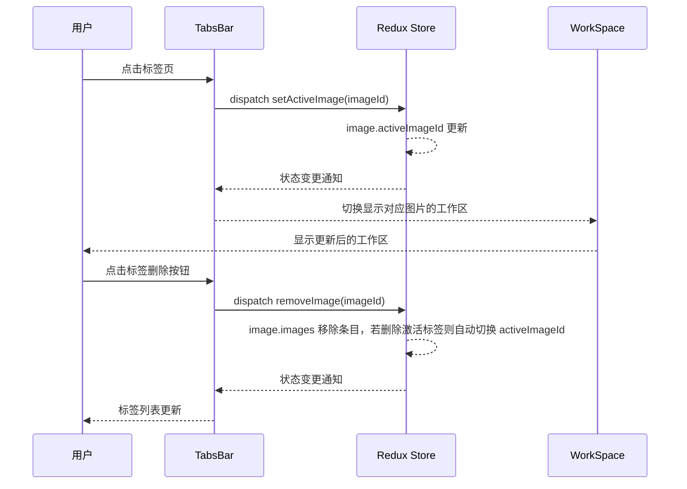

---

### WorkSpace 组件

#### 组件概述

工作区容器，包含工具栏和画布区域，管理当前标签页的编辑区域。每个图片标签页对应一个 WorkSpace 实例。

#### 组件示例

```jsx
<WorkSpace imageId={activeImageId} />
```

#### 组件 Props

| 属性名    | 类型     | 必填 | 默认值 | 来源              | 说明                    |
| --------- | -------- | ---- | ------ | ----------------- | ----------------------- |
| `imageId` | `string` | 是   | -      | 父组件（TabsBar） | 当前工作区对应的图片 ID |

#### 组件结构

```
WorkSpace
├── Toolbar
└── PixiCanvas
```

---

### Toolbar 组件

#### 组件概述

提供常用工具的快速访问，包括标注工具、图片操作工具和辅助线开关。使用 antd FloatButton.Group 实现浮动按钮组。

按钮有两种激活模式：

- async：点击后立即高亮，action 完成（Promise resolve/reject）后恢复默认
- toggle：激活状态与 Redux 状态绑定，状态为 true 时高亮

#### 组件示例

```jsx
<Toolbar imageId={activeImageId} />
```

#### 组件 Props

| 属性名               | 类型      | 必填 | 默认值 | 来源                                                | 说明                                                          |
| -------------------- | --------- | ---- | ------ | --------------------------------------------------- | ------------------------------------------------------------- |
| `imageId`            | `string`  | 是   | -      | 父组件（WorkSpace）                                 | 当前工作区对应的图片 ID，用于 dispatch 需要 imageId 的 action |
| `showAuxiliaryLines` | `boolean` | 是   | -      | Redux：`selectShowAuxiliaryLinesByImageId(imageId)` | 当前图片辅助线开关状态，用于 toggle 按钮的激活显示            |

#### 组件 State

| 名称        | 类型             | 默认值 | 说明                                                 |
| ----------- | ---------------- | ------ | ---------------------------------------------------- |
| `activeKey` | `string \| null` | `null` | 当前处于 async 激活状态的按钮 key，action 完成后清除 |

#### 组件结构

```
Toolbar
└── FloatButton.Group
    ├── FloatButton (水平线段)
    ├── FloatButton (垂直线段)
    ├── FloatButton (普通量角器)
    ├── FloatButton (水平量角器)
    ├── FloatButton (垂直量角器)
    ├── FloatButton (放大)
    ├── FloatButton (缩小)
    ├── FloatButton (适应窗口)
    ├── FloatButton (实际大小)
    ├── FloatButton (顺时针旋转)
    ├── FloatButton (重置旋转)
    └── FloatButton (辅助线开关)
```

#### 组件 Action

| Action 名                                | 调用时机           | 业务逻辑层定义                            |
| ---------------------------------------- | ------------------ | ----------------------------------------- |
| `setActiveTool('horizontal-line')`       | 点击「水平线段」   | [工具模块](./04-业务逻辑层.md#13-actions) |
| `setActiveTool('vertical-line')`         | 点击「垂直线段」   | [工具模块](./04-业务逻辑层.md#13-actions) |
| `setActiveTool('normal-protractor')`     | 点击「普通量角器」 | [工具模块](./04-业务逻辑层.md#13-actions) |
| `setActiveTool('horizontal-protractor')` | 点击「水平量角器」 | [工具模块](./04-业务逻辑层.md#13-actions) |
| `setActiveTool('vertical-protractor')`   | 点击「垂直量角器」 | [工具模块](./04-业务逻辑层.md#13-actions) |
| `zoomIn(imageId)`                        | 点击「放大」       | [画布模块](./04-业务逻辑层.md#63-actions) |
| `zoomOut(imageId)`                       | 点击「缩小」       | [画布模块](./04-业务逻辑层.md#63-actions) |
| `fitWindow(imageId)`                     | 点击「适应窗口」   | [画布模块](./04-业务逻辑层.md#63-actions) |
| `actualSize(imageId)`                    | 点击「实际大小」   | [画布模块](./04-业务逻辑层.md#63-actions) |
| `setRotation(imageId, angle + 90)`       | 点击「顺时针旋转」 | [画布模块](./04-业务逻辑层.md#63-actions) |
| `setRotation(imageId, 0)`                | 点击「重置旋转」   | [画布模块](./04-业务逻辑层.md#63-actions) |
| `toggleAuxiliaryLines(imageId)`          | 点击「辅助线开关」 | [画布模块](./04-业务逻辑层.md#63-actions) |

#### 组件交互

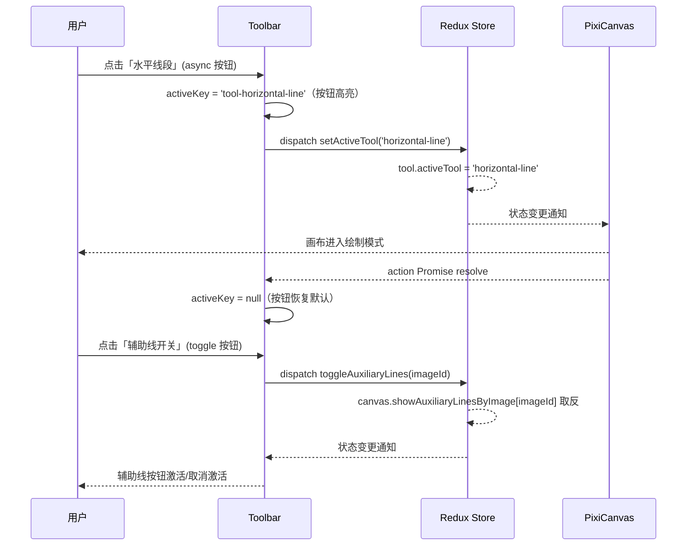

---

### PixiCanvas 组件

#### 组件概述

基于 PixiJS 的画布组件，负责图片的显示、缩放、旋转，以及标注的渲染和交互编辑。是应用的核心交互区域。

详细设计见：[PixiCanvas 设计](./PixiCanvas设计.md)。

---

### StatusBar 组件

#### 组件概述

底部状态栏，显示当前标记文件名、激活图片的缩放比率、旋转角度和原始尺寸。所有数据只读，无交互操作。

#### 组件示例

```jsx
<StatusBar />
```

#### 组件 Props

| 属性名      | 类型                                        | 必填 | 默认值 | 来源                                                        | 说明                                          |
| ----------- | ------------------------------------------- | ---- | ------ | ----------------------------------------------------------- | --------------------------------------------- |
| `fileName`  | `string \| null`                            | 是   | -      | Redux：`selectCurrentFileName`                              | 当前打开的标记文件名；未打开时为 `null`       |
| `zoom`      | `number \| null`                            | 是   | -      | Redux：`selectActiveImageZoom`                              | 当前激活图片的缩放比率；无激活图片时为 `null` |
| `rotation`  | `number \| null`                            | 是   | -      | Redux：`selectActiveImageRotation`                          | 当前激活图片的旋转角度；无激活图片时为 `null` |
| `imageSize` | `{ width: number; height: number } \| null` | 是   | -      | Redux：[`selectImageById`](./04-业务逻辑层.md#34-selectors) | 当前激活图片的原始尺寸；无激活图片时为 `null` |

#### 组件结构

```
StatusBar
├── span: 文件名
├── span: 缩放比率
├── span: 旋转角度
└── span: 原始尺寸
```
