# 业务逻辑层设计

## 整体架构

业务逻辑层采用 Redux Toolkit 进行状态管理，实现状态的集中化管理和可预测性。整体架构分为以下几个核心 Slice：

```text
src/store/
├── index.ts                    # Store 配置中心
├── middleware/                 # 中间件
│   └── reduxLoggerMiddleware.ts # 开发模式 Redux 状态变更日志
├── slices/                     # Redux Toolkit 切片
│   ├── commandSlice.ts         # 命令管理模块（替代 toolSlice）
│   ├── fileSlice.ts            # 文件管理模块
│   ├── imageSlice.ts           # 图片管理模块
│   ├── annotationSlice.ts      # 标注管理模块
│   ├── historySlice.ts         # 撤销/重做模块
│   ├── canvasSlice.ts          # 画布视图模块
│   └── styleSlice.ts           # 样式配置模块
├── selectors/                  # 组合选择器
└── serializers/                # 序列化器
    ├── markerFileSerializer.ts # 标记文件序列化器
    └── annotationSerializer.ts # 标注序列化器
```

### Slice 依赖关系

```text
fileSlice ──┬── 控制 imageSlice 的可用性（未打开文件时禁用图片操作）
            └── 控制 annotationSlice 的可用性

imageSlice ──┬── 决定 annotationSlice 的操作范围（按 activeImageId 过滤）
             ├── 决定 historySlice 的操作范围
             └── 决定 canvasSlice 的操作范围

commandSlice ─── 影响画布交互模式（创建 vs 编辑），管理命令执行状态

annotationSlice ──┴── 变更触发 historySlice 快照记录

styleSlice ──────── 全局样式配置，影响所有标注的渲染
```

---

## Slice 设计文档

### 1. commandSlice — 命令管理模块

#### 1.1 Slice 概述

**职责**：管理当前激活的工具类型，支持工具切换和重置，同时管理所有 MenuBar 命令的执行状态。

**核心功能**：

- 保存当前激活的工具类型
- 提供工具切换的 Action
- 支持工具状态的查询
- 管理命令的执行状态
- 记录命令的禁用状态

**支持的命令**：

| 命令 ID                      | 说明               | 快捷键       |
| ---------------------------- | ------------------ | ------------ |
| `file-new`                   | 新建标记文件       |              |
| `file-open`                  | 打开标记文件       |              |
| `file-save`                  | 保存标记文件       | Ctrl+S       |
| `file-save-as`               | 另存为标记文件     | Ctrl+Shift+S |
| `file-add-image`             | 添加图片           |              |
| `file-remove-image`          | 删除图片           |              |
| `file-export-png`            | 导出 PNG           |              |
| `edit-undo`                  | 撤销操作           | Ctrl+Z       |
| `edit-redo`                  | 重做操作           | Ctrl+Y       |
| `edit-clear-all`             | 清除所有标注       |              |
| `edit-delete-selected`       | 删除选中标注       | Delete       |
| `tool-horizontal-line`       | 选择水平线段工具   |              |
| `tool-vertical-line`         | 选择垂直线段工具   |              |
| `tool-normal-protractor`     | 选择普通量角器工具 |              |
| `tool-horizontal-protractor` | 选择水平量角器工具 |              |
| `tool-vertical-protractor`   | 选择垂直量角器工具 |              |
| `image-zoom-in`              | 放大画布           | Ctrl++       |
| `image-zoom-out`             | 缩小画布           | Ctrl+-       |
| `image-fit-window`           | 适应窗口           | Ctrl+0       |
| `image-actual-size`          | 实际大小           | Ctrl+1       |
| `image-rotate`               | 顺时针旋转         | Ctrl+R       |
| `image-rotate-counter`       | 逆时针旋转         | Ctrl+Shift+R |
| `image-reset-rotation`       | 重置旋转           | Ctrl+Shift+0 |

#### 1.2 State 结构

| 字段               | 类型/范围                | 说明                                                                     |
| ------------------ | ------------------------ | ------------------------------------------------------------------------ |
| `activeTool`       | 工具类型                 | 当前激活的工具；初始为无工具，也可为水平线段、垂直线段或三类量角器工具。 |
| `executingCommand` | 命令 ID 或空值           | 当前正在执行的命令；没有执行中的命令时为空值。                           |
| `commands`         | 命令 ID 到禁用状态的映射 | 记录各菜单命令是否禁用。                                                 |

#### 1.3 Actions

| Action                   | 类型        | Payload                                       | 说明                   |
| ------------------------ | ----------- | --------------------------------------------- | ---------------------- |
| `setActiveTool`          | 同步 Action | `toolType: ToolType`                          | 设置当前激活的工具     |
| `resetTool`              | 同步 Action | 无                                            | 重置工具为无工具状态   |
| `executeCommand`         | 同步 Action | `commandId: CommandId`                        | 开始执行命令           |
| `finishCommand`          | 同步 Action | 无                                            | 结束命令执行           |
| `setCommandDisabled`     | 同步 Action | `{ commandId: CommandId; disabled: boolean }` | 设置命令的禁用状态     |
| `setAllCommandsDisabled` | 同步 Action | `disabled: boolean`                           | 设置所有命令的禁用状态 |

#### 1.4 Selectors

| Selector                     | 返回值                              | 说明                                          |
| ---------------------------- | ----------------------------------- | --------------------------------------------- |
| `selectActiveTool`           | `ToolType`                          | 获取当前激活的工具类型                        |
| `selectExecutingCommand`     | `CommandId 或 null`                 | 获取正在执行的命令                            |
| `selectCommandDisabled`      | `(commandId: CommandId) => boolean` | 检查指定命令是否禁用                          |
| `selectIsToolActive`         | `(toolType: ToolType) => boolean`   | 检查指定工具是否激活                          |
| `selectIsCreatingAnnotation` | `boolean`                           | 是否处于标注创建模式（activeTool 不是无工具） |

#### 1.5 Action 时序图

以下时序图只描述业务状态转移，不描述具体代码实现。

##### `setActiveTool` Action 时序图

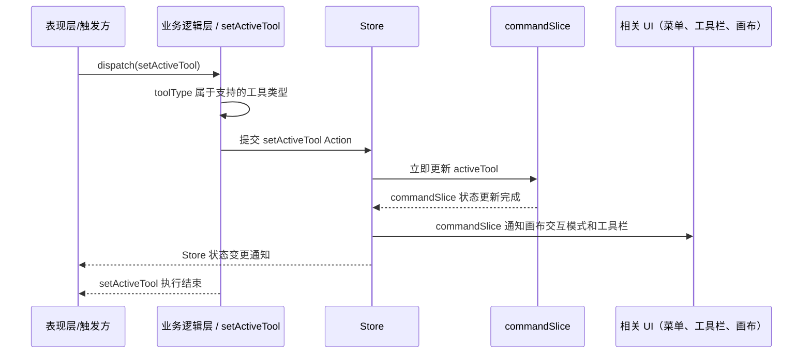
```mermaid
sequenceDiagram
    participant UI as 表现层/触发方
    participant BL as 业务逻辑层 / setActiveTool
    participant ST as Store
    participant SL as commandSlice
    participant R as 相关 UI（菜单、工具栏、画布）

    UI->>BL: dispatch(setActiveTool)
    BL->>BL: toolType 属于支持的工具类型
    BL->>ST: 提交 setActiveTool Action
    ST->>SL: 立即更新 activeTool
    SL-->>ST: commandSlice 状态更新完成
    ST->>R: commandSlice 通知画布交互模式和工具栏
    ST-->>UI: Store 状态变更通知
    BL-->>UI: setActiveTool 执行结束
```

##### `resetTool` Action 时序图

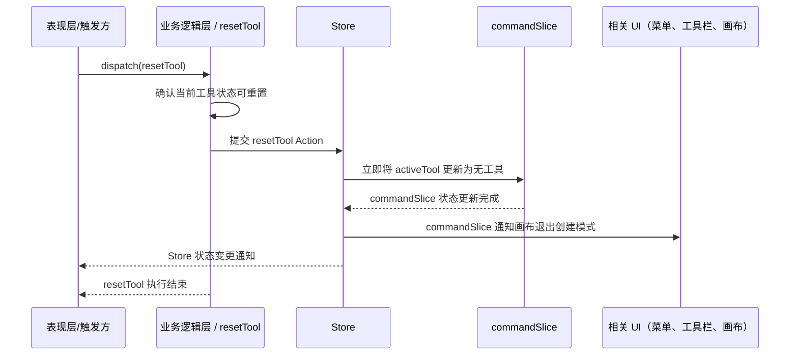
```mermaid
sequenceDiagram
    participant UI as 表现层/触发方
    participant BL as 业务逻辑层 / resetTool
    participant ST as Store
    participant SL as commandSlice
    participant R as 相关 UI（菜单、工具栏、画布）

    UI->>BL: dispatch(resetTool)
    BL->>BL: 确认当前工具状态可重置
    BL->>ST: 提交 resetTool Action
    ST->>SL: 立即将 activeTool 更新为无工具
    SL-->>ST: commandSlice 状态更新完成
    ST->>R: commandSlice 通知画布退出创建模式
    ST-->>UI: Store 状态变更通知
    BL-->>UI: resetTool 执行结束
```

##### `executeCommand` Action 时序图

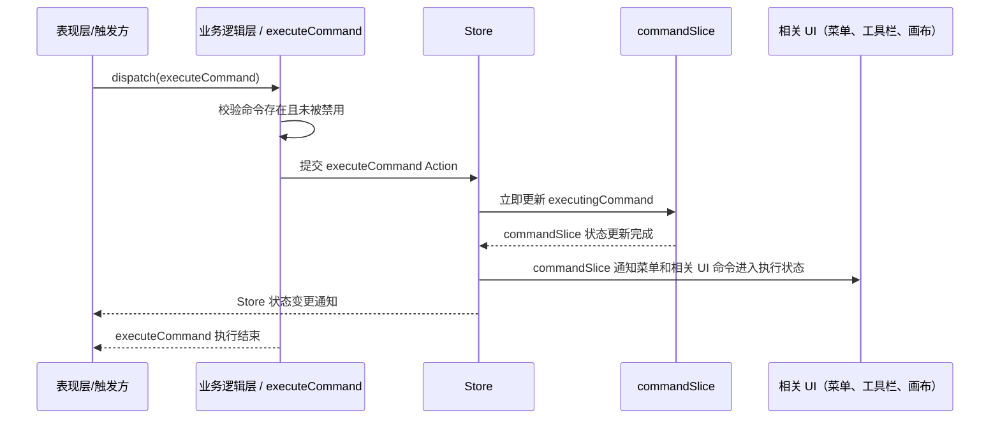
```mermaid
sequenceDiagram
    participant UI as 表现层/触发方
    participant BL as 业务逻辑层 / executeCommand
    participant ST as Store
    participant SL as commandSlice
    participant R as 相关 UI（菜单、工具栏、画布）

    UI->>BL: dispatch(executeCommand)
    BL->>BL: 校验命令存在且未被禁用
    BL->>ST: 提交 executeCommand Action
    ST->>SL: 立即更新 executingCommand
    SL-->>ST: commandSlice 状态更新完成
    ST->>R: commandSlice 通知菜单和相关 UI 命令进入执行状态
    ST-->>UI: Store 状态变更通知
    BL-->>UI: executeCommand 执行结束
```

##### `finishCommand` Action 时序图

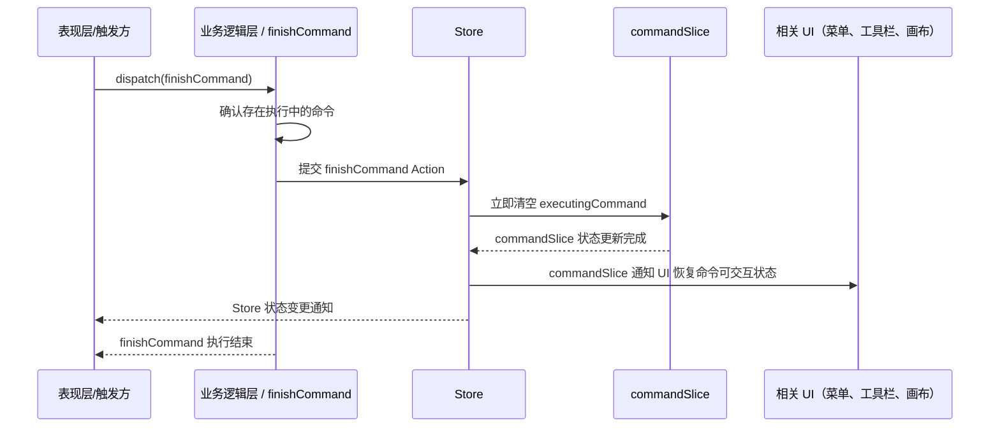
```mermaid
sequenceDiagram
    participant UI as 表现层/触发方
    participant BL as 业务逻辑层 / finishCommand
    participant ST as Store
    participant SL as commandSlice
    participant R as 相关 UI（菜单、工具栏、画布）

    UI->>BL: dispatch(finishCommand)
    BL->>BL: 确认存在执行中的命令
    BL->>ST: 提交 finishCommand Action
    ST->>SL: 立即清空 executingCommand
    SL-->>ST: commandSlice 状态更新完成
    ST->>R: commandSlice 通知 UI 恢复命令可交互状态
    ST-->>UI: Store 状态变更通知
    BL-->>UI: finishCommand 执行结束
```

##### `setCommandDisabled` Action 时序图

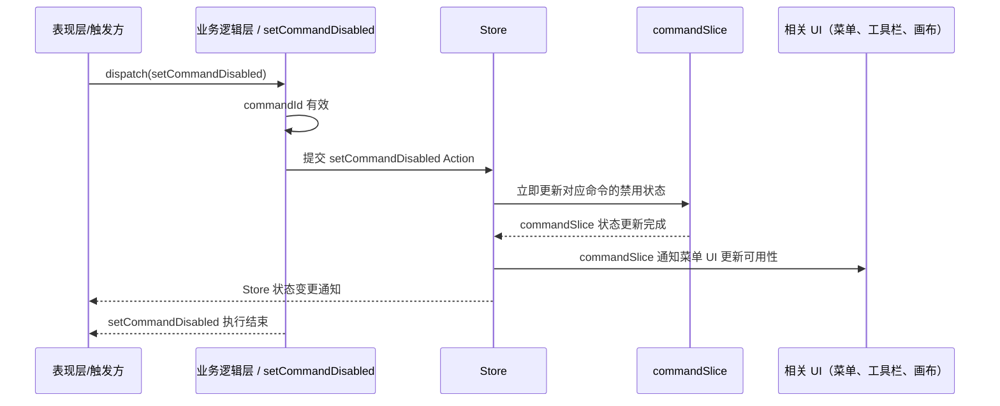
```mermaid
sequenceDiagram
    participant UI as 表现层/触发方
    participant BL as 业务逻辑层 / setCommandDisabled
    participant ST as Store
    participant SL as commandSlice
    participant R as 相关 UI（菜单、工具栏、画布）

    UI->>BL: dispatch(setCommandDisabled)
    BL->>BL: commandId 有效
    BL->>ST: 提交 setCommandDisabled Action
    ST->>SL: 立即更新对应命令的禁用状态
    SL-->>ST: commandSlice 状态更新完成
    ST->>R: commandSlice 通知菜单 UI 更新可用性
    ST-->>UI: Store 状态变更通知
    BL-->>UI: setCommandDisabled 执行结束
```

##### `setAllCommandsDisabled` Action 时序图

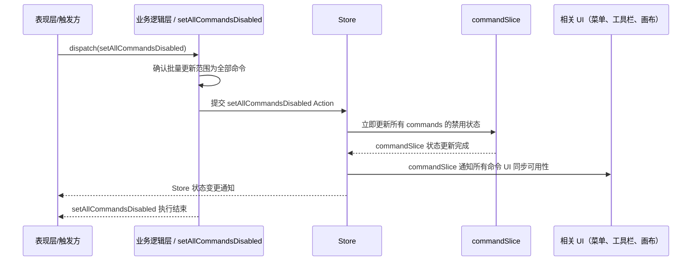
```mermaid
sequenceDiagram
    participant UI as 表现层/触发方
    participant BL as 业务逻辑层 / setAllCommandsDisabled
    participant ST as Store
    participant SL as commandSlice
    participant R as 相关 UI（菜单、工具栏、画布）

    UI->>BL: dispatch(setAllCommandsDisabled)
    BL->>BL: 确认批量更新范围为全部命令
    BL->>ST: 提交 setAllCommandsDisabled Action
    ST->>SL: 立即更新所有 commands 的禁用状态
    SL-->>ST: commandSlice 状态更新完成
    ST->>R: commandSlice 通知所有命令 UI 同步可用性
    ST-->>UI: Store 状态变更通知
    BL-->>UI: setAllCommandsDisabled 执行结束
```

---

### 2. fileSlice — 文件管理模块

#### 2.1 Slice 概述

**职责**：管理标记文件的操作，包括新建、打开、保存、另存为等功能。是应用的文件系统入口，负责协调业务状态与持久化存储。

**核心功能**：

- 管理当前打开的标记文件路径和状态
- 支持标记文件的新建、打开、保存、另存为操作
- 与 Electron 主进程通信，完成文件对话框交互
- 控制其他 slice 的可用性（未打开文件时禁用相关操作）

#### 2.2 State 结构

| 字段                | 类型             | 说明                                       |
| ------------------- | ---------------- | ------------------------------------------ |
| `filePath`          | `string \| null` | 当前文件的绝对路径；Untitled 文件为 `null` |
| `fileName`          | `string`         | 当前显示名称，如 `Untitled-1`              |
| `isUntitled`        | `boolean`        | 是否为尚未保存到磁盘的内存文件             |
| `hasUnsavedChanges` | `boolean`        | 是否有未保存的更改                         |

#### 2.3 Actions

| Action             | 类型        | Payload                                  | 说明                                      |
| ------------------ | ----------- | ---------------------------------------- | ----------------------------------------- |
| `createNewFile`    | 同步 Action | 无                                       | 创建内存中的 Untitled 文件，不写入磁盘    |
| `setFileOpened`    | 同步 Action | `{ filePath: string; fileName: string }` | 标记已保存/打开的文件                     |
| `setFileClosed`    | 同步 Action | 无                                       | 关闭当前文件并清理文件元数据              |
| `markFileSaved`    | 同步 Action | 无                                       | 标记文件已保存                            |
| `markFileUnsaved`  | 同步 Action | 无                                       | 标记文件有未保存的更改                    |
| `openFile`         | 异步 Thunk  | 无                                       | 打开文件并加载图片、标注内容              |
| `saveFile`         | 异步 Thunk  | 无                                       | 保存当前文件；Untitled 文件首次保存时弹框 |
| `saveFileAs`       | 异步 Thunk  | 无                                       | 另存为新文件                              |
| `exportImageAsPng` | 异步 Thunk  | `imageId: string`                        | 将指定图片及其标注内容导出为 PNG          |

同步 Action 只负责更新 `fileSlice` 的内存状态；异步 Thunk 负责与 Electron API 协作，并在文件操作成功或状态需要变化时触发对应的同步状态变化。用户取消文件对话框时，Thunk 应结束本次操作而不修改文件内容；文件读写或解析失败时，应返回失败状态供表现层提示用户。

#### 2.3.1 Action 时序图

##### `createNewFile` Action 时序图

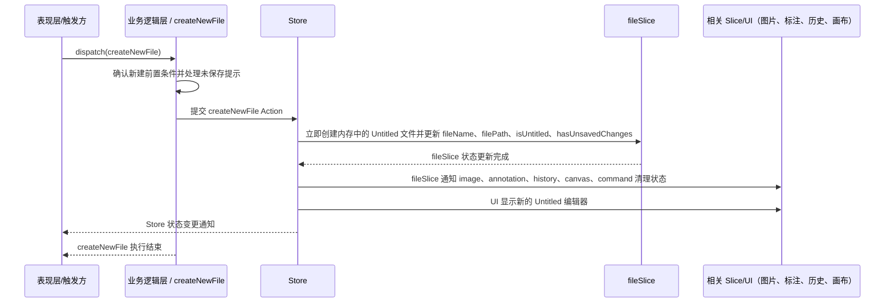
```mermaid
sequenceDiagram
    participant UI as 表现层/触发方
    participant BL as 业务逻辑层 / createNewFile
    participant ST as Store
    participant SL as fileSlice
    participant R as 相关 Slice/UI（图片、标注、历史、画布）

    UI->>BL: dispatch(createNewFile)
    BL->>BL: 确认新建前置条件并处理未保存提示
    BL->>ST: 提交 createNewFile Action
    ST->>SL: 立即创建内存中的 Untitled 文件并更新 fileName、filePath、isUntitled、hasUnsavedChanges
    SL-->>ST: fileSlice 状态更新完成
    ST->>R: fileSlice 通知 image、annotation、history、canvas、command 清理状态
    ST->>R: UI 显示新的 Untitled 编辑器
    ST-->>UI: Store 状态变更通知
    BL-->>UI: createNewFile 执行结束
```

##### `setFileOpened` Action 时序图

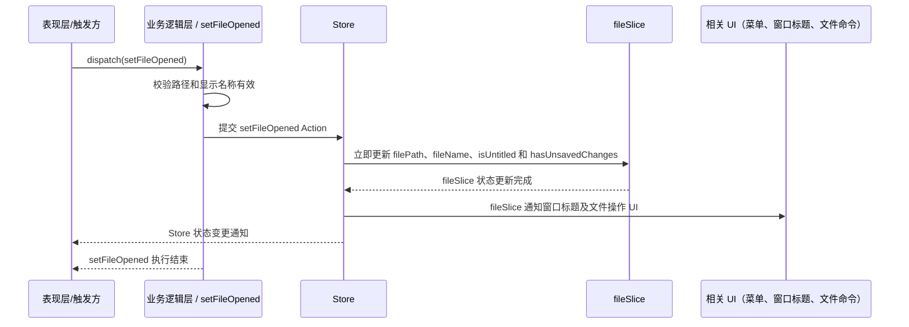
```mermaid
sequenceDiagram
    participant UI as 表现层/触发方
    participant BL as 业务逻辑层 / setFileOpened
    participant ST as Store
    participant SL as fileSlice
    participant R as 相关 UI（菜单、窗口标题、文件命令）

    UI->>BL: dispatch(setFileOpened)
    BL->>BL: 校验路径和显示名称有效
    BL->>ST: 提交 setFileOpened Action
    ST->>SL: 立即更新 filePath、fileName、isUntitled 和 hasUnsavedChanges
    SL-->>ST: fileSlice 状态更新完成
    ST->>R: fileSlice 通知窗口标题及文件操作 UI
    ST-->>UI: Store 状态变更通知
    BL-->>UI: setFileOpened 执行结束
```

##### `setFileClosed` Action 时序图

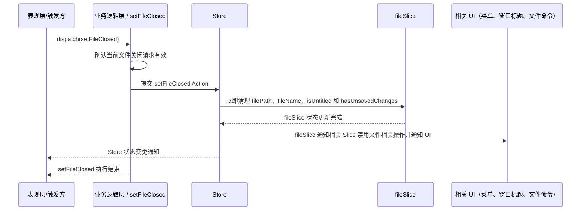
```mermaid
sequenceDiagram
    participant UI as 表现层/触发方
    participant BL as 业务逻辑层 / setFileClosed
    participant ST as Store
    participant SL as fileSlice
    participant R as 相关 UI（菜单、窗口标题、文件命令）

    UI->>BL: dispatch(setFileClosed)
    BL->>BL: 确认当前文件关闭请求有效
    BL->>ST: 提交 setFileClosed Action
    ST->>SL: 立即清理 filePath、fileName、isUntitled 和 hasUnsavedChanges
    SL-->>ST: fileSlice 状态更新完成
    ST->>R: fileSlice 通知相关 Slice 禁用文件相关操作并通知 UI
    ST-->>UI: Store 状态变更通知
    BL-->>UI: setFileClosed 执行结束
```

##### `markFileSaved` Action 时序图

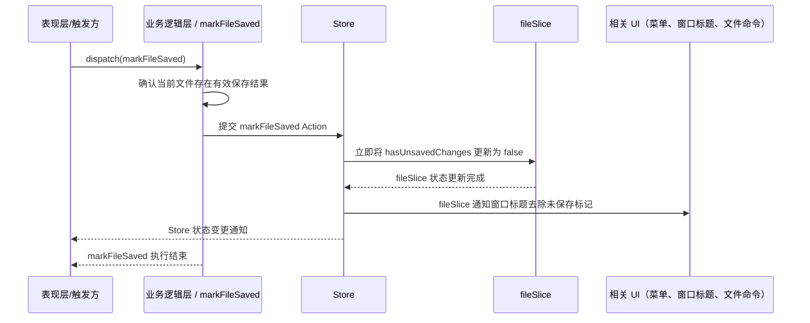
```mermaid
sequenceDiagram
    participant UI as 表现层/触发方
    participant BL as 业务逻辑层 / markFileSaved
    participant ST as Store
    participant SL as fileSlice
    participant R as 相关 UI（菜单、窗口标题、文件命令）

    UI->>BL: dispatch(markFileSaved)
    BL->>BL: 确认当前文件存在有效保存结果
    BL->>ST: 提交 markFileSaved Action
    ST->>SL: 立即将 hasUnsavedChanges 更新为 false
    SL-->>ST: fileSlice 状态更新完成
    ST->>R: fileSlice 通知窗口标题去除未保存标记
    ST-->>UI: Store 状态变更通知
    BL-->>UI: markFileSaved 执行结束
```

##### `markFileUnsaved` Action 时序图

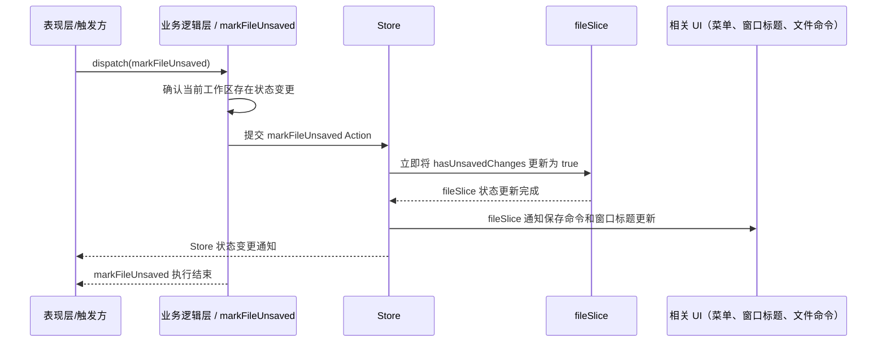
```mermaid
sequenceDiagram
    participant UI as 表现层/触发方
    participant BL as 业务逻辑层 / markFileUnsaved
    participant ST as Store
    participant SL as fileSlice
    participant R as 相关 UI（菜单、窗口标题、文件命令）

    UI->>BL: dispatch(markFileUnsaved)
    BL->>BL: 确认当前工作区存在状态变更
    BL->>ST: 提交 markFileUnsaved Action
    ST->>SL: 立即将 hasUnsavedChanges 更新为 true
    SL-->>ST: fileSlice 状态更新完成
    ST->>R: fileSlice 通知保存命令和窗口标题更新
    ST-->>UI: Store 状态变更通知
    BL-->>UI: markFileUnsaved 执行结束
```

##### `openFile` Action 时序图

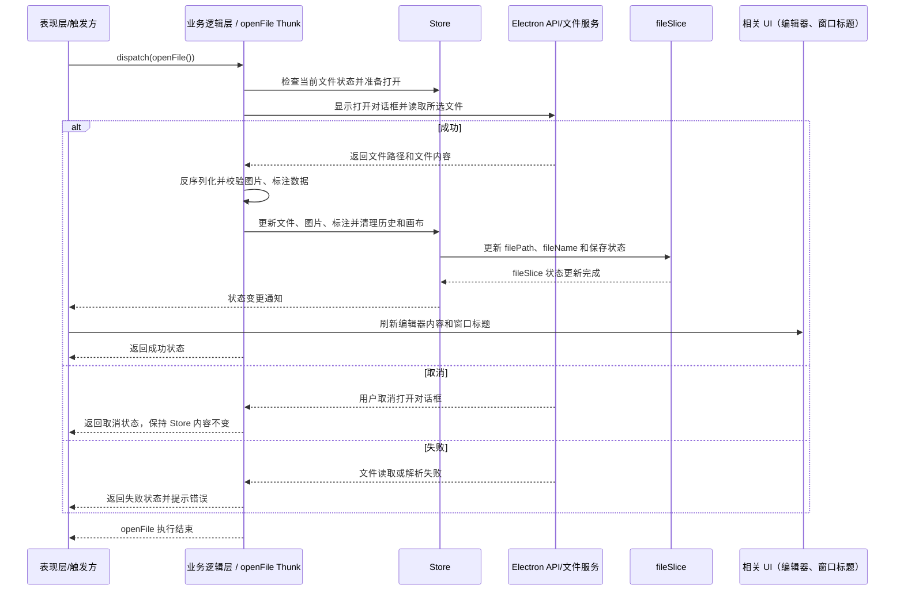
```mermaid
sequenceDiagram
    participant UI as 表现层/触发方
    participant BL as 业务逻辑层 / openFile Thunk
    participant ST as Store
    participant EP as Electron API/文件服务
    participant FS as fileSlice
    participant R as 相关 UI（编辑器、窗口标题）

    UI->>BL: dispatch(openFile())
    BL->>ST: 检查当前文件状态并准备打开
    BL->>EP: 显示打开对话框并读取所选文件
    alt 成功
        EP-->>BL: 返回文件路径和文件内容
        BL->>BL: 反序列化并校验图片、标注数据
        BL->>ST: 更新文件、图片、标注并清理历史和画布
        ST->>FS: 更新 filePath、fileName 和保存状态
        FS-->>ST: fileSlice 状态更新完成
        ST-->>UI: 状态变更通知
        UI->>R: 刷新编辑器内容和窗口标题
        BL-->>UI: 返回成功状态
    else 取消
        EP-->>BL: 用户取消打开对话框
        BL-->>UI: 返回取消状态，保持 Store 内容不变
    else 失败
        EP-->>BL: 文件读取或解析失败
        BL-->>UI: 返回失败状态并提示错误
    end
    BL-->>UI: openFile 执行结束
```

##### `saveFile` Action 时序图

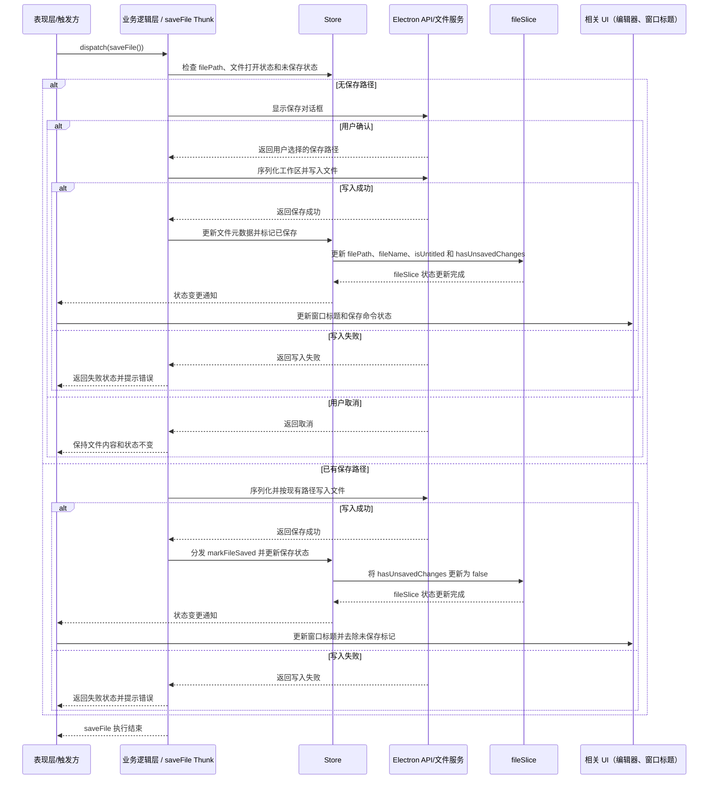
```mermaid
sequenceDiagram
    participant UI as 表现层/触发方
    participant BL as 业务逻辑层 / saveFile Thunk
    participant ST as Store
    participant EP as Electron API/文件服务
    participant FS as fileSlice
    participant R as 相关 UI（编辑器、窗口标题）

    UI->>BL: dispatch(saveFile())
    BL->>ST: 检查 filePath、文件打开状态和未保存状态
    alt 无保存路径
        BL->>EP: 显示保存对话框
        alt 用户确认
            EP-->>BL: 返回用户选择的保存路径
            BL->>EP: 序列化工作区并写入文件
            alt 写入成功
                EP-->>BL: 返回保存成功
                BL->>ST: 更新文件元数据并标记已保存
                ST->>FS: 更新 filePath、fileName、isUntitled 和 hasUnsavedChanges
                FS-->>ST: fileSlice 状态更新完成
                ST-->>UI: 状态变更通知
                UI->>R: 更新窗口标题和保存命令状态
            else 写入失败
                EP-->>BL: 返回写入失败
                BL-->>UI: 返回失败状态并提示错误
            end
        else 用户取消
            EP-->>BL: 返回取消
            BL-->>UI: 保持文件内容和状态不变
        end
    else 已有保存路径
        BL->>EP: 序列化并按现有路径写入文件
        alt 写入成功
            EP-->>BL: 返回保存成功
            BL->>ST: 分发 markFileSaved 并更新保存状态
            ST->>FS: 将 hasUnsavedChanges 更新为 false
            FS-->>ST: fileSlice 状态更新完成
            ST-->>UI: 状态变更通知
            UI->>R: 更新窗口标题并去除未保存标记
        else 写入失败
            EP-->>BL: 返回写入失败
            BL-->>UI: 返回失败状态并提示错误
        end
    end
    BL-->>UI: saveFile 执行结束
```

##### `saveFileAs` Action 时序图

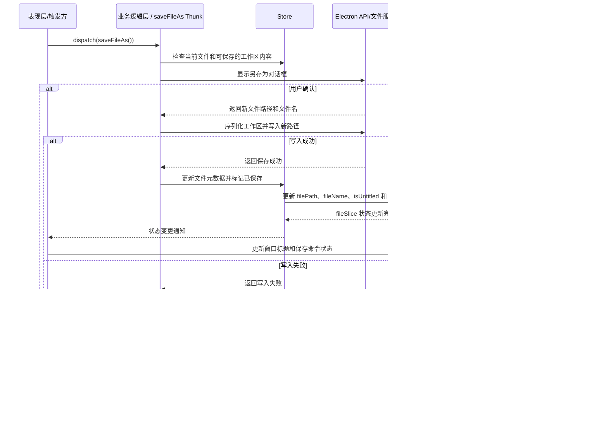
```mermaid
sequenceDiagram
    participant UI as 表现层/触发方
    participant BL as 业务逻辑层 / saveFileAs Thunk
    participant ST as Store
    participant EP as Electron API/文件服务
    participant FS as fileSlice
    participant R as 相关 UI（编辑器、窗口标题）

    UI->>BL: dispatch(saveFileAs())
    BL->>ST: 检查当前文件和可保存的工作区内容
    BL->>EP: 显示另存为对话框
    alt 用户确认
        EP-->>BL: 返回新文件路径和文件名
        BL->>EP: 序列化工作区并写入新路径
        alt 写入成功
            EP-->>BL: 返回保存成功
            BL->>ST: 更新文件元数据并标记已保存
            ST->>FS: 更新 filePath、fileName、isUntitled 和 hasUnsavedChanges
            FS-->>ST: fileSlice 状态更新完成
            ST-->>UI: 状态变更通知
            UI->>R: 更新窗口标题和保存命令状态
        else 写入失败
            EP-->>BL: 返回写入失败
            BL-->>UI: 返回失败状态并提示错误
        end
    else 用户取消
        EP-->>BL: 返回取消
        BL-->>UI: 保持当前文件元数据和内容不变
    end
    BL-->>UI: saveFileAs 执行结束
```

##### `exportImageAsPng` Action 时序图

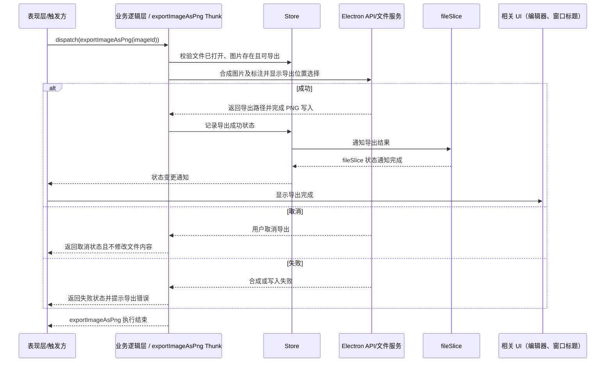
```mermaid
sequenceDiagram
    participant UI as 表现层/触发方
    participant BL as 业务逻辑层 / exportImageAsPng Thunk
    participant ST as Store
    participant EP as Electron API/文件服务
    participant FS as fileSlice
    participant R as 相关 UI（编辑器、窗口标题）

    UI->>BL: dispatch(exportImageAsPng(imageId))
    BL->>ST: 校验文件已打开、图片存在且可导出
    BL->>EP: 合成图片及标注并显示导出位置选择
    alt 成功
        EP-->>BL: 返回导出路径并完成 PNG 写入
        BL->>ST: 记录导出成功状态
        ST->>FS: 通知导出结果
        FS-->>ST: fileSlice 状态通知完成
        ST-->>UI: 状态变更通知
        UI->>R: 显示导出完成
    else 取消
        EP-->>BL: 用户取消导出
        BL-->>UI: 返回取消状态且不修改文件内容
    else 失败
        EP-->>BL: 合成或写入失败
        BL-->>UI: 返回失败状态并提示导出错误
    end
    BL-->>UI: exportImageAsPng 执行结束
```

##### 2.3.2 新建文件场景级时序图

新建文件采用 VS Code 的 Untitled 策略：只在 Redux 和内存中创建文件，不调用 `getTempDir()`，也不提前写入 `untitled.json`。文件首次保存时才弹出保存对话框并写入用户选择的路径。下图描述表现层到业务层的完整场景，和上面的 Action 级流程图互为补充。

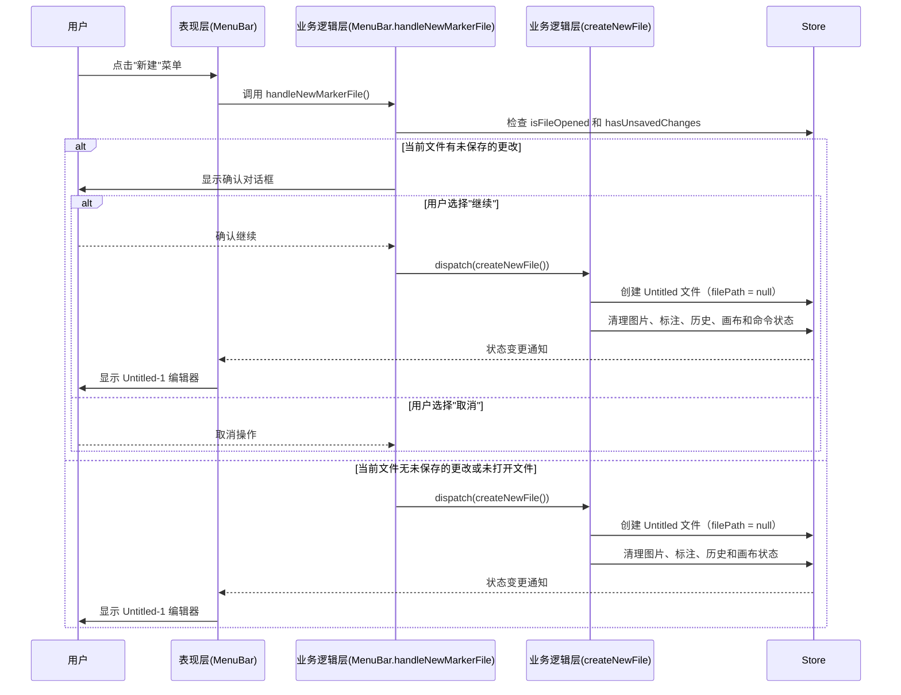
```mermaid
sequenceDiagram
    participant U as 用户
    participant UI as 表现层(MenuBar)
    participant CL as 业务逻辑层(MenuBar.handleNewMarkerFile)
    participant NF as 业务逻辑层(createNewFile)
    participant SL as Store

    U->>UI: 点击"新建"菜单
    UI->>CL: 调用 handleNewMarkerFile()
    CL->>SL: 检查 isFileOpened 和 hasUnsavedChanges
    alt 当前文件有未保存的更改
        CL->>U: 显示确认对话框
        alt 用户选择"继续"
            U-->>CL: 确认继续
            CL->>NF: dispatch(createNewFile())
            NF->>SL: 创建 Untitled 文件（filePath = null）
            NF->>SL: 清理图片、标注、历史、画布和命令状态
            SL-->>UI: 状态变更通知
            UI->>U: 显示 Untitled-1 编辑器
        else 用户选择"取消"
            U-->>CL: 取消操作
        end
    else 当前文件无未保存的更改或未打开文件
        CL->>NF: dispatch(createNewFile())
        NF->>SL: 创建 Untitled 文件（filePath = null）
        NF->>SL: 清理图片、标注、历史和画布状态
        SL-->>UI: 状态变更通知
        UI->>U: 显示 Untitled-1 编辑器
    end
```

**Untitled 文件策略**：

- `createNewFile()` 只创建内存中的 Untitled 文件，`filePath` 保持为 `null`。
- Untitled 文件使用递增显示名称（如 `Untitled-1`），不创建临时目录文件。
- 首次执行 `saveFile()` 时复用 `saveFileAs()`，由用户选择正式保存路径。
- 保存成功后将 `isUntitled` 设为 `false`，后续保存直接覆盖该路径。
- 新建或打开文件时清理图片、标注、历史、画布和命令状态，避免工作区数据串文件。

##### 2.3.3 打开文件场景级时序图

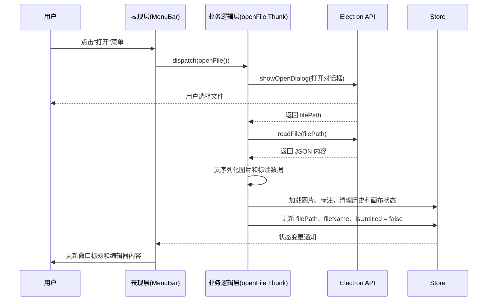
```mermaid
sequenceDiagram
    participant U as 用户
    participant UI as 表现层(MenuBar)
    participant CL as 业务逻辑层(openFile Thunk)
    participant EP as Electron API
    participant SL as Store

    U->>UI: 点击"打开"菜单
    UI->>CL: dispatch(openFile())
    CL->>EP: showOpenDialog(打开对话框)
    EP-->>U: 用户选择文件
    EP-->>CL: 返回 filePath
    CL->>EP: readFile(filePath)
    EP-->>CL: 返回 JSON 内容
    CL->>CL: 反序列化图片和标注数据
    CL->>SL: 加载图片、标注，清理历史和画布状态
    CL->>SL: 更新 filePath、fileName、isUntitled = false
    SL-->>UI: 状态变更通知
    UI->>U: 更新窗口标题和编辑器内容
```

##### 2.3.4 保存文件场景级时序图

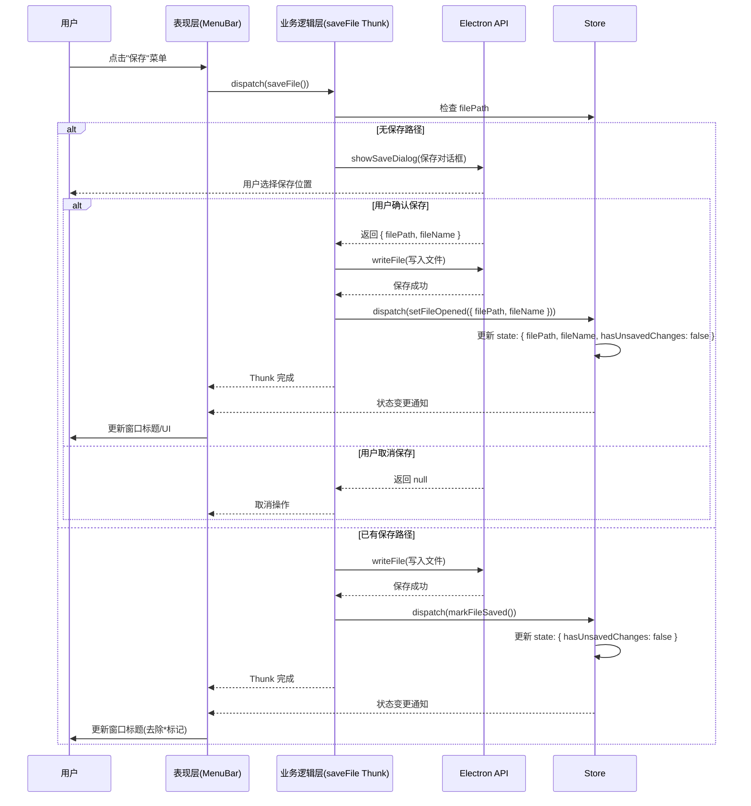
```mermaid
sequenceDiagram
    participant U as 用户
    participant UI as 表现层(MenuBar)
    participant CL as 业务逻辑层(saveFile Thunk)
    participant EP as Electron API
    participant SL as Store

    U->>UI: 点击"保存"菜单
    UI->>CL: dispatch(saveFile())
    CL->>SL: 检查 filePath
    alt 无保存路径
        CL->>EP: showSaveDialog(保存对话框)
        EP-->>U: 用户选择保存位置
        alt 用户确认保存
            EP-->>CL: 返回 { filePath, fileName }
            CL->>EP: writeFile(写入文件)
            EP-->>CL: 保存成功
            CL->>SL: dispatch(setFileOpened({ filePath, fileName }))
            SL->>SL: 更新 state: { filePath, fileName, hasUnsavedChanges: false }
            CL-->>UI: Thunk 完成
            SL-->>UI: 状态变更通知
            UI->>U: 更新窗口标题/UI
        else 用户取消保存
            EP-->>CL: 返回 null
            CL-->>UI: 取消操作
        end
    else 已有保存路径
        CL->>EP: writeFile(写入文件)
        EP-->>CL: 保存成功
        CL->>SL: dispatch(markFileSaved())
        SL->>SL: 更新 state: { hasUnsavedChanges: false }
        CL-->>UI: Thunk 完成
        SL-->>UI: 状态变更通知
        UI->>U: 更新窗口标题(去除*标记)
    end
```

##### 2.3.5 另存为文件场景级时序图

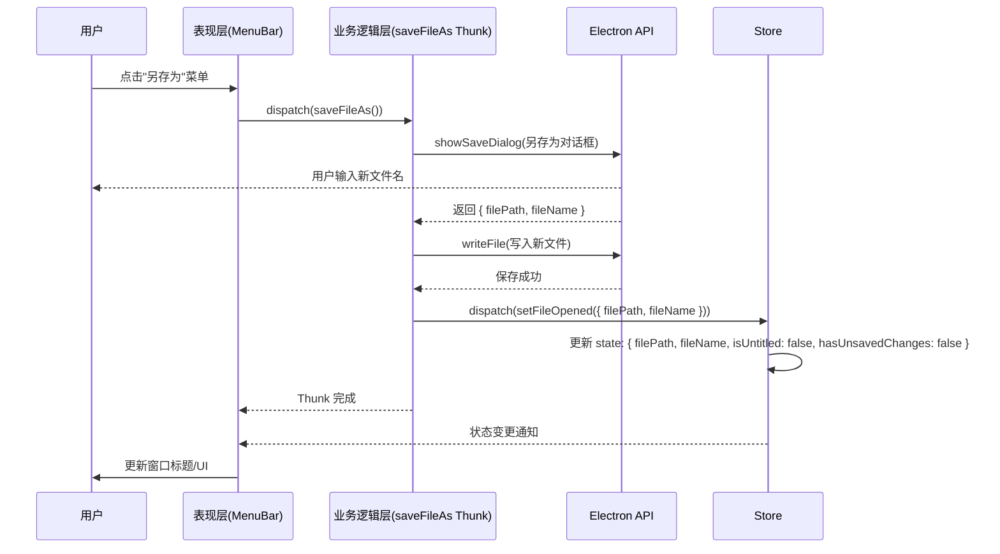
```mermaid
sequenceDiagram
    participant U as 用户
    participant UI as 表现层(MenuBar)
    participant CL as 业务逻辑层(saveFileAs Thunk)
    participant EP as Electron API
    participant SL as Store

    U->>UI: 点击"另存为"菜单
    UI->>CL: dispatch(saveFileAs())
    CL->>EP: showSaveDialog(另存为对话框)
    EP-->>U: 用户输入新文件名
    EP-->>CL: 返回 { filePath, fileName }
    CL->>EP: writeFile(写入新文件)
    EP-->>CL: 保存成功
    CL->>SL: dispatch(setFileOpened({ filePath, fileName }))
    SL->>SL: 更新 state: { filePath, fileName, isUntitled: false, hasUnsavedChanges: false }
    CL-->>UI: Thunk 完成
    SL-->>UI: 状态变更通知
    UI->>U: 更新窗口标题/UI
```

#### 2.4 Selectors

##### 2.4.1 基础 Selectors

| Selector                  | 返回值           | 说明                                       |
| ------------------------- | ---------------- | ------------------------------------------ |
| `selectFilePath`          | `string \| null` | 获取当前文件路径；Untitled 文件返回 `null` |
| `selectFileName`          | `string`         | 获取当前显示名称                           |
| `selectIsUntitled`        | `boolean`        | 是否为尚未保存的内存文件                   |
| `selectIsFileOpened`      | `boolean`        | 文件是否已打开（包括 Untitled 文件）       |
| `selectHasUnsavedChanges` | `boolean`        | 是否有未保存的更改                         |

##### 2.4.2 复杂 Selectors

| Selector                        | 输入 | 返回值    | 说明                                               |
| ------------------------------- | ---- | --------- | -------------------------------------------------- |
| `selectCanSave`                 | -    | `boolean` | 已打开文件且存在未保存修改，或当前为 Untitled 文件 |
| `selectCanPerformFileOperation` | -    | `boolean` | 文件已打开（包括 Untitled 文件）                   |

---

### 3. imageSlice — 图片管理模块

#### 3.1 Slice 概述

**职责**：管理多张图片的信息，支持图片的添加、切换和删除。

**核心功能**：

- 管理图片列表
- 管理当前激活的图片
- 支持图片的添加、删除和切换
- 保存图片的基本信息（路径、名称、尺寸等）

#### 3.2 State 结构

##### ImageState 顶层结构

| Key             | 类型                        | 默认值 | 说明                                     |
| --------------- | --------------------------- | ------ | ---------------------------------------- |
| `images`        | `Record<string, ImageInfo>` | `{}`   | 以图片 ID 为 key 的图片信息映射。        |
| `imageIds`      | `string[]`                  | `[]`   | 图片 ID 的有序列表，决定标签页展示顺序。 |
| `activeImageId` | `string \| null`            | `null` | 当前激活的图片 ID；无图片时为 `null`。   |

##### `images[imageId]` 的值类型：`ImageInfo`

```ts
interface ImageInfo {
  /** 图片唯一标识，应与 images 的映射 key 保持一致。 */
  id: string;
  /** 图片显示名称，用于标签页标题。 */
  name: string;
  /** 图片绝对路径，供画布加载图片资源。 */
  path: string;
  /** 图片原始宽度，单位为像素，必须大于 0。 */
  width: number;
  /** 图片原始高度，单位为像素，必须大于 0。 */
  height: number;
  /** 图片添加到标记文件的时间，使用 ISO 8601 格式。 */
  createdAt: string;
}
```

#### 3.3 Actions

| Action           | 类型        | Payload                                            | 说明                                                   |
| ---------------- | ----------- | -------------------------------------------------- | ------------------------------------------------------ |
| `addImage`       | 异步 Thunk  | 无（成功后生成 `ImageInfo`）                       | 调用图片选择对话框；用户选择后读取图片信息并写入 Store |
| `removeImage`    | 同步 Action | `imageId: string`                                  | 删除图片                                               |
| `setActiveImage` | 同步 Action | `imageId: string`                                  | 设置当前激活的图片                                     |
| `updateImage`    | 同步 Action | `{ imageId: string; updates: Partial<ImageInfo> }` | 更新图片信息                                           |

#### 3.4 Selectors

| Selector              | 返回值                                        | 说明                         |
| --------------------- | --------------------------------------------- | ---------------------------- |
| `selectImages`        | `ImageInfo[]`                                 | 获取所有图片列表             |
| `selectImageIds`      | `string[]`                                    | 获取图片 ID 列表（保持顺序） |
| `selectActiveImageId` | `string \| null`                              | 获取当前激活的图片 ID        |
| `selectActiveImage`   | `ImageInfo \| undefined`                      | 获取当前激活的图片信息       |
| `selectImageById`     | `(imageId: string) => ImageInfo \| undefined` | 根据 ID 获取图片信息         |
| `selectImageCount`    | `number`                                      | 获取图片总数                 |

#### 3.5 Action 时序图

##### `addImage` Action 时序图

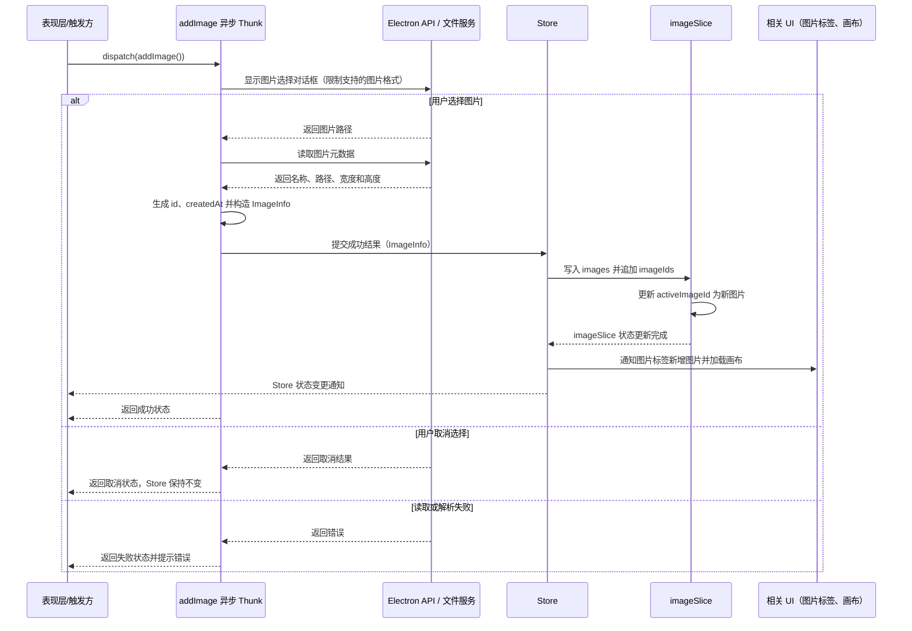
```mermaid
sequenceDiagram
    participant UI as 表现层/触发方
    participant AI as addImage 异步 Thunk
    participant EP as Electron API / 文件服务
    participant ST as Store
    participant SL as imageSlice
    participant R as 相关 UI（图片标签、画布）

    UI->>AI: dispatch(addImage())
    AI->>EP: 显示图片选择对话框（限制支持的图片格式）
    alt 用户选择图片
        EP-->>AI: 返回图片路径
        AI->>EP: 读取图片元数据
        EP-->>AI: 返回名称、路径、宽度和高度
        AI->>AI: 生成 id、createdAt 并构造 ImageInfo
        AI->>ST: 提交成功结果（ImageInfo）
        ST->>SL: 写入 images 并追加 imageIds
        SL->>SL: 更新 activeImageId 为新图片
        SL-->>ST: imageSlice 状态更新完成
        ST->>R: 通知图片标签新增图片并加载画布
        ST-->>UI: Store 状态变更通知
        AI-->>UI: 返回成功状态
    else 用户取消选择
        EP-->>AI: 返回取消结果
        AI-->>UI: 返回取消状态，Store 保持不变
    else 读取或解析失败
        EP-->>AI: 返回错误
        AI-->>UI: 返回失败状态并提示错误
    end
```

##### `removeImage` Action 时序图

```mermaid
sequenceDiagram
    participant UI as 表现层/触发方
    participant BL as 业务逻辑层 / removeImage
    participant ST as Store
    participant SL as imageSlice
    participant R as 相关 Slice/UI（标注、画布、图片标签）

    UI->>BL: dispatch(removeImage)
    BL->>BL: 校验图片存在
    BL->>ST: 提交 removeImage Action
    ST->>SL: 立即从 images 和 imageIds 移除图片
    SL-->>ST: imageSlice 状态更新完成
    ST->>R: 若删除的是当前图片，则切换 activeImageId 或置空
    ST->>R: imageSlice 通知 annotation、canvas 和 UI 更新
    ST-->>UI: Store 状态变更通知
    BL-->>UI: removeImage 执行结束
```

##### `setActiveImage` Action 时序图

```mermaid
sequenceDiagram
    participant UI as 表现层/触发方
    participant BL as 业务逻辑层 / setActiveImage
    participant ST as Store
    participant SL as imageSlice
    participant R as 相关 Slice/UI（标注、画布、图片标签）

    UI->>BL: dispatch(setActiveImage)
    BL->>BL: imageId 对应图片存在
    BL->>ST: 提交 setActiveImage Action
    ST->>SL: 立即更新 activeImageId
    SL-->>ST: imageSlice 状态更新完成
    ST->>R: imageSlice 通知 annotation、history、canvas 和图片标签 UI
    ST-->>UI: Store 状态变更通知
    BL-->>UI: setActiveImage 执行结束
```

##### `updateImage` Action 时序图

```mermaid
sequenceDiagram
    participant UI as 表现层/触发方
    participant BL as 业务逻辑层 / updateImage
    participant ST as Store
    participant SL as imageSlice
    participant R as 相关 Slice/UI（标注、画布、图片标签）

    UI->>BL: dispatch(updateImage)
    BL->>BL: 校验图片存在且更新字段有效
    BL->>ST: 提交 updateImage Action
    ST->>SL: 立即更新对应图片信息
    SL-->>ST: imageSlice 状态更新完成
    ST->>R: imageSlice 通知图片列表、画布元数据和相关 UI
    ST-->>UI: Store 状态变更通知
    BL-->>UI: updateImage 执行结束
```

---

### 4. annotationSlice — 标注管理模块

#### 4.1 Slice 概述

**职责**：管理所有图片的标注数据和选中状态，支持多种标注类型的创建、编辑、删除操作。

**核心功能**：

- 按图片 ID 组织标注数据
- 支持多种标注类型的创建
- 管理标注的选中状态
- 支持标注的编辑和删除
- 提供标注数据的查询
- 支持辅助线功能，显示标注间距离

**标注类型**：

| 标注类型   | 值                      | 说明                       |
| ---------- | ----------------------- | -------------------------- |
| 水平线段   | `horizontal-line`       | 标记水平位置，测量垂直比例 |
| 垂直线段   | `vertical-line`         | 标记垂直位置，测量水平比例 |
| 普通量角器 | `normal-protractor`     | 测量任意角度               |
| 水平量角器 | `horizontal-protractor` | 测量相对于水平线的角度     |
| 垂直量角器 | `vertical-protractor`   | 测量相对于垂直线的角度     |

#### 4.2 State 结构

| 字段                   | 类型/范围                              | 说明                                           |
| ---------------------- | -------------------------------------- | ---------------------------------------------- |
| `annotations`          | 图片 ID到标注 ID到标注对象的映射       | 按图片隔离保存全部标注。                       |
| `selectedAnnotationId` | 标注 ID 或空值                         | 当前选中的标注。                               |
| 标注公共字段           | `id`、`type`、`createdAt`、`updatedAt` | 标识标注、类型及创建/更新时间。                |
| 线段标注字段           | 起止点坐标                             | 水平线段和垂直线段使用起止点描述几何位置。     |
| 量角器标注字段         | 顶点、起止点坐标和角度                 | 三类量角器使用顶点、两条边和角度描述几何信息。 |

#### 4.3 Actions

| Action                     | 类型        | Payload                                                                   | 说明                   |
| -------------------------- | ----------- | ------------------------------------------------------------------------- | ---------------------- |
| `addAnnotation`            | 同步 Action | `{ imageId: string; annotation: Annotation }`                             | 添加标注               |
| `updateAnnotation`         | 同步 Action | `{ imageId: string; annotationId: string; updates: Partial<Annotation> }` | 更新标注               |
| `deleteAnnotation`         | 同步 Action | `{ imageId: string; annotationId: string }`                               | 删除标注               |
| `deleteSelectedAnnotation` | 同步 Action | `imageId: string`                                                         | 删除选中的标注         |
| `clearAllAnnotations`      | 同步 Action | `imageId: string`                                                         | 清除指定图片的所有标注 |
| `selectAnnotation`         | 同步 Action | `{ imageId: string; annotationId: string }`                               | 选中标注               |
| `deselectAnnotation`       | 同步 Action | 无                                                                        | 取消选中标注           |

#### 4.4 Selectors

| Selector                      | 返回值                                                               | 说明                   |
| ----------------------------- | -------------------------------------------------------------------- | ---------------------- |
| `selectAnnotations`           | `(imageId: string) => Record<string, Annotation>`                    | 获取指定图片的所有标注 |
| `selectAnnotationById`        | `(imageId: string, annotationId: string) => Annotation \| undefined` | 根据 ID 获取标注       |
| `selectSelectedAnnotationId`  | `string \| null`                                                     | 获取选中的标注 ID      |
| `selectSelectedAnnotation`    | `(imageId: string) => Annotation \| undefined`                       | 获取选中的标注         |
| `selectAnnotationsByType`     | `(imageId: string, type: AnnotationType) => Annotation[]`            | 按类型获取标注列表     |
| `selectHasAnnotations`        | `(imageId: string) => boolean`                                       | 检查是否有标注         |
| `selectHasSelectedAnnotation` | `boolean`                                                            | 检查是否有选中的标注   |

#### 4.5 Action 时序图

##### `addAnnotation` Action 时序图

```mermaid
sequenceDiagram
    participant UI as 表现层/触发方
    participant BL as 业务逻辑层 / addAnnotation
    participant ST as Store
    participant SL as annotationSlice
    participant HS as historySlice
    participant R as 相关 UI（画布、属性面板）

    UI->>BL: dispatch(addAnnotation)
    BL->>BL: 校验图片存在、标注 ID 和类型有效
    BL->>ST: 提交 addAnnotation Action
    ST->>SL: 立即写入对应图片的 annotations
    SL-->>ST: annotationSlice 状态更新完成
    ST->>R: historySlice 记录标注快照，annotationSlice 通知画布 UI
    ST-->>UI: Store 状态变更通知
    BL-->>UI: addAnnotation 执行结束
```

##### `updateAnnotation` Action 时序图

```mermaid
sequenceDiagram
    participant UI as 表现层/触发方
    participant BL as 业务逻辑层 / updateAnnotation
    participant ST as Store
    participant SL as annotationSlice
    participant HS as historySlice
    participant R as 相关 UI（画布、属性面板）

    UI->>BL: dispatch(updateAnnotation)
    BL->>BL: 校验图片及标注存在
    BL->>ST: 提交 updateAnnotation Action
    ST->>SL: 立即更新标注几何字段或属性并刷新 updatedAt
    SL-->>ST: annotationSlice 状态更新完成
    ST->>R: historySlice 记录变更，canvas 和 UI 重新渲染标注
    ST-->>UI: Store 状态变更通知
    BL-->>UI: updateAnnotation 执行结束
```

##### `deleteAnnotation` Action 时序图

```mermaid
sequenceDiagram
    participant UI as 表现层/触发方
    participant BL as 业务逻辑层 / deleteAnnotation
    participant ST as Store
    participant SL as annotationSlice
    participant HS as historySlice
    participant R as 相关 UI（画布、属性面板）

    UI->>BL: dispatch(deleteAnnotation)
    BL->>BL: 校验图片及标注存在
    BL->>ST: 提交 deleteAnnotation Action
    ST->>SL: 立即删除对应标注，必要时清空 selectedAnnotationId
    SL-->>ST: annotationSlice 状态更新完成
    ST->>R: historySlice 记录删除结果，annotationSlice 通知 canvas 和 UI
    ST-->>UI: Store 状态变更通知
    BL-->>UI: deleteAnnotation 执行结束
```

##### `deleteSelectedAnnotation` Action 时序图

```mermaid
sequenceDiagram
    participant UI as 表现层/触发方
    participant BL as 业务逻辑层 / deleteSelectedAnnotation
    participant ST as Store
    participant SL as annotationSlice
    participant HS as historySlice
    participant R as 相关 UI（画布、属性面板）

    UI->>BL: dispatch(deleteSelectedAnnotation)
    BL->>BL: 校验存在选中标注且属于该图片
    BL->>ST: 提交 deleteSelectedAnnotation Action
    ST->>SL: 立即删除 selectedAnnotationId 对应标注并清空选中状态
    SL-->>ST: annotationSlice 状态更新完成
    ST->>R: historySlice 记录变更，canvas 和 UI 刷新
    ST-->>UI: Store 状态变更通知
    BL-->>UI: deleteSelectedAnnotation 执行结束
```

##### `clearAllAnnotations` Action 时序图

```mermaid
sequenceDiagram
    participant UI as 表现层/触发方
    participant BL as 业务逻辑层 / clearAllAnnotations
    participant ST as Store
    participant SL as annotationSlice
    participant HS as historySlice
    participant R as 相关 UI（画布、属性面板）

    UI->>BL: dispatch(clearAllAnnotations)
    BL->>BL: 校验图片存在并确认清除范围
    BL->>ST: 提交 clearAllAnnotations Action
    ST->>SL: 立即清空该图片的 annotations 和 selectedAnnotationId
    SL-->>ST: annotationSlice 状态更新完成
    ST->>R: historySlice 记录清空结果，canvas 和 UI 显示无标注状态
    ST-->>UI: Store 状态变更通知
    BL-->>UI: clearAllAnnotations 执行结束
```

##### `selectAnnotation` Action 时序图

```mermaid
sequenceDiagram
    participant UI as 表现层/触发方
    participant BL as 业务逻辑层 / selectAnnotation
    participant ST as Store
    participant SL as annotationSlice
    participant R as 相关 UI（画布、属性面板）

    UI->>BL: dispatch(selectAnnotation)
    BL->>BL: 校验图片及标注存在
    BL->>ST: 提交 selectAnnotation Action
    ST->>SL: 立即更新 selectedAnnotationId
    SL-->>ST: annotationSlice 状态更新完成
    ST->>R: annotationSlice 通知画布高亮标注并更新属性面板
    ST-->>UI: Store 状态变更通知
    BL-->>UI: selectAnnotation 执行结束
```

##### `deselectAnnotation` Action 时序图

```mermaid
sequenceDiagram
    participant UI as 表现层/触发方
    participant BL as 业务逻辑层 / deselectAnnotation
    participant ST as Store
    participant SL as annotationSlice
    participant R as 相关 UI（画布、属性面板）

    UI->>BL: dispatch(deselectAnnotation)
    BL->>BL: 确认当前选中状态可清除
    BL->>ST: 提交 deselectAnnotation Action
    ST->>SL: 立即将 selectedAnnotationId 更新为空值
    SL-->>ST: annotationSlice 状态更新完成
    ST->>R: annotationSlice 通知 canvas 取消高亮并更新 UI
    ST-->>UI: Store 状态变更通知
    BL-->>UI: deselectAnnotation 执行结束
```

#### 4.6 标注创建流程

**重要**：标注创建过程中的临时状态（如鼠标移动预览）**不放入 Redux**，由 `AnnotationCreationSession` 类管理。

创建流程：

1. 用户选择工具后进入标注创建模式。
2. PixiCanvas 创建标注创建会话实例。
3. 会话内部维护临时状态（步骤、点位等）。
4. 会话通过回调通知 PixiCanvas 更新预览图形。
5. 创建完成后，将完整标注提交到 `annotationSlice`，并由 `historySlice` 记录快照。
6. 创建完成或取消后退出工具模式。

---

### 5. historySlice — 撤销/重做模块

#### 5.1 Slice 概述

**职责**：实现撤销/重做功能，管理操作历史记录，支持多图片的历史管理。

**核心功能**：

- 按图片 ID 组织历史记录
- 记录标注操作的历史
- 支持撤销上一步操作
- 支持重做已撤销的操作
- 管理历史记录的大小限制（最多保存 20 次操作）

**设计原理**：

- 为每张图片维护独立的历史栈
- 使用两个栈（past 和 future）实现撤销/重做
- past 栈：保存已执行的操作，支持撤销
- future 栈：保存已撤销的操作，支持重做
- 每个历史条目是某时刻的标注状态快照

#### 5.2 State 结构

| 字段                       | 类型/范围                | 说明                                             |
| -------------------------- | ------------------------ | ------------------------------------------------ |
| `histories`                | 图片 ID 到图片历史的映射 | 每张图片独立维护 `past` 和 `future` 两个历史栈。 |
| `maxHistorySize`           | 数字                     | 历史记录上限，默认最多保存 20 次操作。           |
| `HistoryEntry.annotations` | 标注快照                 | 表示某一时刻指定图片的完整标注状态。             |

#### 5.3 Actions

| Action         | 类型        | Payload                                    | 说明                         |
| -------------- | ----------- | ------------------------------------------ | ---------------------------- |
| `pushHistory`  | 同步 Action | `{ imageId: string; entry: HistoryEntry }` | 推送新的历史条目             |
| `undo`         | 同步 Action | `imageId: string`                          | 撤销指定图片的上一步操作     |
| `redo`         | 同步 Action | `imageId: string`                          | 重做指定图片的上一步撤销操作 |
| `clearHistory` | 同步 Action | `imageId: string`                          | 清除指定图片的历史记录       |

#### 5.4 Selectors

| Selector              | 返回值                         | 说明             |
| --------------------- | ------------------------------ | ---------------- |
| `selectCanUndo`       | `(imageId: string) => boolean` | 检查是否可以撤销 |
| `selectCanRedo`       | `(imageId: string) => boolean` | 检查是否可以重做 |
| `selectHistoryLength` | `(imageId: string) => number`  | 获取历史长度     |

#### 5.5 Action 时序图

##### `pushHistory` Action 时序图

```mermaid
sequenceDiagram
    participant UI as 表现层/触发方
    participant BL as 业务逻辑层 / pushHistory
    participant ST as Store
    participant SL as historySlice
    participant AS as annotationSlice
    participant R as 相关 UI（画布、撤销/重做命令）

    UI->>BL: dispatch(pushHistory)
    BL->>BL: 校验图片和历史条目有效
    BL->>ST: 提交 pushHistory Action
    ST->>SL: 立即将 entry 加入对应 past 栈并清空 future 栈
    SL-->>ST: historySlice 状态更新完成
    ST->>R: 超过 maxHistorySize 时移除最早条目
    ST->>R: historySlice 通知撤销/重做 UI 更新
    ST-->>UI: Store 状态变更通知
    BL-->>UI: pushHistory 执行结束
```

##### `undo` Action 时序图

```mermaid
sequenceDiagram
    participant UI as 表现层/触发方
    participant BL as 业务逻辑层 / undo
    participant ST as Store
    participant SL as historySlice
    participant AS as annotationSlice
    participant R as 相关 UI（画布、撤销/重做命令）

    UI->>BL: dispatch(undo)
    BL->>BL: 校验该图片的 past 栈非空
    BL->>ST: 提交 undo Action
    ST->>SL: 立即移动最近历史条目到 future 栈并恢复上一状态
    SL-->>ST: historySlice 状态更新完成
    ST->>R: historySlice 通知 annotation、canvas 和 UI 更新
    ST-->>UI: Store 状态变更通知
    BL-->>UI: undo 执行结束
```

##### `redo` Action 时序图

```mermaid
sequenceDiagram
    participant UI as 表现层/触发方
    participant BL as 业务逻辑层 / redo
    participant ST as Store
    participant SL as historySlice
    participant AS as annotationSlice
    participant R as 相关 UI（画布、撤销/重做命令）

    UI->>BL: dispatch(redo)
    BL->>BL: 校验该图片的 future 栈非空
    BL->>ST: 提交 redo Action
    ST->>SL: 立即移动最近撤销条目回 past 栈并恢复对应状态
    SL-->>ST: historySlice 状态更新完成
    ST->>R: historySlice 通知 annotation、canvas 和 UI 更新
    ST-->>UI: Store 状态变更通知
    BL-->>UI: redo 执行结束
```

##### `clearHistory` Action 时序图

```mermaid
sequenceDiagram
    participant UI as 表现层/触发方
    participant BL as 业务逻辑层 / clearHistory
    participant ST as Store
    participant SL as historySlice
    participant AS as annotationSlice
    participant R as 相关 UI（画布、撤销/重做命令）

    UI->>BL: dispatch(clearHistory)
    BL->>BL: 确认清理指定图片的历史范围
    BL->>ST: 提交 clearHistory Action
    ST->>SL: 立即清空该图片的 past 和 future 栈
    SL-->>ST: historySlice 状态更新完成
    ST->>R: historySlice 通知撤销和重做命令更新可用性
    ST-->>UI: Store 状态变更通知
    BL-->>UI: clearHistory 执行结束
```

#### 5.6 历史记录中间件

标注操作需要自动记录历史，通过中间件实现。每次标注新增、更新、删除或全部清除完成后，业务逻辑层读取对应图片的最新标注快照，生成历史条目并提交 `pushHistory`。历史记录应与图片 ID 绑定，且不影响其他图片的历史栈。

---

### 6. canvasSlice — 画布视图模块

#### 6.1 Slice 概述

**职责**：管理画布的视图状态，包括缩放、旋转等，支持多图片的视图状态管理。

**核心功能**：

- 按图片 ID 组织画布状态
- 管理画布的缩放比例（范围：10% - 800%）
- 管理画布的旋转角度（范围：-180° - 180°）
- 提供缩放控制 Action
- 管理辅助线显示状态

#### 6.2 State 结构

| 字段                 | 类型/范围                            | 说明                                     |
| -------------------- | ------------------------------------ | ---------------------------------------- |
| `canvasStates`       | 图片 ID 到画布状态的映射             | 保存每张图片独立的视图状态。             |
| `zoom`               | 数字，10%–800%                       | 当前缩放比例，放大和缩小按既定步长变化。 |
| `rotation`           | 角度，-180°–180°                     | 当前旋转角度，支持顺时针、逆时针和重置。 |
| `showAuxiliaryLines` | `boolean`                            | 当前图片是否显示标注辅助线。             |
| 默认画布状态         | `zoom=100`、`rotation=0`、辅助线关闭 | 新图片首次显示时使用的视图状态。         |

#### 6.3 Actions

| Action                   | 类型        | Payload                              | 说明               |
| ------------------------ | ----------- | ------------------------------------ | ------------------ |
| `zoomIn`                 | 同步 Action | `imageId: string`                    | 放大画布           |
| `zoomOut`                | 同步 Action | `imageId: string`                    | 缩小画布           |
| `setZoom`                | 同步 Action | `{ imageId: string; zoom: number }`  | 设置缩放比例       |
| `fitWindow`              | 同步 Action | `imageId: string`                    | 适应窗口           |
| `actualSize`             | 同步 Action | `imageId: string`                    | 实际大小（100%）   |
| `rotateClockwise`        | 同步 Action | `imageId: string`                    | 顺时针旋转         |
| `rotateCounterClockwise` | 同步 Action | `imageId: string`                    | 逆时针旋转         |
| `resetRotation`          | 同步 Action | `imageId: string`                    | 重置旋转           |
| `toggleAuxiliaryLines`   | 同步 Action | `imageId: string`                    | 切换辅助线显示     |
| `setAuxiliaryLines`      | 同步 Action | `{ imageId: string; show: boolean }` | 设置辅助线显示状态 |

#### 6.4 Selectors

| Selector                   | 返回值                             | 说明                   |
| -------------------------- | ---------------------------------- | ---------------------- |
| `selectCanvasState`        | `(imageId: string) => CanvasState` | 获取指定图片的画布状态 |
| `selectZoom`               | `(imageId: string) => number`      | 获取缩放比例           |
| `selectRotation`           | `(imageId: string) => number`      | 获取旋转角度           |
| `selectShowAuxiliaryLines` | `(imageId: string) => boolean`     | 是否显示辅助线         |
| `selectCanZoomIn`          | `(imageId: string) => boolean`     | 是否可以放大           |
| `selectCanZoomOut`         | `(imageId: string) => boolean`     | 是否可以缩小           |

#### 6.5 Action 时序图

##### `zoomIn` Action 时序图

```mermaid
sequenceDiagram
    participant UI as 表现层/触发方
    participant BL as 业务逻辑层 / zoomIn
    participant ST as Store
    participant SL as canvasSlice
    participant R as 相关 UI（PixiCanvas、工具栏）

    UI->>BL: dispatch(zoomIn)
    BL->>BL: 校验图片画布状态存在或可初始化
    BL->>ST: 提交 zoomIn Action
    ST->>SL: 立即增加 zoom，不超过 800%
    SL-->>ST: canvasSlice 状态更新完成
    ST->>R: canvasSlice 通知画布和缩放 UI 重绘
    ST-->>UI: Store 状态变更通知
    BL-->>UI: zoomIn 执行结束
```

##### `zoomOut` Action 时序图

```mermaid
sequenceDiagram
    participant UI as 表现层/触发方
    participant BL as 业务逻辑层 / zoomOut
    participant ST as Store
    participant SL as canvasSlice
    participant R as 相关 UI（PixiCanvas、工具栏）

    UI->>BL: dispatch(zoomOut)
    BL->>BL: 校验图片画布状态存在或可初始化
    BL->>ST: 提交 zoomOut Action
    ST->>SL: 立即减少 zoom，不低于 10%
    SL-->>ST: canvasSlice 状态更新完成
    ST->>R: canvasSlice 通知画布和缩放 UI 重绘
    ST-->>UI: Store 状态变更通知
    BL-->>UI: zoomOut 执行结束
```

##### `setZoom` Action 时序图

```mermaid
sequenceDiagram
    participant UI as 表现层/触发方
    participant BL as 业务逻辑层 / setZoom
    participant ST as Store
    participant SL as canvasSlice
    participant R as 相关 UI（PixiCanvas、工具栏）

    UI->>BL: dispatch(setZoom)
    BL->>BL: imageId 并将 zoom 限制在 10%–800%
    BL->>ST: 提交 setZoom Action
    ST->>SL: 立即更新指定图片的 zoom
    SL-->>ST: canvasSlice 状态更新完成
    ST->>R: canvasSlice 通知画布和缩放 UI 重绘
    ST-->>UI: Store 状态变更通知
    BL-->>UI: setZoom 执行结束
```

##### `fitWindow` Action 时序图

```mermaid
sequenceDiagram
    participant UI as 表现层/触发方
    participant BL as 业务逻辑层 / fitWindow
    participant ST as Store
    participant SL as canvasSlice
    participant R as 相关 UI（PixiCanvas、工具栏）

    UI->>BL: dispatch(fitWindow)
    BL->>BL: 校验图片和窗口尺寸可用
    BL->>ST: 提交 fitWindow Action
    ST->>SL: 立即计算并更新适应窗口的 zoom
    SL-->>ST: canvasSlice 状态更新完成
    ST->>R: canvasSlice 通知画布按窗口适配显示
    ST-->>UI: Store 状态变更通知
    BL-->>UI: fitWindow 执行结束
```

##### `actualSize` Action 时序图

```mermaid
sequenceDiagram
    participant UI as 表现层/触发方
    participant BL as 业务逻辑层 / actualSize
    participant ST as Store
    participant SL as canvasSlice
    participant R as 相关 UI（PixiCanvas、工具栏）

    UI->>BL: dispatch(actualSize)
    BL->>BL: 校验图片画布状态可用
    BL->>ST: 提交 actualSize Action
    ST->>SL: 立即将指定图片 zoom 更新为 100%
    SL-->>ST: canvasSlice 状态更新完成
    ST->>R: canvasSlice 通知画布显示实际大小
    ST-->>UI: Store 状态变更通知
    BL-->>UI: actualSize 执行结束
```

##### `rotateClockwise` Action 时序图

```mermaid
sequenceDiagram
    participant UI as 表现层/触发方
    participant BL as 业务逻辑层 / rotateClockwise
    participant ST as Store
    participant SL as canvasSlice
    participant R as 相关 UI（PixiCanvas、工具栏）

    UI->>BL: dispatch(rotateClockwise)
    BL->>BL: 校验图片画布状态可用
    BL->>ST: 提交 rotateClockwise Action
    ST->>SL: 立即按旋转步长增加 rotation 并保持范围
    SL-->>ST: canvasSlice 状态更新完成
    ST->>R: canvasSlice 通知画布和方向 UI 重绘
    ST-->>UI: Store 状态变更通知
    BL-->>UI: rotateClockwise 执行结束
```

##### `rotateCounterClockwise` Action 时序图

```mermaid
sequenceDiagram
    participant UI as 表现层/触发方
    participant BL as 业务逻辑层 / rotateCounterClockwise
    participant ST as Store
    participant SL as canvasSlice
    participant R as 相关 UI（PixiCanvas、工具栏）

    UI->>BL: dispatch(rotateCounterClockwise)
    BL->>BL: 校验图片画布状态可用
    BL->>ST: 提交 rotateCounterClockwise Action
    ST->>SL: 立即按旋转步长减少 rotation 并保持范围
    SL-->>ST: canvasSlice 状态更新完成
    ST->>R: canvasSlice 通知画布和方向 UI 重绘
    ST-->>UI: Store 状态变更通知
    BL-->>UI: rotateCounterClockwise 执行结束
```

##### `resetRotation` Action 时序图

```mermaid
sequenceDiagram
    participant UI as 表现层/触发方
    participant BL as 业务逻辑层 / resetRotation
    participant ST as Store
    participant SL as canvasSlice
    participant R as 相关 UI（PixiCanvas、工具栏）

    UI->>BL: dispatch(resetRotation)
    BL->>BL: 校验图片画布状态可用
    BL->>ST: 提交 resetRotation Action
    ST->>SL: 立即将指定图片 rotation 更新为 0
    SL-->>ST: canvasSlice 状态更新完成
    ST->>R: canvasSlice 通知画布恢复默认方向
    ST-->>UI: Store 状态变更通知
    BL-->>UI: resetRotation 执行结束
```

##### `toggleAuxiliaryLines` Action 时序图

```mermaid
sequenceDiagram
    participant UI as 表现层/触发方
    participant BL as 业务逻辑层 / toggleAuxiliaryLines
    participant ST as Store
    participant SL as canvasSlice
    participant R as 相关 UI（PixiCanvas、工具栏）

    UI->>BL: dispatch(toggleAuxiliaryLines)
    BL->>BL: 校验图片画布状态可用
    BL->>ST: 提交 toggleAuxiliaryLines Action
    ST->>SL: 立即反转 showAuxiliaryLines
    SL-->>ST: canvasSlice 状态更新完成
    ST->>R: canvasSlice 通知画布显示或隐藏辅助线
    ST-->>UI: Store 状态变更通知
    BL-->>UI: toggleAuxiliaryLines 执行结束
```

##### `setAuxiliaryLines` Action 时序图

```mermaid
sequenceDiagram
    participant UI as 表现层/触发方
    participant BL as 业务逻辑层 / setAuxiliaryLines
    participant ST as Store
    participant SL as canvasSlice
    participant R as 相关 UI（PixiCanvas、工具栏）

    UI->>BL: dispatch(setAuxiliaryLines)
    BL->>BL: imageId 和 show 状态有效
    BL->>ST: 提交 setAuxiliaryLines Action
    ST->>SL: 立即更新指定图片的 showAuxiliaryLines
    SL-->>ST: canvasSlice 状态更新完成
    ST->>R: canvasSlice 通知画布和工具栏同步辅助线状态
    ST-->>UI: Store 状态变更通知
    BL-->>UI: setAuxiliaryLines 执行结束
```

---

### 7. styleSlice — 样式配置模块

#### 7.1 Slice 概述

**职责**：管理标注的样式设置，支持修改线条颜色、线条宽度、标注文字字体、文字大小和文字颜色。

**核心功能**：

- 管理全局样式设置
- 支持样式的修改和重置
- 提供样式查询接口

#### 7.2 State 结构

| 字段         | 类型/范围  | 说明                                          |
| ------------ | ---------- | --------------------------------------------- |
| `lineColor`  | 颜色字符串 | 标注线条颜色，默认红色。                      |
| `lineWidth`  | 数字       | 标注线条宽度，最小值为 1。                    |
| `fontColor`  | 颜色字符串 | 标注文字颜色，默认白色。                      |
| `fontSize`   | 数字       | 标注文字大小，业务范围为 8–72。               |
| `fontFamily` | 字体字符串 | 标注文字字体，默认使用 Arial 或系统回退字体。 |

#### 7.3 Actions

| Action          | 类型        | Payload          | 说明             |
| --------------- | ----------- | ---------------- | ---------------- |
| `setLineColor`  | 同步 Action | `color: string`  | 设置线条颜色     |
| `setLineWidth`  | 同步 Action | `width: number`  | 设置线条宽度     |
| `setFontColor`  | 同步 Action | `color: string`  | 设置标注文字颜色 |
| `setFontSize`   | 同步 Action | `size: number`   | 设置标注文字大小 |
| `setFontFamily` | 同步 Action | `family: string` | 设置标注文字字体 |
| `resetStyle`    | 同步 Action | 无               | 重置样式为默认值 |

#### 7.4 Selectors

| Selector           | 返回值       | 说明         |
| ------------------ | ------------ | ------------ |
| `selectStyle`      | `StyleState` | 获取当前样式 |
| `selectLineColor`  | `string`     | 获取线条颜色 |
| `selectLineWidth`  | `number`     | 获取线条宽度 |
| `selectFontColor`  | `string`     | 获取文字颜色 |
| `selectFontSize`   | `number`     | 获取文字大小 |
| `selectFontFamily` | `string`     | 获取文字字体 |

#### 7.5 Action 时序图

##### `setLineColor` Action 时序图

```mermaid
sequenceDiagram
    participant UI as 表现层/触发方
    participant BL as 业务逻辑层 / setLineColor
    participant ST as Store
    participant SL as styleSlice
    participant R as 相关 UI（标注画布、样式面板）

    UI->>BL: dispatch(setLineColor)
    BL->>BL: 校验颜色格式有效
    BL->>ST: 提交 setLineColor Action
    ST->>SL: 立即更新 lineColor
    SL-->>ST: styleSlice 状态更新完成
    ST->>R: styleSlice 通知所有标注画布和样式 UI 重绘
    ST-->>UI: Store 状态变更通知
    BL-->>UI: setLineColor 执行结束
```

##### `setLineWidth` Action 时序图

```mermaid
sequenceDiagram
    participant UI as 表现层/触发方
    participant BL as 业务逻辑层 / setLineWidth
    participant ST as Store
    participant SL as styleSlice
    participant R as 相关 UI（标注画布、样式面板）

    UI->>BL: dispatch(setLineWidth)
    BL->>BL: 校验宽度并限制最小值
    BL->>ST: 提交 setLineWidth Action
    ST->>SL: 立即更新 lineWidth
    SL-->>ST: styleSlice 状态更新完成
    ST->>R: styleSlice 通知所有标注画布和样式 UI 重绘
    ST-->>UI: Store 状态变更通知
    BL-->>UI: setLineWidth 执行结束
```

##### `setFontColor` Action 时序图

```mermaid
sequenceDiagram
    participant UI as 表现层/触发方
    participant BL as 业务逻辑层 / setFontColor
    participant ST as Store
    participant SL as styleSlice
    participant R as 相关 UI（标注画布、样式面板）

    UI->>BL: dispatch(setFontColor)
    BL->>BL: 校验颜色格式有效
    BL->>ST: 提交 setFontColor Action
    ST->>SL: 立即更新 fontColor
    SL-->>ST: styleSlice 状态更新完成
    ST->>R: styleSlice 通知标注文字画布和样式 UI 重绘
    ST-->>UI: Store 状态变更通知
    BL-->>UI: setFontColor 执行结束
```

##### `setFontSize` Action 时序图

```mermaid
sequenceDiagram
    participant UI as 表现层/触发方
    participant BL as 业务逻辑层 / setFontSize
    participant ST as Store
    participant SL as styleSlice
    participant R as 相关 UI（标注画布、样式面板）

    UI->>BL: dispatch(setFontSize)
    BL->>BL: 校验字号并限制在 8–72
    BL->>ST: 提交 setFontSize Action
    ST->>SL: 立即更新 fontSize
    SL-->>ST: styleSlice 状态更新完成
    ST->>R: styleSlice 通知标注文字画布和样式 UI 重绘
    ST-->>UI: Store 状态变更通知
    BL-->>UI: setFontSize 执行结束
```

##### `setFontFamily` Action 时序图

```mermaid
sequenceDiagram
    participant UI as 表现层/触发方
    participant BL as 业务逻辑层 / setFontFamily
    participant ST as Store
    participant SL as styleSlice
    participant R as 相关 UI（标注画布、样式面板）

    UI->>BL: dispatch(setFontFamily)
    BL->>BL: 校验字体名称非空
    BL->>ST: 提交 setFontFamily Action
    ST->>SL: 立即更新 fontFamily
    SL-->>ST: styleSlice 状态更新完成
    ST->>R: styleSlice 通知标注文字画布和样式 UI 重绘
    ST-->>UI: Store 状态变更通知
    BL-->>UI: setFontFamily 执行结束
```

##### `resetStyle` Action 时序图

```mermaid
sequenceDiagram
    participant UI as 表现层/触发方
    participant BL as 业务逻辑层 / resetStyle
    participant ST as Store
    participant SL as styleSlice
    participant R as 相关 UI（标注画布、样式面板）

    UI->>BL: dispatch(resetStyle)
    BL->>BL: 确认使用默认样式配置
    BL->>ST: 提交 resetStyle Action
    ST->>SL: 立即恢复 lineColor、lineWidth、fontColor、fontSize、fontFamily
    SL-->>ST: styleSlice 状态更新完成
    ST->>R: styleSlice 通知所有标注画布和样式 UI 重绘
    ST-->>UI: Store 状态变更通知
    BL-->>UI: resetStyle 执行结束
```

---

## Store 配置

Store 负责组合 command、file、image、annotation、history、canvas 和 style 七个 Slice，并统一提供状态分发、订阅和开发日志能力。开发模式下可启用状态变更日志；序列化检查等运行时策略由 Store 配置统一管理。本节只描述职责和状态边界，不展开具体创建代码。

### RootState 类型

RootState 是 Store 的聚合状态，包含以下七个顶层状态域：command、file、image、annotation、history、canvas 和 style。各 Slice 只能通过公开的 Action 和 Selector 访问自身职责范围内的状态，跨 Slice 协作通过业务事件完成。

---

## 序列化模块（Serialization Module）

**职责**：负责标记文件和标注数据的序列化与反序列化操作，将业务数据转换为可存储的格式。

**核心功能**：

- 将标记文件对象序列化为 JSON 字符串
- 将 JSON 字符串反序列化为标记文件对象
- 将标注对象序列化为 JSON 格式
- 将 JSON 格式反序列化为标注对象

序列化模块只负责数据格式转换，不直接改变 Redux 状态。文件保存流程调用序列化模块生成持久化内容，文件打开流程调用反序列化模块并在校验通过后更新 fileSlice、imageSlice 和 annotationSlice。解析失败时保持当前工作区状态不变，并将失败结果交由表现层提示。
