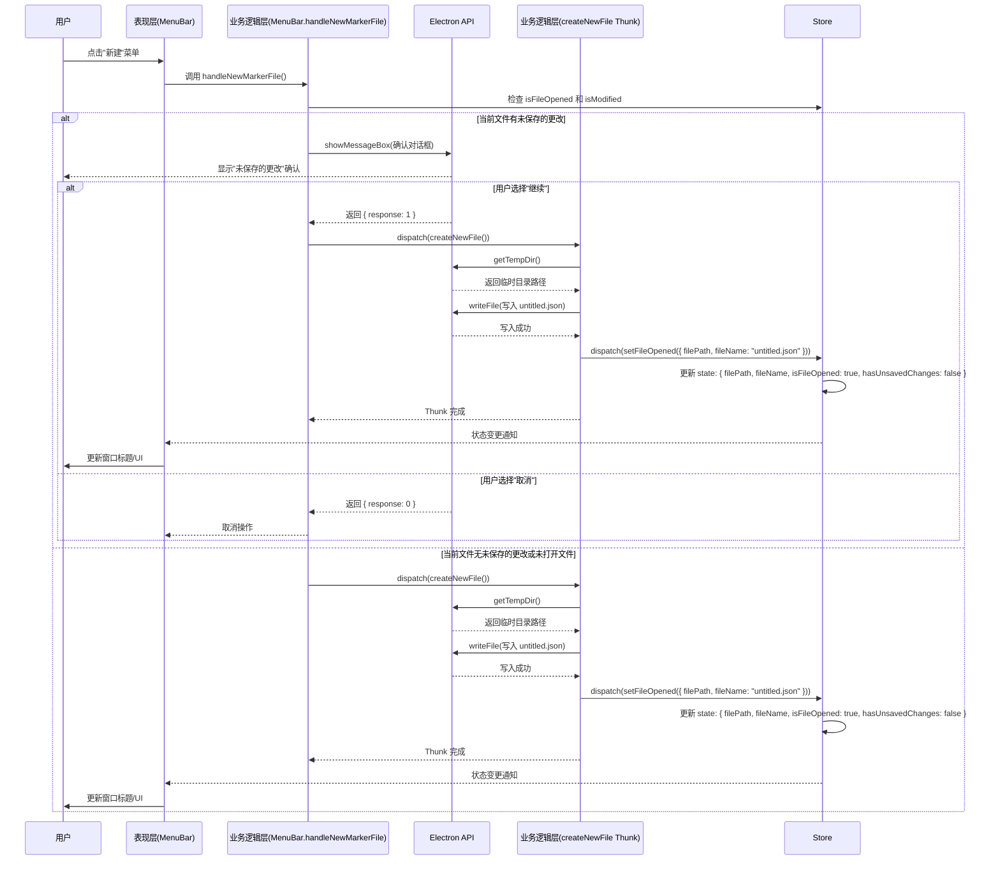
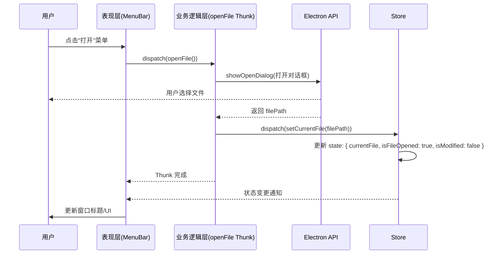
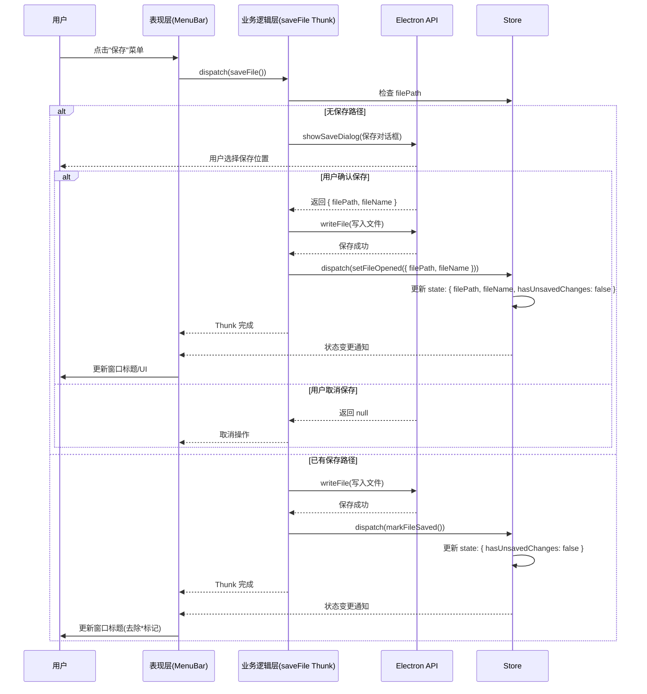
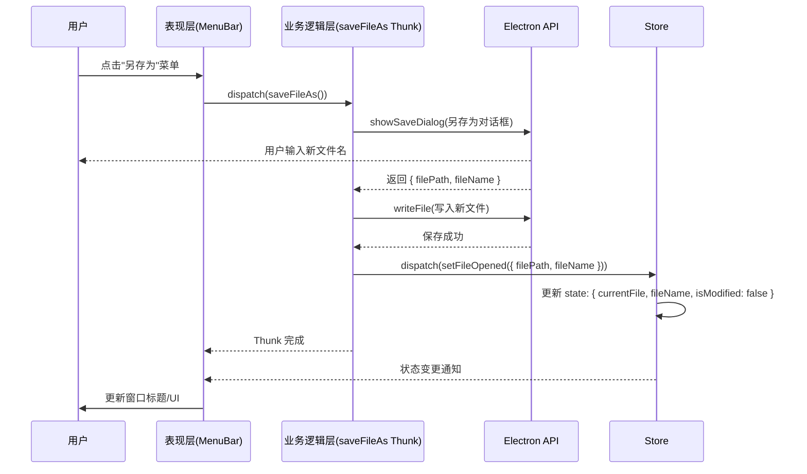

# 业务逻辑层设计

## 整体架构

业务逻辑层采用 Redux Toolkit 进行状态管理，实现状态的集中化管理和可预测性。整体架构分为以下几个核心 Slice：

```
src/store/
├── index.ts                    # Store 配置中心
├── middleware/                 # 中间件
│   └── historyMiddleware.ts    # 历史记录中间件
├── slices/                     # Redux Toolkit 切片
│   ├── commandSlice.ts         # 命令管理模块（替代 toolSlice）
│   ├── fileSlice.ts            # 文件管理模块
│   ├── imageSlice.ts           # 图片管理模块
│   ├── annotationSlice.ts      # 标注管理模块
│   ├── historySlice.ts         # 撤销/重做模块
│   ├── canvasSlice.ts          # 画布视图模块
│   └── styleSlice.ts           # 样式配置模块
├── selectors/                  # 组合选择器
└── serializers/                # 序列化器
    ├── markerFileSerializer.ts # 标记文件序列化器
    └── annotationSerializer.ts # 标注序列化器
```

### Slice 依赖关系

```
fileSlice ──┬── 控制 imageSlice 的可用性（未打开文件时禁用图片操作）
            └── 控制 annotationSlice 的可用性

imageSlice ──┬── 决定 annotationSlice 的操作范围（按 activeImageId 过滤）
             ├── 决定 historySlice 的操作范围
             └── 决定 canvasSlice 的操作范围

commandSlice ─── 影响画布交互模式（创建 vs 编辑），管理命令执行状态

annotationSlice ──┴── 变更触发 historySlice 快照记录

styleSlice ──────── 全局样式配置，影响所有标注的渲染
```

---

## Slice 设计文档

### 1. commandSlice — 命令管理模块

#### 1.1 Slice 概述

**职责**：管理当前激活的工具类型，支持工具切换和重置，同时管理所有 MenuBar 命令的执行状态。

**核心功能**：

- 保存当前激活的工具类型
- 提供工具切换的 Action
- 支持工具状态的查询
- 管理命令的执行状态
- 记录命令的禁用状态

**支持的命令**：

| 命令 ID                      | 说明               | 快捷键       |
| ---------------------------- | ------------------ | ------------ |
| `file-new`                   | 新建标记文件       |              |
| `file-open`                  | 打开标记文件       |              |
| `file-save`                  | 保存标记文件       | Ctrl+S       |
| `file-save-as`               | 另存为标记文件     | Ctrl+Shift+S |
| `file-add-image`             | 添加图片           |              |
| `file-remove-image`          | 删除图片           |              |
| `file-export-png`            | 导出 PNG           |              |
| `edit-undo`                  | 撤销操作           | Ctrl+Z       |
| `edit-redo`                  | 重做操作           | Ctrl+Y       |
| `edit-clear-all`             | 清除所有标注       |              |
| `edit-delete-selected`       | 删除选中标注       | Delete       |
| `tool-horizontal-line`       | 选择水平线段工具   |              |
| `tool-vertical-line`         | 选择垂直线段工具   |              |
| `tool-normal-protractor`     | 选择普通量角器工具 |              |
| `tool-horizontal-protractor` | 选择水平量角器工具 |              |
| `tool-vertical-protractor`   | 选择垂直量角器工具 |              |
| `image-zoom-in`              | 放大画布           | Ctrl++       |
| `image-zoom-out`             | 缩小画布           | Ctrl+-       |
| `image-fit-window`           | 适应窗口           | Ctrl+0       |
| `image-actual-size`          | 实际大小           | Ctrl+1       |
| `image-rotate`               | 顺时针旋转         | Ctrl+R       |
| `image-rotate-counter`       | 逆时针旋转         | Ctrl+Shift+R |
| `image-reset-rotation`       | 重置旋转           | Ctrl+Shift+0 |

#### 1.2 State 结构

```typescript
interface CommandState {
  activeTool: ToolType;
  executingCommand: CommandId | null;
  commands: Record<CommandId, boolean>;
}

export type ToolType =
  | 'none'
  | 'horizontal-line'
  | 'vertical-line'
  | 'normal-protractor'
  | 'horizontal-protractor'
  | 'vertical-protractor';

export type CommandId =
  | 'file-new'
  | 'file-open'
  | 'file-save'
  | 'file-save-as'
  | 'file-add-image'
  | 'file-remove-image'
  | 'file-export-png'
  | 'edit-undo'
  | 'edit-redo'
  | 'edit-clear-all'
  | 'edit-delete-selected'
  | 'tool-horizontal-line'
  | 'tool-vertical-line'
  | 'tool-normal-protractor'
  | 'tool-horizontal-protractor'
  | 'tool-vertical-protractor'
  | 'image-zoom-in'
  | 'image-zoom-out'
  | 'image-fit-window'
  | 'image-actual-size'
  | 'image-rotate'
  | 'image-rotate-counter'
  | 'image-reset-rotation'
  | 'help-dev-tools';

const initialState: CommandState = {
  activeTool: 'none',
  executingCommand: null,
  commands: {
    'file-new': false,
    'file-open': false,
    'file-save': false,
    'file-save-as': false,
    'file-add-image': false,
    'file-remove-image': false,
    'file-export-png': false,
    'edit-undo': false,
    'edit-redo': false,
    'edit-clear-all': false,
    'edit-delete-selected': false,
    'tool-horizontal-line': false,
    'tool-vertical-line': false,
    'tool-normal-protractor': false,
    'tool-horizontal-protractor': false,
    'tool-vertical-protractor': false,
    'image-zoom-in': false,
    'image-zoom-out': false,
    'image-fit-window': false,
    'image-actual-size': false,
    'image-rotate': false,
    'image-rotate-counter': false,
    'image-reset-rotation': false,
    'help-dev-tools': false,
  },
};
```

#### 1.3 Actions

| Action                   | Payload                                       | 说明                   |
| ------------------------ | --------------------------------------------- | ---------------------- |
| `setActiveTool`          | `toolType: ToolType`                          | 设置当前激活的工具     |
| `resetTool`              | 无                                            | 重置工具为无工具状态   |
| `executeCommand`         | `commandId: CommandId`                        | 开始执行命令           |
| `finishCommand`          | 无                                            | 结束命令执行           |
| `setCommandDisabled`     | `{ commandId: CommandId; disabled: boolean }` | 设置命令的禁用状态     |
| `setAllCommandsDisabled` | `disabled: boolean`                           | 设置所有命令的禁用状态 |

#### 1.4 Selectors

| Selector                     | 返回值                              | 说明                                          |
| ---------------------------- | ----------------------------------- | --------------------------------------------- |
| `selectActiveTool`           | `ToolType`                          | 获取当前激活的工具类型                        |
| `selectExecutingCommand`     | `CommandId  null`                   | 获取正在执行的命令                            |
| `selectCommandDisabled`      | `(commandId: CommandId) => boolean` | 检查指定命令是否禁用                          |
| `selectIsToolActive`         | `(toolType: ToolType) => boolean`   | 检查指定工具是否激活                          |
| `selectIsCreatingAnnotation` | `boolean`                           | 是否处于标注创建模式（activeTool !== 'none'） |

#### 1.5 Reducer 逻辑

```typescript
const commandSlice = createSlice({
  name: 'command',
  initialState,
  reducers: {
    setActiveTool: (state, action: PayloadAction<ToolType>) => {
      state.activeTool = action.payload;
    },
    resetTool: (state) => {
      state.activeTool = 'none';
    },
    executeCommand: (state, action: PayloadAction<CommandId>) => {
      state.executingCommand = action.payload;
    },
    finishCommand: (state) => {
      state.executingCommand = null;
    },
    setCommandDisabled: (
      state,
      action: PayloadAction<{ commandId: CommandId; disabled: boolean }>
    ) => {
      state.commands[action.payload.commandId] = action.payload.disabled;
    },
    setAllCommandsDisabled: (state, action: PayloadAction<boolean>) => {
      const keys = Object.keys(state.commands) as CommandId[];
      keys.forEach((key) => {
        state.commands[key] = action.payload;
      });
    },
  },
});
```

#### 1.6 使用示例

```typescript
// 组件中 dispatch 工具切换
dispatch(setActiveTool('horizontal-line'));

// 组件中执行命令
dispatch(executeCommand('file-save'));
dispatch(saveFile());
dispatch(finishCommand());

// 组件中订阅
const activeTool = useAppSelector(selectActiveTool);
const executingCommand = useAppSelector(selectExecutingCommand);
const isSaveDisabled = useAppSelector((state) => selectCommandDisabled('file-save')(state));
```

---

### 2. fileSlice — 文件管理模块

#### 2.1 Slice 概述

**职责**：管理标记文件的操作，包括新建、打开、保存、另存为等功能。是应用的文件系统入口，负责协调业务状态与持久化存储。

**核心功能**：

- 管理当前打开的标记文件路径和状态
- 支持标记文件的新建、打开、保存、另存为操作
- 与 Electron 主进程通信，完成文件对话框交互
- 控制其他 slice 的可用性（未打开文件时禁用相关操作）

#### 2.2 State 结构

| 字段                | 类型             | 说明                   |
| ------------------- | ---------------- | ---------------------- |
| `filePath`          | `string \| null` | 当前打开文件的绝对路径 |
| `fileName`          | `string`         | 当前文件名（不含路径） |
| `hasUnsavedChanges` | `boolean`        | 是否有未保存的更改     |

#### 2.3 Actions

##### 2.3.1 同步 Actions

| Action            | Payload                                  | 说明                    |
| ----------------- | ---------------------------------------- | ----------------------- |
| `setFileOpened`   | `{ filePath: string; fileName: string }` | 标记文件已打开/新建成功 |
| `setFileClosed`   | 无                                       | 关闭当前文件            |
| `markFileSaved`   | 无                                       | 标记文件已保存          |
| `markFileUnsaved` | 无                                       | 标记文件有未保存的更改  |

##### 2.3.2 异步 Thunks

| Thunk              | Payload           | 说明                             |
| ------------------ | ----------------- | -------------------------------- |
| `createNewFile`    | 无                | 新建空白标记文件                 |
| `openFile`         | 无                | 打开已存在的标记文件             |
| `saveFile`         | 无                | 保存当前文件（覆盖）             |
| `saveFileAs`       | 无                | 另存为新文件                     |
| `exportImageAsPng` | `imageId: string` | 将指定图片及其标注内容导出为 PNG |

##### 2.3.3 新建文件时序图



##### 2.3.4 打开文件时序图



##### 2.3.5 保存文件时序图



##### 2.3.6 另存为时序图



#### 2.4 Selectors

##### 2.4.1 基础 Selectors

| Selector                  | 返回值           | 说明               |
| ------------------------- | ---------------- | ------------------ |
| `selectFilePath`          | `string \| null` | 获取当前文件路径   |
| `selectFileName`          | `string`         | 获取当前文件名     |
| `selectIsFileOpened`      | `boolean`        | 文件是否已打开     |
| `selectHasUnsavedChanges` | `boolean`        | 是否有未保存的更改 |

##### 2.4.2 复杂 Selectors

| Selector                        | 输入 | 返回值    | 说明                                 |
| ------------------------------- | ---- | --------- | ------------------------------------ |
| `selectCanSave`                 | -    | `boolean` | 是否可以保存（已打开且有未保存更改） |
| `selectCanPerformFileOperation` | -    | `boolean` | 是否可以执行文件操作（文件已打开）   |

---

### 3. imageSlice — 图片管理模块

#### 3.1 Slice 概述

**职责**：管理多张图片的信息，支持图片的添加、切换和删除。

**核心功能**：

- 管理图片列表
- 管理当前激活的图片
- 支持图片的添加、删除和切换
- 保存图片的基本信息（路径、名称、尺寸等）

#### 3.2 State 结构

```typescript
interface ImageInfo {
  id: string;
  name: string;
  path: string;
  width: number;
  height: number;
  createdAt: string;
}

interface ImageState {
  images: Record<string, ImageInfo>;
  imageIds: string[];
  activeImageId: string | null;
}

const initialState: ImageState = {
  images: {},
  imageIds: [],
  activeImageId: null,
};
```

#### 3.3 Actions

| Action           | Payload                                            | 说明               |
| ---------------- | -------------------------------------------------- | ------------------ |
| `addImage`       | `ImageInfo`                                        | 添加新图片         |
| `removeImage`    | `imageId: string`                                  | 删除图片           |
| `setActiveImage` | `imageId: string`                                  | 设置当前激活的图片 |
| `updateImage`    | `{ imageId: string; updates: Partial<ImageInfo> }` | 更新图片信息       |

#### 3.4 Selectors

| Selector              | 返回值                                        | 说明                         |
| --------------------- | --------------------------------------------- | ---------------------------- |
| `selectImages`        | `ImageInfo[]`                                 | 获取所有图片列表             |
| `selectImageIds`      | `string[]`                                    | 获取图片 ID 列表（保持顺序） |
| `selectActiveImageId` | `string \| null`                              | 获取当前激活的图片 ID        |
| `selectActiveImage`   | `ImageInfo \| undefined`                      | 获取当前激活的图片信息       |
| `selectImageById`     | `(imageId: string) => ImageInfo \| undefined` | 根据 ID 获取图片信息         |
| `selectImageCount`    | `number`                                      | 获取图片总数                 |

#### 3.5 Reducer 逻辑

```typescript
const imageSlice = createSlice({
  name: 'image',
  initialState,
  reducers: {
    addImage: (state, action: PayloadAction<ImageInfo>) => {
      const image = action.payload;
      state.images[image.id] = image;
      state.imageIds.push(image.id);
      if (state.activeImageId === null) {
        state.activeImageId = image.id;
      }
    },
    removeImage: (state, action: PayloadAction<string>) => {
      const imageId = action.payload;
      delete state.images[imageId];
      state.imageIds = state.imageIds.filter((id) => id !== imageId);
      if (state.activeImageId === imageId) {
        state.activeImageId = state.imageIds[0] ?? null;
      }
    },
    setActiveImage: (state, action: PayloadAction<string>) => {
      if (state.images[action.payload]) {
        state.activeImageId = action.payload;
      }
    },
    updateImage: (
      state,
      action: PayloadAction<{ imageId: string; updates: Partial<ImageInfo> }>
    ) => {
      const { imageId, updates } = action.payload;
      if (state.images[imageId]) {
        state.images[imageId] = { ...state.images[imageId], ...updates };
      }
    },
  },
});
```

#### 3.6 使用示例

```typescript
// 添加图片
dispatch(
  addImage({
    id: 'image-1',
    name: 'example.jpg',
    path: '/path/to/image.jpg',
    width: 1920,
    height: 1080,
    createdAt: new Date().toISOString(),
  })
);

// 切换图片
dispatch(setActiveImage('image-2'));

// 删除图片
dispatch(removeImage('image-1'));

// 组件中订阅
const images = useAppSelector(selectImages);
const activeImage = useAppSelector(selectActiveImage);
```

---

### 4. annotationSlice — 标注管理模块

#### 4.1 Slice 概述

**职责**：管理所有图片的标注数据和选中状态，支持多种标注类型的创建、编辑、删除操作。

**核心功能**：

- 按图片 ID 组织标注数据
- 支持多种标注类型的创建
- 管理标注的选中状态
- 支持标注的编辑和删除
- 提供标注数据的查询
- 支持辅助线功能，显示标注间距离

**标注类型**：

| 标注类型   | 值                      | 说明                       |
| ---------- | ----------------------- | -------------------------- |
| 水平线段   | `horizontal-line`       | 标记水平位置，测量垂直比例 |
| 垂直线段   | `vertical-line`         | 标记垂直位置，测量水平比例 |
| 普通量角器 | `normal-protractor`     | 测量任意角度               |
| 水平量角器 | `horizontal-protractor` | 测量相对于水平线的角度     |
| 垂直量角器 | `vertical-protractor`   | 测量相对于垂直线的角度     |

#### 4.2 State 结构

```typescript
interface BaseAnnotation {
  id: string;
  type: AnnotationType;
  createdAt: string;
  updatedAt: string;
}

interface HorizontalLineAnnotation extends BaseAnnotation {
  type: 'horizontal-line';
  startX: number;
  startY: number;
  endX: number;
  endY: number;
}

interface VerticalLineAnnotation extends BaseAnnotation {
  type: 'vertical-line';
  startX: number;
  startY: number;
  endX: number;
  endY: number;
}

interface NormalProtractorAnnotation extends BaseAnnotation {
  type: 'normal-protractor';
  vertexX: number;
  vertexY: number;
  startX: number;
  startY: number;
  endX: number;
  endY: number;
  angle: number;
}

interface HorizontalProtractorAnnotation extends BaseAnnotation {
  type: 'horizontal-protractor';
  vertexX: number;
  vertexY: number;
  startX: number;
  startY: number;
  endX: number;
  endY: number;
  angle: number;
}

interface VerticalProtractorAnnotation extends BaseAnnotation {
  type: 'vertical-protractor';
  vertexX: number;
  vertexY: number;
  startX: number;
  startY: number;
  endX: number;
  endY: number;
  angle: number;
}

type Annotation =
  | HorizontalLineAnnotation
  | VerticalLineAnnotation
  | NormalProtractorAnnotation
  | HorizontalProtractorAnnotation
  | VerticalProtractorAnnotation;

type AnnotationType = Annotation['type'];

interface AnnotationState {
  annotations: Record<string, Record<string, Annotation>>;
  selectedAnnotationId: string | null;
}

const initialState: AnnotationState = {
  annotations: {},
  selectedAnnotationId: null,
};
```

#### 4.3 Actions

| Action                     | Payload                                                                   | 说明                   |
| -------------------------- | ------------------------------------------------------------------------- | ---------------------- |
| `addAnnotation`            | `{ imageId: string; annotation: Annotation }`                             | 添加标注               |
| `updateAnnotation`         | `{ imageId: string; annotationId: string; updates: Partial<Annotation> }` | 更新标注               |
| `deleteAnnotation`         | `{ imageId: string; annotationId: string }`                               | 删除标注               |
| `deleteSelectedAnnotation` | `imageId: string`                                                         | 删除选中的标注         |
| `clearAllAnnotations`      | `imageId: string`                                                         | 清除指定图片的所有标注 |
| `selectAnnotation`         | `{ imageId: string; annotationId: string }`                               | 选中标注               |
| `deselectAnnotation`       | 无                                                                        | 取消选中标注           |

#### 4.4 Selectors

| Selector                      | 返回值                                                               | 说明                   |
| ----------------------------- | -------------------------------------------------------------------- | ---------------------- |
| `selectAnnotations`           | `(imageId: string) => Record<string, Annotation>`                    | 获取指定图片的所有标注 |
| `selectAnnotationById`        | `(imageId: string, annotationId: string) => Annotation \| undefined` | 根据 ID 获取标注       |
| `selectSelectedAnnotationId`  | `string \| null`                                                     | 获取选中的标注 ID      |
| `selectSelectedAnnotation`    | `(imageId: string) => Annotation \| undefined`                       | 获取选中的标注         |
| `selectAnnotationsByType`     | `(imageId: string, type: AnnotationType) => Annotation[]`            | 按类型获取标注列表     |
| `selectHasAnnotations`        | `(imageId: string) => boolean`                                       | 检查是否有标注         |
| `selectHasSelectedAnnotation` | `boolean`                                                            | 检查是否有选中的标注   |

#### 4.5 Reducer 逻辑

```typescript
const annotationSlice = createSlice({
  name: 'annotation',
  initialState,
  reducers: {
    addAnnotation: (state, action: PayloadAction<{ imageId: string; annotation: Annotation }>) => {
      const { imageId, annotation } = action.payload;
      if (!state.annotations[imageId]) {
        state.annotations[imageId] = {};
      }
      state.annotations[imageId][annotation.id] = annotation;
    },
    updateAnnotation: (
      state,
      action: PayloadAction<{ imageId: string; annotationId: string; updates: Partial<Annotation> }>
    ) => {
      const { imageId, annotationId, updates } = action.payload;
      if (state.annotations[imageId]?.[annotationId]) {
        state.annotations[imageId][annotationId] = {
          ...state.annotations[imageId][annotationId],
          ...updates,
          updatedAt: new Date().toISOString(),
        };
      }
    },
    deleteAnnotation: (state, action: PayloadAction<{ imageId: string; annotationId: string }>) => {
      const { imageId, annotationId } = action.payload;
      if (state.annotations[imageId]) {
        delete state.annotations[imageId][annotationId];
        if (state.selectedAnnotationId === annotationId) {
          state.selectedAnnotationId = null;
        }
      }
    },
    deleteSelectedAnnotation: (state, action: PayloadAction<string>) => {
      const imageId = action.payload;
      if (state.selectedAnnotationId && state.annotations[imageId]) {
        delete state.annotations[imageId][state.selectedAnnotationId];
        state.selectedAnnotationId = null;
      }
    },
    clearAllAnnotations: (state, action: PayloadAction<string>) => {
      const imageId = action.payload;
      state.annotations[imageId] = {};
      state.selectedAnnotationId = null;
    },
    selectAnnotation: (state, action: PayloadAction<{ imageId: string; annotationId: string }>) => {
      state.selectedAnnotationId = action.payload.annotationId;
    },
    deselectAnnotation: (state) => {
      state.selectedAnnotationId = null;
    },
  },
});
```

#### 4.6 标注创建流程

**重要**：标注创建过程中的临时状态（如鼠标移动预览）**不放入 Redux**，由 `AnnotationCreationSession` 类管理。

创建流程：

1. 用户选择工具 → dispatch `setActiveTool`
2. PixiCanvas 创建 `AnnotationCreationSession` 实例
3. Session 内部维护临时状态（步骤、点位等）
4. Session 通过回调通知 PixiCanvas 更新预览图形
5. 创建完成 → Session dispatch `addAnnotation` 到 Redux
6. 创建完成/取消 → Session dispatch `resetTool`

#### 4.7 使用示例

```typescript
// 添加标注
dispatch(
  addAnnotation({
    imageId: 'image-1',
    annotation: {
      id: 'annotation-1',
      type: 'horizontal-line',
      startX: 100,
      startY: 200,
      endX: 300,
      endY: 200,
      createdAt: new Date().toISOString(),
      updatedAt: new Date().toISOString(),
    },
  })
);

// 选中标注
dispatch(selectAnnotation({ imageId: 'image-1', annotationId: 'annotation-1' }));

// 删除选中标注
dispatch(deleteSelectedAnnotation('image-1'));

// 组件中订阅
const annotations = useAppSelector((state) => selectAnnotations('image-1')(state));
const selectedId = useAppSelector(selectSelectedAnnotationId);
```

---

### 5. historySlice — 撤销/重做模块

#### 5.1 Slice 概述

**职责**：实现撤销/重做功能，管理操作历史记录，支持多图片的历史管理。

**核心功能**：

- 按图片 ID 组织历史记录
- 记录标注操作的历史
- 支持撤销上一步操作
- 支持重做已撤销的操作
- 管理历史记录的大小限制（最多保存 20 次操作）

**设计原理**：

- 为每张图片维护独立的历史栈
- 使用两个栈（past 和 future）实现撤销/重做
- past 栈：保存已执行的操作，支持撤销
- future 栈：保存已撤销的操作，支持重做
- 每个历史条目是某时刻的标注状态快照

#### 5.2 State 结构

```typescript
interface HistoryEntry {
  annotations: Record<string, Annotation>;
}

interface ImageHistory {
  past: HistoryEntry[];
  future: HistoryEntry[];
}

interface HistoryState {
  histories: Record<string, ImageHistory>;
  maxHistorySize: number;
}

const initialState: HistoryState = {
  histories: {},
  maxHistorySize: 20,
};
```

#### 5.3 Actions

| Action         | Payload                                    | 说明                         |
| -------------- | ------------------------------------------ | ---------------------------- |
| `pushHistory`  | `{ imageId: string; entry: HistoryEntry }` | 推送新的历史条目             |
| `undo`         | `imageId: string`                          | 撤销指定图片的上一步操作     |
| `redo`         | `imageId: string`                          | 重做指定图片的上一步撤销操作 |
| `clearHistory` | `imageId: string`                          | 清除指定图片的历史记录       |

#### 5.4 Selectors

| Selector              | 返回值                         | 说明             |
| --------------------- | ------------------------------ | ---------------- |
| `selectCanUndo`       | `(imageId: string) => boolean` | 检查是否可以撤销 |
| `selectCanRedo`       | `(imageId: string) => boolean` | 检查是否可以重做 |
| `selectHistoryLength` | `(imageId: string) => number`  | 获取历史长度     |

#### 5.5 Reducer 逻辑

```typescript
const historySlice = createSlice({
  name: 'history',
  initialState,
  reducers: {
    pushHistory: (state, action: PayloadAction<{ imageId: string; entry: HistoryEntry }>) => {
      const { imageId, entry } = action.payload;
      if (!state.histories[imageId]) {
        state.histories[imageId] = { past: [], future: [] };
      }
      const history = state.histories[imageId];
      history.past.push(entry);
      if (history.past.length > state.maxHistorySize) {
        history.past.shift();
      }
      history.future = [];
    },
    undo: (state, action: PayloadAction<string>) => {
      const imageId = action.payload;
      const history = state.histories[imageId];
      if (history && history.past.length > 0) {
        const current = history.past.pop();
        if (current) {
          history.future.push(current);
        }
      }
    },
    redo: (state, action: PayloadAction<string>) => {
      const imageId = action.payload;
      const history = state.histories[imageId];
      if (history && history.future.length > 0) {
        const entry = history.future.pop();
        if (entry) {
          history.past.push(entry);
        }
      }
    },
    clearHistory: (state, action: PayloadAction<string>) => {
      const imageId = action.payload;
      state.histories[imageId] = { past: [], future: [] };
    },
  },
});
```

#### 5.6 历史记录中间件

标注操作需要自动记录历史，通过中间件实现：

```typescript
const historyMiddleware: Middleware = (store) => (next) => (action) => {
  const result = next(action);

  const historyActions = [
    'annotation/addAnnotation',
    'annotation/updateAnnotation',
    'annotation/deleteAnnotation',
    'annotation/clearAllAnnotations',
  ];

  if (historyActions.includes(action.type)) {
    const state = store.getState();
    const imageId = action.payload?.imageId;
    if (imageId) {
      const annotations = state.annotation.annotations[imageId] || {};
      store.dispatch(
        pushHistory({ imageId, entry: { annotations: JSON.parse(JSON.stringify(annotations)) } })
      );
    }
  }

  return result;
};
```

#### 5.7 使用示例

```typescript
// 撤销
dispatch(undo('image-1'));

// 重做
dispatch(redo('image-1'));

// 组件中订阅
const canUndo = useAppSelector((state) => selectCanUndo('image-1')(state));
const canRedo = useAppSelector((state) => selectCanRedo('image-1')(state));
```

---

### 6. canvasSlice — 画布视图模块

#### 6.1 Slice 概述

**职责**：管理画布的视图状态，包括缩放、旋转等，支持多图片的视图状态管理。

**核心功能**：

- 按图片 ID 组织画布状态
- 管理画布的缩放比例（范围：10% - 800%）
- 管理画布的旋转角度（范围：-180° - 180°）
- 提供缩放控制 Action
- 管理辅助线显示状态

#### 6.2 State 结构

```typescript
interface CanvasState {
  zoom: number;
  rotation: number;
  showAuxiliaryLines: boolean;
}

interface CanvasSliceState {
  canvasStates: Record<string, CanvasState>;
}

const MIN_ZOOM = 10;
const MAX_ZOOM = 800;
const MIN_ROTATION = -180;
const MAX_ROTATION = 180;
const ZOOM_STEP = 10;
const ROTATION_STEP = 90;

const defaultCanvasState: CanvasState = {
  zoom: 100,
  rotation: 0,
  showAuxiliaryLines: false,
};

const initialState: CanvasSliceState = {
  canvasStates: {},
};
```

#### 6.3 Actions

| Action                   | Payload                              | 说明               |
| ------------------------ | ------------------------------------ | ------------------ |
| `zoomIn`                 | `imageId: string`                    | 放大画布           |
| `zoomOut`                | `imageId: string`                    | 缩小画布           |
| `setZoom`                | `{ imageId: string; zoom: number }`  | 设置缩放比例       |
| `fitWindow`              | `imageId: string`                    | 适应窗口           |
| `actualSize`             | `imageId: string`                    | 实际大小（100%）   |
| `rotateClockwise`        | `imageId: string`                    | 顺时针旋转         |
| `rotateCounterClockwise` | `imageId: string`                    | 逆时针旋转         |
| `resetRotation`          | `imageId: string`                    | 重置旋转           |
| `toggleAuxiliaryLines`   | `imageId: string`                    | 切换辅助线显示     |
| `setAuxiliaryLines`      | `{ imageId: string; show: boolean }` | 设置辅助线显示状态 |

#### 6.4 Selectors

| Selector                   | 返回值                             | 说明                   |
| -------------------------- | ---------------------------------- | ---------------------- |
| `selectCanvasState`        | `(imageId: string) => CanvasState` | 获取指定图片的画布状态 |
| `selectZoom`               | `(imageId: string) => number`      | 获取缩放比例           |
| `selectRotation`           | `(imageId: string) => number`      | 获取旋转角度           |
| `selectShowAuxiliaryLines` | `(imageId: string) => boolean`     | 是否显示辅助线         |
| `selectCanZoomIn`          | `(imageId: string) => boolean`     | 是否可以放大           |
| `selectCanZoomOut`         | `(imageId: string) => boolean`     | 是否可以缩小           |

#### 6.5 Reducer 逻辑

```typescript
const canvasSlice = createSlice({
  name: 'canvas',
  initialState,
  reducers: {
    zoomIn: (state, action: PayloadAction<string>) => {
      const imageId = action.payload;
      const canvasState = state.canvasStates[imageId] ?? { ...defaultCanvasState };
      canvasState.zoom = Math.min(canvasState.zoom + ZOOM_STEP, MAX_ZOOM);
      state.canvasStates[imageId] = canvasState;
    },
    zoomOut: (state, action: PayloadAction<string>) => {
      const imageId = action.payload;
      const canvasState = state.canvasStates[imageId] ?? { ...defaultCanvasState };
      canvasState.zoom = Math.max(canvasState.zoom - ZOOM_STEP, MIN_ZOOM);
      state.canvasStates[imageId] = canvasState;
    },
    setZoom: (state, action: PayloadAction<{ imageId: string; zoom: number }>) => {
      const { imageId, zoom } = action.payload;
      const canvasState = state.canvasStates[imageId] ?? { ...defaultCanvasState };
      canvasState.zoom = Math.max(MIN_ZOOM, Math.min(MAX_ZOOM, zoom));
      state.canvasStates[imageId] = canvasState;
    },
    fitWindow: (state, action: PayloadAction<string>) => {
      const imageId = action.payload;
      const canvasState = state.canvasStates[imageId] ?? { ...defaultCanvasState };
      canvasState.zoom = 100;
      state.canvasStates[imageId] = canvasState;
    },
    actualSize: (state, action: PayloadAction<string>) => {
      const imageId = action.payload;
      const canvasState = state.canvasStates[imageId] ?? { ...defaultCanvasState };
      canvasState.zoom = 100;
      state.canvasStates[imageId] = canvasState;
    },
    rotateClockwise: (state, action: PayloadAction<string>) => {
      const imageId = action.payload;
      const canvasState = state.canvasStates[imageId] ?? { ...defaultCanvasState };
      canvasState.rotation =
        ((canvasState.rotation + ROTATION_STEP + MAX_ROTATION) % (MAX_ROTATION * 2)) - MAX_ROTATION;
      state.canvasStates[imageId] = canvasState;
    },
    rotateCounterClockwise: (state, action: PayloadAction<string>) => {
      const imageId = action.payload;
      const canvasState = state.canvasStates[imageId] ?? { ...defaultCanvasState };
      canvasState.rotation =
        ((canvasState.rotation - ROTATION_STEP + MAX_ROTATION) % (MAX_ROTATION * 2)) - MAX_ROTATION;
      state.canvasStates[imageId] = canvasState;
    },
    resetRotation: (state, action: PayloadAction<string>) => {
      const imageId = action.payload;
      const canvasState = state.canvasStates[imageId] ?? { ...defaultCanvasState };
      canvasState.rotation = 0;
      state.canvasStates[imageId] = canvasState;
    },
    toggleAuxiliaryLines: (state, action: PayloadAction<string>) => {
      const imageId = action.payload;
      const canvasState = state.canvasStates[imageId] ?? { ...defaultCanvasState };
      canvasState.showAuxiliaryLines = !canvasState.showAuxiliaryLines;
      state.canvasStates[imageId] = canvasState;
    },
    setAuxiliaryLines: (state, action: PayloadAction<{ imageId: string; show: boolean }>) => {
      const { imageId, show } = action.payload;
      const canvasState = state.canvasStates[imageId] ?? { ...defaultCanvasState };
      canvasState.showAuxiliaryLines = show;
      state.canvasStates[imageId] = canvasState;
    },
  },
});
```

#### 6.6 使用示例

```typescript
// 放大画布
dispatch(zoomIn('image-1'));

// 设置旋转
dispatch(rotateClockwise('image-1'));

// 切换辅助线
dispatch(toggleAuxiliaryLines('image-1'));

// 组件中订阅
const zoom = useAppSelector((state) => selectZoom('image-1')(state));
const rotation = useAppSelector((state) => selectRotation('image-1')(state));
```

---

### 7. styleSlice — 样式配置模块

#### 7.1 Slice 概述

**职责**：管理标注的样式设置，支持修改线条颜色、线条宽度、标注文字字体、文字大小和文字颜色。

**核心功能**：

- 管理全局样式设置
- 支持样式的修改和重置
- 提供样式查询接口

#### 7.2 State 结构

```typescript
interface StyleState {
  lineColor: string;
  lineWidth: number;
  fontColor: string;
  fontSize: number;
  fontFamily: string;
}

const defaultStyle: StyleState = {
  lineColor: '#ff0000',
  lineWidth: 2,
  fontColor: '#ffffff',
  fontSize: 14,
  fontFamily: 'Arial, sans-serif',
};

const initialState: StyleState = { ...defaultStyle };
```

#### 7.3 Actions

| Action          | Payload          | 说明             |
| --------------- | ---------------- | ---------------- |
| `setLineColor`  | `color: string`  | 设置线条颜色     |
| `setLineWidth`  | `width: number`  | 设置线条宽度     |
| `setFontColor`  | `color: string`  | 设置标注文字颜色 |
| `setFontSize`   | `size: number`   | 设置标注文字大小 |
| `setFontFamily` | `family: string` | 设置标注文字字体 |
| `resetStyle`    | 无               | 重置样式为默认值 |

#### 7.4 Selectors

| Selector           | 返回值       | 说明         |
| ------------------ | ------------ | ------------ |
| `selectStyle`      | `StyleState` | 获取当前样式 |
| `selectLineColor`  | `string`     | 获取线条颜色 |
| `selectLineWidth`  | `number`     | 获取线条宽度 |
| `selectFontColor`  | `string`     | 获取文字颜色 |
| `selectFontSize`   | `number`     | 获取文字大小 |
| `selectFontFamily` | `string`     | 获取文字字体 |

#### 7.5 Reducer 逻辑

```typescript
const styleSlice = createSlice({
  name: 'style',
  initialState,
  reducers: {
    setLineColor: (state, action: PayloadAction<string>) => {
      state.lineColor = action.payload;
    },
    setLineWidth: (state, action: PayloadAction<number>) => {
      state.lineWidth = Math.max(1, action.payload);
    },
    setFontColor: (state, action: PayloadAction<string>) => {
      state.fontColor = action.payload;
    },
    setFontSize: (state, action: PayloadAction<number>) => {
      state.fontSize = Math.max(8, Math.min(72, action.payload));
    },
    setFontFamily: (state, action: PayloadAction<string>) => {
      state.fontFamily = action.payload;
    },
    resetStyle: (state) => {
      state.lineColor = defaultStyle.lineColor;
      state.lineWidth = defaultStyle.lineWidth;
      state.fontColor = defaultStyle.fontColor;
      state.fontSize = defaultStyle.fontSize;
      state.fontFamily = defaultStyle.fontFamily;
    },
  },
});
```

#### 7.6 使用示例

```typescript
// 设置线条颜色
dispatch(setLineColor('#00ff00'));

// 设置文字大小
dispatch(setFontSize(16));

// 重置样式
dispatch(resetStyle());

// 组件中订阅
const style = useAppSelector(selectStyle);
const lineColor = useAppSelector(selectLineColor);
```

---

## Store 配置

### Store 创建

```typescript
import { configureStore } from '@reduxjs/toolkit';
import { commandSlice } from './slices/commandSlice';
import { fileSlice } from './slices/fileSlice';
import { imageSlice } from './slices/imageSlice';
import { annotationSlice } from './slices/annotationSlice';
import { historySlice } from './slices/historySlice';
import { canvasSlice } from './slices/canvasSlice';
import { styleSlice } from './slices/styleSlice';
import { historyMiddleware } from './middleware/historyMiddleware';

export const store = configureStore({
  reducer: {
    command: commandSlice.reducer,
    file: fileSlice.reducer,
    image: imageSlice.reducer,
    annotation: annotationSlice.reducer,
    history: historySlice.reducer,
    canvas: canvasSlice.reducer,
    style: styleSlice.reducer,
  },
  middleware: (getDefaultMiddleware) => getDefaultMiddleware().concat(historyMiddleware),
});

export type RootState = ReturnType<typeof store.getState>;
export type AppDispatch = typeof store.dispatch;
```

### RootState 类型

```typescript
interface RootState {
  command: CommandState;
  file: FileState;
  image: ImageState;
  annotation: AnnotationState;
  history: HistoryState;
  canvas: CanvasSliceState;
  style: StyleState;
}
```

---

## 序列化模块 (Serialization Module)

**职责**：负责标记文件和标注数据的序列化与反序列化操作，将业务数据转换为可存储的格式。

**核心功能**：

- 将标记文件对象序列化为 JSON 字符串
- 将 JSON 字符串反序列化为标记文件对象
- 将标注对象序列化为 JSON 格式
- 将 JSON 格式反序列化为标注对象
