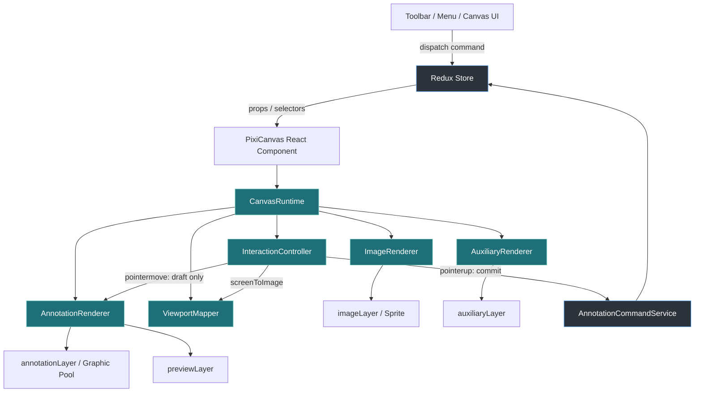
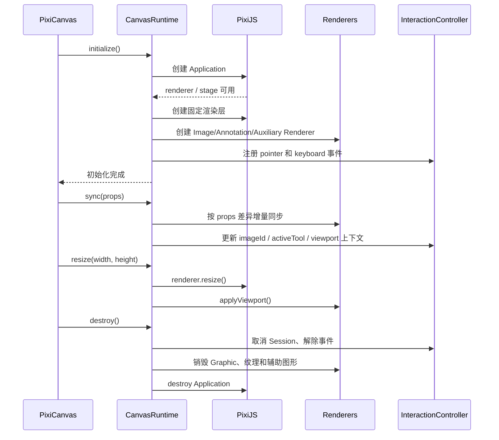
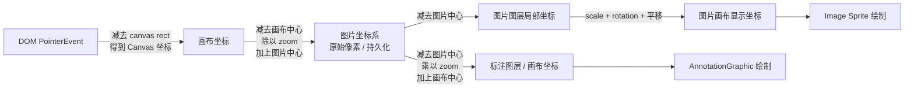
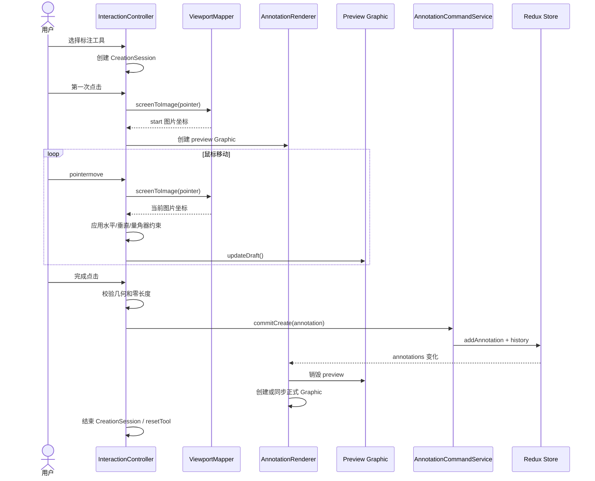
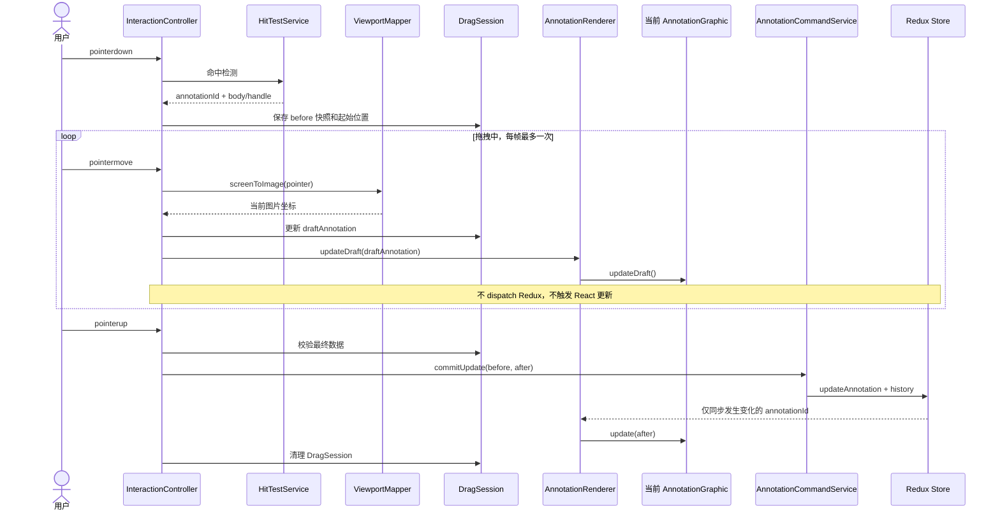
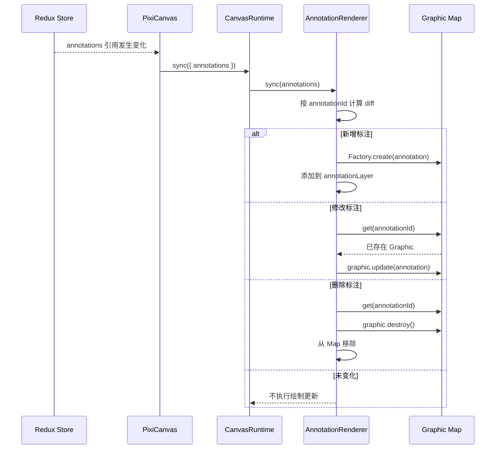

# PixiCanvas 画布设计

## 1. 设计目标

PixiCanvas 是应用的核心渲染与交互组件，负责图片显示、标注显示、标注创建和标注编辑。本设计以需求文档为基准，采用 **PixiJS 常驻对象 + 本地临时交互状态 + Redux 最终提交** 的模式，避免拖拽过程中频繁更新 Redux 和全量重建画布。

核心目标：

- 图片、标注、辅助线和预览图形分层渲染；
- 标注数据统一保存为原始图片坐标；
- 拖拽过程中只更新当前标注 Graphic；
- 拖拽完成后一次性提交 Redux 和历史记录；
- Redux 外部数据变化时按标注 ID 增量同步 Pixi；
- 图片缩放、旋转时保留 Graphic 实例，只重新应用视口变换；
- 创建、选择、拖拽、删除、辅助线和撤销重做职责清晰；
- React 组件不参与高频鼠标移动渲染。

## 2. 关键设计决策

### 2.1 状态职责

```text
Redux
  └── 保存最终业务状态、选择状态、工具状态和历史状态

Canvas Runtime
  └── 保存 Pixi 对象、对象池、视口和事件绑定

Interaction Controller
  └── 保存创建/拖拽期间的本地临时状态

Annotation Graphic
  └── 保存单个标注的视觉对象和当前显示状态
```

拖拽过程中的临时坐标不写入 Redux；只有操作完成、取消或发生错误时，才将临时状态提交或丢弃。

### 2.2 图片旋转语义

需求要求图片旋转时标注不跟随旋转、始终保持屏幕方向。本设计将图片旋转定义为**图片显示层的视图变换**：

- 图片 Sprite 使用缩放和旋转；
- 标注层不继承图片旋转；
- 标注位置使用图片中心、缩放比例和图片坐标计算，但不应用图片 rotation；
- 标注线条、控制点和文字始终保持屏幕方向和固定屏幕像素尺寸。

因此，旋转图片后标注可能不再覆盖图片旋转后的原始特征，这是需求语义的直接结果。若未来要求标注始终锚定图片特征，应将旋转纳入标注坐标变换，并重新定义“标注不跟随旋转”的产品语义。

### 2.3 量角器点位语义

需求文档中的“顶点1、顶点2、顶点3”存在歧义。本设计统一采用标准三点量角器模型：

```text
start —— vertex —— end
```

- 第一次点击确定 `start`；
- 第二次点击确定真正的角度顶点 `vertex`；
- 第三次点击确定 `end`；
- 角度为 `start -> vertex -> end` 的顺时针角度。

如果产品最终要求第一次点击就是角度顶点，应在数据模型和创建流程中整体调整，不允许继续复用相反语义的字段。

## 3. 整体架构

### 3.1 React 与 Pixi 的边界

`PixiCanvas` 只负责 React 生命周期和运行时装配，不负责具体绘图和高频交互。

```text
PixiCanvas (React.Component)
└── CanvasRuntime
    ├── ImageRenderer
    ├── AnnotationRenderer
    ├── AuxiliaryRenderer
    ├── InteractionController
    └── ViewportMapper
```

`PixiCanvas` 的职责：

- 创建画布容器和 ResizeObserver；
- 初始化和销毁 `CanvasRuntime`；
- 对 props 做引用比较；
- 将图片、标注、选择、工具和画布状态分发给对应模块；
- 不在 `componentDidUpdate` 中执行全量 `stage.removeChildren()`；
- 不使用 React state 保存 pointermove 的临时坐标。

### 3.2 Pixi 渲染树

```text
app.stage
├── backgroundLayer
├── imageLayer
│   └── imageSprite
└── annotationStage
    ├── annotationLayer
    │   └── AnnotationGraphic.container ...
    ├── previewLayer
    │   └── 当前创建过程的临时 Graphic
    └── auxiliaryLayer
        └── 距离线、距离文字和辅助标记
```

`imageLayer` 和 `annotationStage` 是兄弟节点。标注不作为 Sprite 的子节点，避免自动继承图片变换。

### 3.3 推荐目录结构

```text
src/components/PixiCanvas/
├── PixiCanvas.tsx
├── runtime/
│   ├── CanvasRuntime.ts              # Pixi 应用和层级装配
│   └── CanvasLayers.ts               # 固定渲染层创建与销毁
├── renderers/
│   ├── ImageRenderer.ts              # 图片纹理、Sprite 和图片视图变换
│   ├── AnnotationRenderer.ts         # Graphic 对象池和增量同步
│   └── AuxiliaryRenderer.ts          # 辅助线和距离信息
├── graphics/
│   ├── AnnotationGraphic.ts          # 标注 Graphic 抽象基类
│   ├── AnnotationGraphicFactory.ts
│   ├── LineGraphic.ts                # 水平线、垂直线的共用实现
│   └── ProtractorGraphic.ts          # 三种量角器共用实现
├── interaction/
│   ├── InteractionController.ts      # 事件入口和交互状态机
│   ├── CreationSession.ts            # 标注创建临时状态
│   ├── DragSession.ts                # 标注拖拽临时状态
│   ├── HitTestService.ts             # 命中测试和控制点识别
│   └── InteractionTypes.ts
├── model/
│   ├── annotationTypes.ts            # 标注和样式类型
│   └── viewportTypes.ts              # 视口和坐标类型
└── utils/
    ├── coordinateMapper.ts           # 图片坐标和屏幕坐标转换
    ├── geometry.ts                   # 线段、平移、约束等几何计算
    └── angle.ts                      # 角度计算和归一化
```

本设计删除原先过度耦合的 `ImageLayerManager`、`AnnotationLayerManager` 和 `InteractionManager` 命名，改用职责更明确的 `Renderer`、`Controller` 和 `Session`：

- `Renderer` 只负责 Pixi 显示对象；
- `Controller` 只负责输入事件和交互流程；
- `Session` 只负责一次创建或拖拽操作的临时状态；
- `CanvasRuntime` 负责运行时装配，不承载具体业务规则。

### 3.4 核心流程图和时序图

#### 3.4.1 模块关系与数据流



关键约束：

- `pointermove` 不进入 Redux；
- `pointermove` 只经过 `InteractionController → AnnotationRenderer → 当前 Graphic`；
- `pointerup` 才通过 `AnnotationCommandService` 写入 Redux 和历史；
- Redux 变化只触发增量同步，不触发整棵 Pixi 渲染树重建。

#### 3.4.2 Pixi 运行时生命周期



#### 3.4.3 坐标转换流程



当前设计中：

- 图片显示路径包含 `rotation`；
- 标注显示路径不包含 `rotation`；
- 指针坐标反算走标注显示路径的逆变换；
- `devicePixelRatio` 不参与逻辑坐标换算。

#### 3.4.4 标注创建时序



#### 3.4.5 标注拖拽时序



#### 3.4.6 Redux 到 Pixi 的增量同步



## 4. CanvasRuntime 与生命周期

### 4.1 CanvasRuntime

`CanvasRuntime` 是 Pixi 运行时的唯一组装入口，持有以下对象：

```typescript
class CanvasRuntime {
  readonly app: Application;
  readonly layers: CanvasLayers;
  readonly viewportMapper: ViewportMapper;
  readonly imageRenderer: ImageRenderer;
  readonly annotationRenderer: AnnotationRenderer;
  readonly auxiliaryRenderer: AuxiliaryRenderer;
  readonly interactionController: InteractionController;

  initialize(): Promise<void>;
  sync(props: CanvasRuntimeProps): void;
  resize(width: number, height: number): void;
  destroy(): void;
}
```

`CanvasRuntime.sync()` 只做增量分发：

```text
图片引用变化
  → ImageRenderer.load()

zoom、rotation 或画布尺寸变化
  → 更新 ViewportMapper
  → ImageRenderer.applyViewport()
  → AnnotationRenderer.applyViewport()
  → AuxiliaryRenderer.applyViewport()

annotations 引用变化
  → AnnotationRenderer.sync()

selectedAnnotations 引用变化
  → AnnotationRenderer.updateSelection()
  → AuxiliaryRenderer.update()

activeTool 或 imageId 变化
  → InteractionController.setContext()
```

严禁在 `sync()` 中调用 `app.stage.removeChildren()`。只有运行时销毁时才统一销毁 Pixi 层。

### 4.2 ImageRenderer

职责：

- 加载和缓存当前图片纹理；
- 创建单个常驻 Sprite；
- 以图片中心为锚点；
- 应用 zoom 和 rotation；
- 计算 fit window 和 actual size；
- 图片切换时取消旧的异步加载结果；
- 图片加载失败时通知 CanvasRuntime 显示错误状态。

图片缩放采用：

```text
scale = zoom / 100
```

不允许额外使用固定的 `0.5` 缩放因子。图片不支持平移，因此视口中心始终为画布中心。

### 4.3 AnnotationRenderer

职责：

- 维护 `Map<annotationId, AnnotationGraphic>`；
- 对 Redux 标注数组做新增、更新、删除 diff；
- 维护标注 Graphic 的常驻实例；
- 处理选中状态的视觉更新；
- 在视口变化时通知所有 Graphic 重新计算显示位置；
- 为 InteractionController 提供 Graphic 查询；
- 管理确认标注层和创建预览层。

核心原则：

```text
标注数据变化
  → 只更新发生变化的 Graphic

拖拽中的临时变化
  → 只更新当前 Graphic
  → 不触发 Redux

视口变化
  → 保留所有 Graphic
  → 重新应用视口变换
```

### 4.4 AuxiliaryRenderer

职责：

- 根据当前选中标注和 hover 标注计算同类标注间距离；
- 绘制距离辅助线和距离文字；
- 支持显示单组距离或全部同类标注距离；
- 显示/隐藏辅助线；
- 不修改标注数据；
- 不将辅助线写入标记文件；
- 不将 hover 和辅助线状态写入历史记录。

辅助线是标注数据的派生视觉结果，不应进入 `annotationSlice`。

## 5. PixiCanvas Props 与生命周期

### 5.1 Props

```typescript
interface PixiCanvasProps {
  imageId: string;
  activeImage?: ImageInfo;
  annotations: Annotation[];
  selectedAnnotationIds: string[];
  activeTool: ToolType;
  zoom: number;
  rotation: number;
  showAuxiliaryLines: boolean;
  dispatch: AppDispatch;
}
```

### 5.2 生命周期

```text
componentDidMount
  → 创建 CanvasRuntime
  → 初始化 Pixi Application
  → 创建固定渲染层
  → 注册 ResizeObserver 和输入事件
  → 执行首次 sync

componentDidUpdate
  → 对图片、标注、选择、工具和视口分别比较引用/值
  → 调用 CanvasRuntime.sync

componentWillUnmount
  → 取消创建和拖拽 Session
  → 解除事件监听
  → 断开 ResizeObserver
  → 销毁 Graphics、Sprite、Texture 和 Application
```

React 组件 state 仅用于：

- Pixi 初始化状态；
- 图片加载状态；
- 错误信息。

不得用 React state 保存鼠标坐标、预览标注或拖拽中的每一帧数据。

## 6. 数据模型与坐标系统

### 6.1 标注数据

所有标注几何数据保存为原始图片像素坐标。运行时的 Pixi Container、选中状态、hover 状态和预览状态不进入序列化数据。

基础模型：

```typescript
interface Point {
  x: number;
  y: number;
}

interface AnnotationStyle {
  strokeColor: number;
  strokeWidth: number;
  textFontFamily: string;
  textFontSize: number;
  textColor: number;
}

interface BaseAnnotation {
  id: string;
  createdAt: string;
  updatedAt: string;
  style?: AnnotationStyle;
}

interface LineAnnotation extends BaseAnnotation {
  type: 'horizontal-line' | 'vertical-line';
  start: Point;
  end: Point;
}

interface ProtractorAnnotation extends BaseAnnotation {
  type: 'normal-protractor' | 'horizontal-protractor' | 'vertical-protractor';
  start: Point;
  vertex: Point;
  end: Point;
}

type Annotation = LineAnnotation | ProtractorAnnotation;
```

现有 `startX`、`startY` 等扁平字段可以在序列化层兼容，但画布内部统一使用 `Point`，避免各模块重复处理坐标字段。

量角器的角度由三个点计算，不以持久化的 `angle` 字段作为唯一真相。加载旧文件时可以读取旧字段，但渲染和编辑后应重新计算角度。

### 6.2 视口状态

```typescript
interface ViewportState {
  canvasWidth: number;
  canvasHeight: number;
  imageWidth: number;
  imageHeight: number;
  zoom: number; // 10 ~ 800，100 表示原始大小
  rotation: number; // -180 ~ 180，仅作用于图片层
}
```

### 6.3 坐标转换

`ViewportMapper` 是唯一的坐标转换入口，其他模块不得自行编写转换公式。

```typescript
class ViewportMapper {
  update(viewport: ViewportState): void;

  imageToImageLayer(point: Point): Point;
  imageToAnnotationScreen(point: Point): Point;
  screenToImage(point: Point): Point;

  getScreenScale(): number;
  getImageCenter(): Point;
}
```

图片层坐标包含图片旋转：

```text
图片坐标 → 以图片中心为原点 → 缩放 → 旋转 → 画布中心
```

标注层坐标不包含图片旋转：

```text
图片坐标 → 以图片中心为原点 → 缩放 → 画布中心
```

这样可以保证：

- 标注数据始终是图片坐标；
- 图片缩放时标注相对位置同步变化；
- 标注线宽、控制点和文字不随 zoom 放大；
- 图片旋转不会改变标注的屏幕方向。

### 6.4 视觉尺寸

标注的线宽、控制点半径、文字大小使用屏幕像素，不随图片 zoom 改变。命中检测的容差也使用屏幕像素，再由 `ViewportMapper` 转换为图片坐标计算。

```text
屏幕线宽 = 固定像素值
图片坐标线宽 = 屏幕线宽 / zoomScale
```

## 7. AnnotationGraphic 体系

### 7.1 抽象基类

```typescript
abstract class AnnotationGraphic {
  readonly container: Container;

  abstract update(annotation: Annotation): void;
  abstract updateDraft(annotation: Annotation): void;
  abstract applyViewport(viewport: ViewportState): void;
  abstract setSelected(selected: boolean): void;
  abstract hitTest(point: Point, tolerance: number): HitTestResult | null;

  destroy(): void;
}
```

`update()` 用于正式 Redux 数据；`updateDraft()` 用于拖拽和创建期间的临时数据。两者都只影响当前 Graphic 自己的 Pixi 子对象。

### 7.2 Graphic 类型

```text
LineGraphic
├── horizontal-line
└── vertical-line

ProtractorGraphic
├── normal-protractor
├── horizontal-protractor
└── vertical-protractor
```

`LineGraphic` 管理：

- 线段主体；
- 起点控制点；
- 终点控制点；
- 距离文字；
- 选中和未选中的样式。

`ProtractorGraphic` 管理：

- 第一条边；
- 第二条边；
- 角度弧线；
- 角度文字；
- start、vertex、end 三个控制点；
- 角度方向和角度显示。

### 7.3 Graphic 对象池

`AnnotationRenderer` 创建 Graphic 后长期保留，禁止在单次拖拽中销毁重建。

```text
新增标注
  → Factory.create
  → 放入 annotationLayer
  → 放入 graphicMap

已有标注几何变化
  → graphicMap.get(id).update

标注删除
  → graphic.destroy
  → 从 graphicMap 移除
```

## 8. InteractionController 与本地临时状态

### 8.1 交互状态机

```typescript
type InteractionMode =
  | { type: 'idle' }
  | { type: 'creating'; session: CreationSession }
  | { type: 'dragging'; session: DragSession };
```

`InteractionController` 是画布输入事件的唯一入口，负责：

- 绑定和解除 Pixi pointer 事件；
- 绑定和解除 Escape、Delete、右键等键盘/鼠标操作；
- 维护当前交互模式；
- 处理命中测试；
- 创建和取消 CreationSession；
- 创建和完成 DragSession；
- 在操作完成时调用业务层命令并提交 Redux。

### 8.2 创建标注

创建过程只在 `previewLayer` 中更新临时 Graphic，不修改 Redux。

#### 水平线和垂直线

```text
idle
  → 选择工具
await-start
  → 第一次点击，记录 start
preview-end
  → pointermove 更新预览 end
  → 第二次点击提交标注
idle
```

水平线创建时强制：

```text
end.y = start.y
```

垂直线创建时强制：

```text
end.x = start.x
```

#### 三种量角器

```text
idle
  → 第一次点击，记录 start
preview-first-arm
  → 第二次点击，记录 vertex
preview-second-arm
  → 第三次点击，记录 end 并提交
idle
```

- 普通量角器的两条边自由移动；
- 水平量角器的第一条边强制水平；
- 垂直量角器的第一条边强制垂直；
- 边长为零时不允许提交；
- 角度统一计算为 `[0, 360)` 范围。

### 8.3 拖拽标注

拖拽开始时保存：

```text
annotationId
拖拽目标：body / start / vertex / end
起始鼠标位置
拖拽前的完整标注快照
```

拖拽过程：

```text
pointermove
  → 屏幕坐标转换为图片坐标
  → 根据拖拽目标计算 draft annotation
  → 只调用当前 Graphic.updateDraft()
  → 不 dispatch Redux
  → 不触发 React 更新
```

拖动主体时，所有点使用同一偏移量；拖动控制点时，只修改对应点，并重新应用水平、垂直或量角器约束。

拖拽结束：

```text
pointerup
  → 校验 draft annotation
  → 通过业务命令一次性提交 Redux
  → 创建一条历史记录
  → 清理 DragSession
```

拖拽取消：

```text
Escape / 切换工具 / 切换图片 / 组件卸载
  → 丢弃 draft annotation
  → 用拖拽前快照恢复当前 Graphic
  → 不修改 Redux
```

### 8.4 事件与帧调度

pointermove 只保存最新指针位置，并使用 `requestAnimationFrame` 合并高频事件。每一帧最多更新一次当前 Graphic，避免鼠标事件频率高于渲染帧率时重复计算。

拖拽开始后使用 pointer capture，保证鼠标离开画布仍能收到 pointerup。拖拽结束、取消和销毁时必须释放 pointer capture。

### 8.5 命中检测

`HitTestService` 使用屏幕像素容差进行命中检测，优先级为：

```text
控制点 > 标注主体 > 空白区域
```

需要支持：

- 点到线段距离；
- 控制点圆形命中；
- 量角器两条边命中；
- 标注主体整体拖拽；
- 根据命中结果返回 annotationId 和 handle。

拖拽开始后不再对所有标注做命中检测，后续 pointermove 直接更新已确定的 Graphic。普通标注数量较少时，pointerdown 使用线性遍历；若未来达到大量标注，再增加空间索引。

## 9. Redux、命令与历史记录

### 9.1 Redux 的更新边界

以下操作完成时才更新 Redux：

- 创建标注完成；
- 拖拽标注完成；
- 调整控制点完成；
- 删除标注；
- 清空所有标注；
- 修改标注样式。

以下状态不在高频交互过程中写入 Redux：

- pointermove 的临时坐标；
- 创建预览；
- 拖拽预览；
- hover 标注；
- 当前帧的辅助线几何；
- Pixi DisplayObject。

选中标注属于低频业务状态，可以在 pointerdown 命中后更新 Redux，但选中状态变化不得触发整张画布重建。

### 9.2 编辑命令

创建、删除和拖拽完成时，统一通过业务层命令提交，而不是由 Pixi Graphic 直接修改 store。

```text
InteractionController
  → AnnotationCommandService
      → 读取 before
      → 生成 after
      → 更新 annotationSlice
      → 写入 historySlice
      → 标记文件 dirty
```

Canvas 模块只依赖最小的命令接口，例如：

```text
commitCreate(imageId, annotation)
commitUpdate(imageId, before, after, label)
commitDelete(imageId, annotationIds)
```

### 9.3 历史数据

历史项必须保存完整的 before/after 快照：

```typescript
interface AnnotationHistoryEntry {
  id: string;
  label: string;
  before: Annotation[];
  after: Annotation[];
}
```

规则：

- 一次完整拖拽只产生一条历史；
- 新编辑会清空 redo 栈；
- 每张图片最多保留最近 20 条编辑历史；
- undo 将 `before` 恢复到 annotationSlice；
- redo 将 `after` 恢复到 annotationSlice；
- 选择、hover、工具切换、缩放和旋转不进入标注历史；
- 新建、打开、删除图片时清理对应图片历史。

`historySlice` 不直接假设能够修改 `annotationSlice`，恢复操作应通过按 `imageId` 的 `restoreAnnotations` action 或统一业务命令完成。

## 10. 标注层同步策略

### 10.1 Redux 到 Pixi

`AnnotationRenderer.sync(annotations)` 使用标注 ID 做增量 diff：

```text
当前 ID 不在新数据中
  → destroy Graphic

新数据中存在、当前没有 Graphic
  → 创建 Graphic

两边都存在且对象或几何发生变化
  → 调用对应 Graphic.update

两边都存在且未变化
  → 不执行任何操作
```

Redux 更新后的同步只影响变化的标注，不调用全量 `renderCanvas()`。

### 10.2 本地临时状态到 Pixi

拖拽期间使用：

```text
DragSession.draftAnnotation
  → AnnotationRenderer.updateDraft(annotation)
  → graphicMap.get(annotation.id)
  → targetGraphic.updateDraft(annotation)
```

该路径不经过 React、Redux 或全量 diff，是拖拽性能的关键路径。

### 10.3 视口变化

zoom、rotation 或画布尺寸变化时，所有标注的位置可能需要重新计算。此时：

- 不销毁 Graphic；
- 不重新创建 Graphic；
- 只调用每个 Graphic 的 `applyViewport()`；
- 线宽、控制点和文字继续使用固定屏幕像素；
- 辅助线重新计算其屏幕显示位置。

## 11. 性能设计

| 场景              | 处理方式                                   |
| ----------------- | ------------------------------------------ |
| 拖拽 pointermove  | 本地 draft 状态，绕过 Redux 和 React       |
| 拖拽 Graphic 更新 | 只调用当前 annotationId 对应的 Graphic     |
| 高频鼠标事件      | requestAnimationFrame 合帧                 |
| 标注新增/删除     | Graphic 对象池 + 单对象创建/销毁           |
| 标注正式更新      | 按 ID 增量同步                             |
| 图片缩放/旋转     | 保留对象，仅 applyViewport                 |
| 选中状态变化      | 只更新目标 Graphic 的选中样式              |
| 辅助线            | 独立派生层，不污染标注数据                 |
| 图片加载          | 纹理缓存、旧请求失效保护                   |
| 画布销毁          | 统一释放事件、纹理、Graphic 和 Application |

禁止以下高成本操作：

- pointermove 中 dispatch Redux；
- pointermove 中触发 React setState；
- pointermove 中 `stage.removeChildren()`；
- 每帧重新创建全部 Sprite 和 Graphics；
- 将 Pixi DisplayObject 放进 Redux；
- 每次选中变化都重建所有标注。

Pixi 仍然会在渲染帧中绘制整个场景，但 JavaScript 侧只修改当前 Graphic 的几何和视觉对象，避免了全量对象创建、销毁和垃圾回收。

## 12. 样式、辅助线与导出

### 12.1 标注样式

样式分为默认样式和标注实例样式：

- 默认样式由渲染层提供；
- 用户修改后的样式写入对应 Annotation.style；
- Graphic 根据选中状态叠加高亮样式；
- 样式修改在 pointerup 或面板提交时写入 Redux；
- 样式修改进入历史记录。

支持：

- 线条颜色；
- 线条宽度；
- 文字字体；
- 文字大小；
- 文字颜色。

### 12.2 辅助线

辅助线仅由 `AuxiliaryRenderer` 根据以下输入派生：

```text
当前图片标注
当前选中标注
当前 hover 标注
showAuxiliaryLines
```

水平线只比较同类水平标注的垂直距离，垂直线只比较同类垂直标注的水平距离。量角器可显示其角度文字，但不参与水平/垂直线段距离分组。

### 12.3 PNG 导出

导出不依赖当前 React DOM，而使用独立导出流程：

```text
读取原始图片
  → 创建离屏 Pixi Application 或 Canvas
  → 按导出规则绘制图片和已确认标注
  → 计算图片与标注的联合边界
  → 超出图片区域部分使用透明背景
  → 生成 PNG
```

导出使用正式 Redux 标注数据，不使用创建中的 preview 或拖拽中的未提交 draft。导出所使用的旋转语义必须与第 2.2 节保持一致；如果要求导出当前屏幕视图，应明确包含当前 rotation，否则按原始图片坐标导出。

## 13. 错误和资源管理

### 13.1 图片加载

`ImageRenderer` 对每次图片加载维护请求标识：

- 新图片开始加载时使旧请求失效；
- 旧纹理完成加载后不得覆盖当前图片；
- 组件销毁后忽略异步回调；
- 纹理加载失败时释放相关资源并通知 UI；
- 切换图片时销毁或复用不再使用的纹理。

### 13.2 交互清理

以下场景必须执行统一清理：

- 切换图片标签；
- 切换工具；
- 按 Escape；
- 删除当前图片；
- Pixi 初始化失败；
- React 组件卸载。

清理内容包括：

```text
取消 CreationSession
取消 DragSession
移除 pointer capture
清空 previewLayer
清空辅助线
解除事件监听
```

## 14. 验收标准

### 架构

- `PixiCanvas` 不包含标注几何绘制代码；
- 不存在拖拽期间的 `stage.removeChildren()`；
- Redux 中不保存 Pixi 对象和 pointermove 临时状态；
- Renderer、Controller、Session 和纯几何函数职责分离。

### 性能

- 拖拽一个标注时，只调用当前标注 Graphic 的 draft 更新；
- 其他标注的 Graphic 实例和几何不发生变化；
- pointermove 不触发 Redux dispatch；
- pointermove 使用 requestAnimationFrame 合帧；
- 一次拖拽只产生一条历史记录。

### 功能

- 水平线和垂直线支持创建、选择、整体拖拽和端点调整；
- 三种量角器支持创建、角度显示、弧线和控制点调整；
- Delete、右键删除、Escape 和工具切换行为正确；
- 图片缩放时标注相对位置正确，视觉尺寸固定；
- 图片旋转时标注保持屏幕方向；
- 辅助线只显示同类标注距离；
- undo/redo 能真正恢复和重做标注数据；
- JSON 文件只保存正式标注数据，不保存运行时 Graphic 和临时交互状态。
