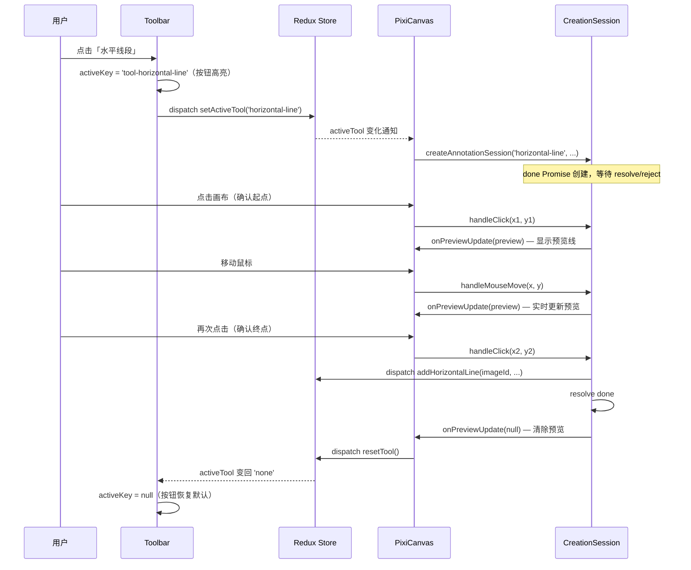

# 业务逻辑层设计

## 整体架构

业务逻辑层采用 React Redux 进行状态管理，实现状态的集中化管理和可预测性。整体架构分为以下几个核心模块：

```
src/store/
├── index.ts                    # Store 配置中心
├── middleware/                 # 中间件
│   └── historyMiddleware.ts    # 历史记录中间件
├── actions/                    # Action 定义
├── reducers/                   # Reducer 定义
├── selectors/                  # 选择器
├── types/                      # 类型定义
├── slices/                     # Redux Toolkit 切片
│   ├── toolSlice.ts            # 工具模块
│   ├── imageSlice.ts           # 图片管理模块
│   ├── annotationSlice.ts      # 标注模块
│   ├── historySlice.ts         # 历史记录模块
│   └── canvasSlice.ts          # 画布模块
└── serializers/                # 序列化器
    ├── markerFileSerializer.ts # 标记文件序列化器
    └── annotationSerializer.ts # 标注序列化器
```

## 核心模块设计

### 工具模块 (Tool Module)

**职责**：管理当前激活的工具类型，支持工具切换和重置。

**核心功能**：

- 保存当前激活的工具类型
- 提供工具切换的 Action
- 支持工具状态的查询
- 管理工具的状态和生命周期

**支持的工具类型**：

- 无工具 (none)
- 水平线段 (horizontal-line)
- 垂直线段 (vertical-line)
- 普通量角器 (normal-protractor)
- 水平量角器 (horizontal-protractor)
- 垂直量角器 (vertical-protractor)

**工具状态管理流程**：

1. 用户选择工具类型
2. 组件 dispatch setActiveTool Action
3. Redux 更新当前激活的工具类型
4. 工具状态变化触发 UI 更新
5. 用户使用工具进行标注操作
6. 操作完成后自动重置工具状态

**主要 Action**：

- `setActiveTool(toolType)`: 设置当前激活的工具
- `resetTool()`: 重置工具为无工具状态
- `getActiveTool()`: 获取当前激活的工具类型
- `isToolActive(toolType)`: 检查指定工具是否激活

### 图片管理模块 (Image Module)

**职责**：管理多张图片的信息，支持图片的添加、切换和删除。

**核心功能**：

- 管理图片列表
- 管理当前激活的图片
- 支持图片的添加、删除和切换
- 保存图片的基本信息（路径、名称等）

**图片数据结构**：

- `id`: 图片唯一标识符
- `name`: 图片文件名
- `path`: 图片文件路径
- `width`: 图片宽度
- `height`: 图片高度
- `createdAt`: 创建时间

**主要 Action**：

- `addImage(image)`: 添加新图片
- `removeImage(imageId)`: 删除图片
- `setActiveImage(imageId)`: 设置当前激活的图片
- `updateImage(imageId, updates)`: 更新图片信息

**主要 Selector**：

- `selectImages(state)`: 获取当前标记文件中所有图片的列表，对应 `image.images`
- `selectActiveImageId(state)`: 获取当前激活的图片 ID，无图片时返回 `null`，对应 `image.activeImageId`
- `selectImageById(state, imageId)`: 根据 ID 获取指定图片信息
- `selectImageCount(state)`: 获取当前图片总数

### 标注模块 (Annotation Module)

**职责**：管理所有图片的标注数据和选中状态，支持多种标注类型的创建、编辑、删除操作。

**核心功能**：

- 按图片 ID 组织标注数据
- 支持多种标注类型的创建
- 管理标注的选中状态
- 支持标注的编辑和删除
- 提供标注数据的查询
- 支持辅助线功能，显示标注间距离

**辅助线功能**：

- 标注距离显示：选中标注后，鼠标悬停在其他同类标注上时，显示两者的距离
- 支持同时显示所有同类标注间的距离

**标注类型**：

1. **水平线段**：标记水平位置，测量垂直比例
2. **垂直线段**：标记垂直位置，测量水平比例
3. **普通量角器**：测量任意角度
4. **水平量角器**：测量相对于水平线的角度
5. **垂直量角器**：测量相对于垂直线的角度

**标注数据结构**：

- 以图片 ID 为键，存储该图片的所有标注
- 每个标注包含：
  - `id`: 唯一标识符
  - `type`: 标注类型
  - 几何信息（坐标、角度等）
  - `createdAt`: 创建时间
  - `updatedAt`: 更新时间

**具体标注类型数据结构**：

- **水平线段**：
  - `startX`: 起点 X 坐标
  - `startY`: 起点 Y 坐标
  - `endX`: 终点 X 坐标
  - `endY`: 终点 Y 坐标（与 startY 相同）

- **垂直线段**：
  - `startX`: 起点 X 坐标
  - `startY`: 起点 Y 坐标
  - `endX`: 终点 X 坐标（与 startX 相同）
  - `endY`: 终点 Y 坐标

- **普通量角器**：
  - `vertexX`: 顶点 X 坐标
  - `vertexY`: 顶点 Y 坐标
  - `startX`: 第一条边终点 X 坐标
  - `startY`: 第一条边终点 Y 坐标
  - `endX`: 第二条边终点 X 坐标
  - `endY`: 第二条边终点 Y 坐标
  - `angle`: 测量角度

- **水平量角器**：
  - `vertexX`: 顶点 X 坐标
  - `vertexY`: 顶点 Y 坐标
  - `startX`: 第一条边终点 X 坐标（水平方向）
  - `startY`: 第一条边终点 Y 坐标（与 vertexY 相同）
  - `endX`: 第二条边终点 X 坐标
  - `endY`: 第二条边终点 Y 坐标
  - `angle`: 测量角度

- **垂直量角器**：
  - `vertexX`: 顶点 X 坐标
  - `vertexY`: 顶点 Y 坐标
  - `startX`: 第一条边终点 X 坐标（与 vertexX 相同）
  - `startY`: 第一条边终点 Y 坐标（垂直方向）
  - `endX`: 第二条边终点 X 坐标
  - `endY`: 第二条边终点 Y 坐标
  - `angle`: 测量角度

**主要 Action**：

- `addHorizontalLine(imageId, ...)`: 为指定图片添加水平线段
- `addVerticalLine(imageId, ...)`: 为指定图片添加垂直线段
- `addNormalProtractor(imageId, ...)`: 为指定图片添加普通量角器
- `addHorizontalProtractor(imageId, ...)`: 为指定图片添加水平量角器
- `addVerticalProtractor(imageId, ...)`: 为指定图片添加垂直量角器
- `selectAnnotation(imageId, id)`: 选中标注
- `deselectAnnotation(imageId, id)`: 取消选中标注
- `deleteSelectedAnnotations(imageId)`: 删除选中标注
- `updateAnnotation(imageId, id, updates)`: 更新标注
- `clearAllAnnotations(imageId)`: 清除指定图片的所有标注

**标注编辑流程**：

- **选择标注**：
  - 点击标注进行选择
  - 显示选中状态（高亮、控制点）
- **移动标注**：
  - 拖拽标注整体移动
- **调整标注**：
  - 拖拽控制点调整标注尺寸或角度
- **删除标注**：
  - 选中标注后按 Delete 键删除
  - 右键菜单删除标注

**标注创建流程**：

- **水平线段标注**：
  - 点击画布确定起点
  - 移动鼠标确定终点
  - 再次点击完成标注
- **垂直线段标注**：
  - 点击画布确定起点
  - 移动鼠标确定终点
  - 再次点击完成标注
- **普通量角器标注**：
  - 点击画布确定顶点1
  - 移动鼠标（可自由移动），实时绘制边1（顶点1为起点，鼠标为终点），然后点击确定顶点2
  - 移动鼠标（可自由移动），实时绘制边2（顶点2为起点，鼠标为终点），最后点击鼠标，确定顶点3，创建结束
- **水平量角器标注**：
  - 点击画布确定顶点1
  - 移动鼠标（只能水平移动），实时绘制边1（顶点1为起点，鼠标为终点），然后点击确定顶点2
  - 移动鼠标（可自由移动），实时绘制边2（顶点2为起点，鼠标为终点），最后点击鼠标，确定顶点3，创建结束
- **垂直量角器标注**：
  - 点击画布确定顶点1
  - 移动鼠标（只能垂直移动），实时绘制边1（顶点1为起点，鼠标为终点），然后点击确定顶点2
  - 移动鼠标（可自由移动），实时绘制边2（顶点2为起点，鼠标为终点），最后点击鼠标，确定顶点3，创建结束

---

## 标注创建 Action 设计

### 设计背景

标注创建是一个多步骤的异步交互过程，具有以下特点：

1. **步骤数不同**：线段类需要 2 次点击，量角器类需要 3 次点击
2. **高频预览更新**：鼠标移动时需要实时更新预览图形，频率远高于 Redux dispatch 的合理频率
3. **外部感知需求**：Toolbar 的 async 按钮需要知道创建过程何时结束（成功或取消），以恢复按钮状态
4. **流程统一性**：不同标注类型的创建流程结构应保持一致，便于维护和扩展

### 架构决策

**创建过程的临时状态不放入 Redux**，原因：
- 鼠标移动事件高频触发，若每次 mousemove 都 dispatch，会导致大量无意义的 re-render
- 预览状态是纯临时数据，不需要历史记录、持久化等能力

**采用 `AnnotationCreationSession` 类管理创建过程**：
- 每次启动一种标注工具，创建一个 Session 实例
- Session 内部维护当前步骤、已确认的点位等临时状态
- Session 通过回调通知 PixiCanvas 更新预览图形（直接操作 PixiJS，不经过 Redux）
- Session 完成或取消时，resolve/reject 对应的 Promise，并 dispatch 最终的 add action 到 Redux

### AnnotationCreationSession 接口设计

```typescript
// 创建过程中的预览数据，由 Session 传给 PixiCanvas 用于实时渲染
type CreationPreview =
  | { type: 'horizontal-line'; startX: number; startY: number; endX: number; endY: number }
  | { type: 'vertical-line'; startX: number; startY: number; endX: number; endY: number }
  | { type: 'protractor'; vertexX: number; vertexY: number; startX: number; startY: number; endX?: number; endY?: number };

// Session 回调接口
interface ICreationSessionCallbacks {
  // 预览图形更新时调用，PixiCanvas 据此实时渲染预览
  onPreviewUpdate: (preview: CreationPreview | null) => void;
  // 创建完成时调用，dispatch add action 到 Redux
  onComplete: (imageId: string, params: AnnotationCreateParams) => void;
}

// 统一的 Session 接口
interface IAnnotationCreationSession {
  // 处理画布点击（确认当前步骤的点位）
  handleClick(x: number, y: number): void;
  // 处理鼠标移动（更新预览，不推进步骤）
  handleMouseMove(x: number, y: number): void;
  // 取消创建（按 Esc 或切换工具时调用）
  cancel(): void;
  // 外部通过此 Promise 感知创建过程结束（完成或取消）
  readonly done: Promise<void>;
}
```

### 各标注类型 Session 实现

所有 Session 继承自统一基类 `BaseCreationSession`，基类负责：
- 维护 `done` Promise 及其 resolve/reject
- 提供 `cancel()` 的默认实现（清除预览，reject Promise）
- 定义 `handleClick` / `handleMouseMove` 的抽象接口

```typescript
abstract class BaseCreationSession implements IAnnotationCreationSession {
  readonly done: Promise<void>;
  protected resolve: () => void;
  protected reject: (reason?: unknown) => void;

  constructor(protected callbacks: ICreationSessionCallbacks) {
    this.done = new Promise<void>((res, rej) => {
      this.resolve = res;
      this.reject = rej;
    });
  }

  cancel(): void {
    this.callbacks.onPreviewUpdate(null); // 清除预览
    this.reject(new CreationCancelledError());
  }

  abstract handleClick(x: number, y: number): void;
  abstract handleMouseMove(x: number, y: number): void;
}
```

#### LineCreationSession（水平线段 / 垂直线段）

两步流程，内部用 `step: 0 | 1` 区分：

```
step 0: 等待第一次点击 → 记录起点，进入 step 1
step 1: 鼠标移动更新预览 → 等待第二次点击 → 调用 onComplete，resolve done
```

- `handleClick`：
  - step 0：记录 `startX/Y`，step → 1
  - step 1：计算终点（水平线固定 Y，垂直线固定 X），调用 `onComplete`，`resolve()`
- `handleMouseMove`：
  - step 1：更新预览终点，调用 `onPreviewUpdate`

#### ProtractorCreationSession（普通 / 水平 / 垂直量角器）

三步流程，内部用 `step: 0 | 1 | 2` 区分：

```
step 0: 等待第一次点击 → 记录顶点，进入 step 1
step 1: 鼠标移动更新边1预览（水平/垂直量角器约束方向）→ 等待第二次点击 → 记录 start 点，进入 step 2
step 2: 鼠标移动更新边2预览（自由移动）→ 等待第三次点击 → 调用 onComplete，resolve done
```

- `handleClick`：
  - step 0：记录 `vertexX/Y`，step → 1
  - step 1：记录 `startX/Y`（水平量角器固定 Y = vertexY，垂直量角器固定 X = vertexX），step → 2
  - step 2：记录 `endX/Y`，计算 angle，调用 `onComplete`，`resolve()`
- `handleMouseMove`：
  - step 1：更新边1预览（含方向约束），调用 `onPreviewUpdate`
  - step 2：更新边2预览，调用 `onPreviewUpdate`

### 工厂函数

```typescript
function createAnnotationSession(
  toolType: ToolType,
  imageId: string,
  dispatch: AppDispatch,
  onPreviewUpdate: (preview: CreationPreview | null) => void
): IAnnotationCreationSession {
  const callbacks: ICreationSessionCallbacks = {
    onPreviewUpdate,
    onComplete: (imageId, params) => dispatch(addAnnotation(imageId, params)),
  };

  switch (toolType) {
    case 'horizontal-line':
      return new LineCreationSession('horizontal', imageId, callbacks);
    case 'vertical-line':
      return new LineCreationSession('vertical', imageId, callbacks);
    case 'normal-protractor':
      return new ProtractorCreationSession('normal', imageId, callbacks);
    case 'horizontal-protractor':
      return new ProtractorCreationSession('horizontal', imageId, callbacks);
    case 'vertical-protractor':
      return new ProtractorCreationSession('vertical', imageId, callbacks);
    default:
      throw new Error(`Unknown tool type: ${toolType}`);
  }
}
```

### 与 PixiCanvas 的集成

PixiCanvas 持有当前活跃的 Session 引用，并将画布事件转发给它：

```typescript
// PixiCanvas 内部（伪代码）
let activeSession: IAnnotationCreationSession | null = null;

// 当 activeTool 变化时（通过 Redux 订阅）
function onActiveToolChange(toolType: ToolType) {
  // 取消旧 session
  activeSession?.cancel();

  if (toolType === 'none') {
    activeSession = null;
    return;
  }

  activeSession = createAnnotationSession(toolType, imageId, dispatch, (preview) => {
    // 直接更新 PixiJS 预览图形，不经过 Redux
    renderPreview(preview);
  });

  // 将 done Promise 传给 Toolbar，用于恢复按钮状态
  activeSession.done
    .catch(() => { /* 取消是正常情况，忽略 */ })
    .finally(() => dispatch(resetTool()));
}

// 画布点击事件
canvas.on('click', (x, y) => activeSession?.handleClick(x, y));
// 画布鼠标移动事件
canvas.on('mousemove', (x, y) => activeSession?.handleMouseMove(x, y));
```

### 与 Toolbar 的集成

Toolbar 的 async 按钮点击后，通过 `setActiveTool` 触发 PixiCanvas 创建 Session，Session 的 `done` Promise 在 PixiCanvas 内部通过 `resetTool()` 间接通知 Toolbar 恢复按钮状态：

```
用户点击 Toolbar 按钮
  → dispatch setActiveTool(toolType)
  → PixiCanvas 监听到 activeTool 变化
  → 创建 Session，session.done.finally(() => dispatch(resetTool()))
  → Toolbar 监听到 activeTool 变回 'none'
  → 按钮恢复默认状态
```

### 完整创建时序图



### 取消流程

以下情况会取消当前创建过程：

- 用户按 `Esc` 键
- 用户切换到其他工具（`setActiveTool` 触发新 Session 创建前，先 cancel 旧 Session）
- 用户切换图片标签页

取消时 Session 调用 `cancel()`，清除预览并 reject `done` Promise，PixiCanvas 在 `.catch()` 中忽略取消错误，`.finally()` 中 dispatch `resetTool()`。

### 历史记录模块 (History Module)

**职责**：实现撤销/重做功能，管理操作历史记录，支持多图片的历史管理。

**核心功能**：

- 按图片 ID 组织历史记录
- 记录标注操作的历史
- 支持撤销上一步操作
- 支持重做已撤销的操作
- 管理历史记录的大小限制（最多保存20次操作）

**设计原理**：

- 为每张图片维护独立的历史栈
- 使用两个栈（past 和 future）实现撤销/重做
- past 栈：保存已执行的操作，支持撤销
- future 栈：保存已撤销的操作，支持重做
- 每个历史条目是某时刻的状态快照

**主要 Action**：

- `undo(imageId)`: 撤销指定图片的上一步操作
- `redo(imageId)`: 重做指定图片的上一步撤销操作
- `canUndo(imageId)`: 检查指定图片是否可以撤销
- `canRedo(imageId)`: 检查指定图片是否可以重做
- `clearHistory(imageId)`: 清除指定图片的历史记录

### 画布模块 (Canvas Module)

**职责**：管理画布的视图状态，包括缩放、旋转等，支持多图片的视图状态管理。

**核心功能**：

- 按图片 ID 组织画布状态
- 管理画布的缩放比例（范围：10% - 800%）
- 管理画布的旋转角度（范围：-180° - 180°）
- 提供缩放控制 Action

**画布状态数据结构**：

- 以图片 ID 为键，存储该图片的画布状态
- 每个画布状态包含：
  - `zoom`: 缩放比例
  - `rotation`: 旋转角度
  - `panX`: 平移 X 坐标
  - `panY`: 平移 Y 坐标
  - `showAuxiliaryLines`: 是否显示辅助线

**主要 Action**：

- `zoomIn(imageId)`: 放大指定图片的画布
- `zoomOut(imageId)`: 缩小指定图片的画布
- `fitWindow(imageId)`: 使指定图片适应窗口
- `actualSize(imageId)`: 显示指定图片的实际大小
- `setRotation(imageId, angle)`: 设置指定图片的旋转角度
- `setPan(imageId, panX, panY)`: 设置指定图片的平移位置
- `toggleAuxiliaryLines(imageId)`: 切换指定图片的辅助线显示状态
- `exportImage(imageId)`: 导出指定图片及其标注为PNG格式

**导出图片功能**：

- 将当前标签页的图片和标注导出为PNG格式
- 导出时将原始图片和所有标注合并到一张PNG图片中
- 导出尺寸取标注和图片两者间的最大值
- 标注超出图片时，背景为透明

### 样式模块 (Style Module)

**职责**：管理标注的样式设置，支持修改线条颜色、线条宽度、标注文字字体、文字大小和文字颜色。

**核心功能**：

- 管理全局样式设置
- 支持样式的修改和重置
- 提供样式查询接口

**样式数据结构**：

- `lineColor`: 线条颜色
- `lineWidth`: 线条宽度
- `fontColor`: 标注文字颜色
- `fontSize`: 标注文字大小
- `fontFamily`: 标注文字字体

**主要 Action**：

- `setLineColor(color)`: 设置线条颜色
- `setLineWidth(width)`: 设置线条宽度
- `setFontColor(color)`: 设置标注文字颜色
- `setFontSize(size)`: 设置标注文字大小
- `setFontFamily(family)`: 设置标注文字字体
- `resetStyle()`: 重置样式为默认值

### 文件模块 (File Module)

**职责**：管理标记文件的操作，包括新建、打开、保存、另存为等功能。

**核心功能**：

- 管理当前打开的标记文件
- 支持标记文件的新建、打开、保存、另存为操作
- 支持图片的添加和删除
- 管理文件路径和状态

**文件状态数据结构**：

- `currentFile`: 当前打开的标记文件路径
- `isFileOpened`: 是否有文件打开
- `isModified`: 文件是否被修改

**主要 Action**：

- `newMarkerFile()`: 新建标记文件
- `openMarkerFile()`: 打开标记文件
- `saveMarkerFile()`: 保存当前标记文件
- `saveMarkerFileAs()`: 另存为新的标记文件
- `addImageToFile()`: 向当前标记文件添加图片
- `removeImageFromFile(imageId)`: 从当前标记文件删除图片
- `exportImageFromFile(imageId)`: 导出当前标记文件中的图片及其标注

### 快捷键模块 (Keyboard Module)

**职责**：管理应用的快捷键支持，提供键盘操作的映射和处理。

**核心功能**：

- 定义和管理应用的快捷键映射
- 处理键盘事件
- 支持快捷键的启用和禁用

**支持的快捷键**：

- 撤销：Ctrl+Z
- 重做：Ctrl+Y
- 放大：Ctrl++
- 缩小：Ctrl+- 
- 适应窗口：Ctrl+0
- 实际大小：Ctrl+1
- 顺时针旋转：Ctrl+R
- 逆时针旋转：Ctrl+Shift+R
- 重置旋转：Ctrl+Shift+0
- 删除标注：Delete

**主要 Action**：

- `registerShortcuts()`: 注册所有快捷键
- `handleKeyboardEvent(event)`: 处理键盘事件
- `enableShortcuts()`: 启用快捷键
- `disableShortcuts()`: 禁用快捷键

### 菜单栏模块 (MenuBar Module)

**职责**：管理菜单栏的状态，包括菜单项的可用性、激活状态和当前展开的菜单。

**核心功能**：

- 管理菜单栏的展开/收起状态
- 计算每个菜单项的可用性
- 管理当前激活的菜单项
- 提供菜单状态查询接口
- 响应相关状态变化自动更新菜单可用性

**菜单栏状态数据结构**：

```typescript
// 菜单项状态
interface IMenuItemState {
  id: string; // 菜单项ID
  disabled: boolean; // 是否禁用
  active: boolean; // 是否激活
}

// 菜单状态
interface IMenuState {
  id: string; // 菜单ID
  items: IMenuItemState[]; // 菜单项状态列表
}

// 菜单栏完整状态
interface IMenuBarState {
  menus: IMenuState[]; // 所有菜单状态
  activeMenuId: string | null; // 当前激活的菜单ID
  open: boolean; // 菜单栏是否展开
}
```

**菜单项可用性计算规则**：

| 菜单项               | 可用条件                                                          | 依赖状态               |
| -------------------- | ----------------------------------------------------------------- | ---------------------- |
| file-new             | 始终可用                                                          | -                      |
| file-open            | 始终可用                                                          | -                      |
| file-save            | `isFileOpened && isFileModified`                                  | 文件模块               |
| file-save-as         | `isFileOpened`                                                    | 文件模块               |
| file-add-image       | `isFileOpened`                                                    | 文件模块               |
| file-remove-image    | `isFileOpened && activeImageId !== null`                          | 文件模块、图片模块     |
| file-export-png      | `isFileOpened && activeImageId !== null`                          | 文件模块、图片模块     |
| edit-undo            | `activeImageId !== null && canUndo(activeImageId)`                | 图片模块、历史记录模块 |
| edit-redo            | `activeImageId !== null && canRedo(activeImageId)`                | 图片模块、历史记录模块 |
| edit-clear-all       | `activeImageId !== null && hasAnnotations(activeImageId)`         | 图片模块、标注模块     |
| edit-delete-selected | `activeImageId !== null && hasSelectedAnnotations(activeImageId)` | 图片模块、标注模块     |
| tool-*               | `isFileOpened && activeImageId !== null`                          | 文件模块、图片模块     |
| image-zoom-in        | `activeImageId !== null && zoom < maxZoom`                        | 图片模块、画布模块     |
| image-zoom-out       | `activeImageId !== null && zoom > minZoom`                        | 图片模块、画布模块     |
| image-fit-window     | `activeImageId !== null`                                          | 图片模块               |
| image-actual-size    | `activeImageId !== null`                                          | 图片模块               |
| image-rotate         | `activeImageId !== null`                                          | 图片模块               |

**主要 Action**：

- `openMenu(menuId)`: 展开指定菜单
- `closeMenu()`: 关闭当前展开的菜单
- `toggleMenu(menuId)`: 切换菜单展开状态
- `setActiveMenuItem(menuId, itemId)`: 设置当前激活的菜单项
- `updateMenuItemsAvailability()`: 更新所有菜单项的可用性
- `setMenuItemDisabled(menuId, itemId, disabled)`: 设置指定菜单项的禁用状态

**主要 Selector**：

- `selectMenuBarState`: 获取完整的菜单栏状态
- `selectMenuState(menuId)`: 获取指定菜单的状态
- `selectMenuItemState(menuId, itemId)`: 获取指定菜单项的状态
- `selectIsMenuItemDisabled(menuId, itemId)`: 获取菜单项是否禁用
- `selectIsMenuItemActive(menuId, itemId)`: 获取菜单项是否激活
- `selectMenuItemsAvailability`: 获取所有菜单项的可用性计算结果

**菜单可用性更新机制**：

1. **初始化时**：应用启动时根据初始状态计算所有菜单项可用性
2. **状态变化时**：监听相关Redux状态变化，自动重新计算受影响菜单项的可用性
3. **监听的状态包括**：
   - 文件打开状态 (`file.isFileOpened`)
   - 文件修改状态 (`file.isModified`)
   - 当前激活图片 (`image.activeImageId`)
   - 图片标注数量 (`annotation.annotationsByImage[imageId]`)
   - 选中标注 (`annotation.selectedAnnotationsByImage[imageId]`)
   - 历史记录状态 (`history.pastByImage[imageId]`, `history.futureByImage[imageId]`)
   - 画布缩放级别 (`canvas.zoomByImage[imageId]`)

## 中间件设计

**历史记录中间件**：

- 自动捕获标注相关的操作
- 为每个标注操作生成历史记录
- 按图片 ID 组织历史记录
- 无需在每个 Action 中手动调用历史记录

**工作流程**：

1. 拦截标注相关的 Action
2. 提取当前图片 ID 和状态
3. 创建历史快照
4. 推入对应图片的历史栈
5. 继续执行原始 Action

## 数据流设计

**图片操作流程**：

1. 用户打开图片
2. 组件 dispatch addImage Action
3. 图片添加到图片列表
4. 自动设置为当前激活图片
5. UI 更新显示新图片

**标注操作流程**：

1. 用户在当前图片上触发标注操作
2. 组件 dispatch 对应 Action（包含图片 ID）
3. 历史记录中间件拦截 Action
4. 提取当前图片的状态并创建历史记录
5. 推入对应图片的历史栈
6. Reducer 更新指定图片的标注数据
7. 组件通过 connect 方法订阅状态变化
8. UI 自动更新

**图片切换流程**：

1. 用户切换图片标签页
2. 组件 dispatch setActiveImage Action
3. Redux 更新当前激活的图片 ID
4. 组件通过 connect 方法订阅状态变化
5. UI 切换显示对应图片及其标注

**撤销/重做流程**：

1. 用户在当前图片上触发撤销/重做
2. 组件 dispatch undo/redo Action（包含图片 ID）
3. 从对应图片的 past/future 栈弹出历史记录
4. 交换 past 和 future 栈
5. 恢复历史记录的状态
6. UI 自动更新

## 设计原则

1. **模块化设计**：
   - 每个模块职责单一
   - 模块之间松耦合
   - 便于测试和维护

2. **不可变性**：
   - 状态不可直接修改
   - 每次操作返回新状态
   - 便于追踪状态变化

3. **单一数据源**：
   - 所有状态存储在 Store 中
   - 组件通过 dispatch Action 修改状态
   - 保证数据的一致性

4. **可预测性**：
   - Reducer 是纯函数
   - 相同的输入产生相同的输出
   - 便于调试和测试

5. **扩展性**：
   - 新增标注类型只需添加新的 Action
   - 新增工具类型只需修改工具模块
   - 便于功能扩展

6. **多图片支持**：
   - 按图片 ID 组织数据
   - 每张图片独立管理标注和历史
   - 支持同时处理多张图片

## 序列化模块 (Serialization Module)

**职责**：负责标记文件和标注数据的序列化与反序列化操作，将业务数据转换为可存储的格式。

**核心功能**：

- 将标记文件对象序列化为 JSON 字符串
- 将 JSON 字符串反序列化为标记文件对象
- 将标注对象序列化为 JSON 格式
- 将 JSON 格式反序列化为标注对象