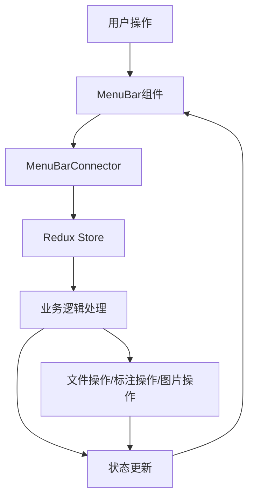

# 6.1 表现层设计

## 6.1.1 组件结构概览

根据需求文档，Trae Image Marker 应用采用上中下三部分垂直布局，表现层组件结构如下：

```
App
├── ThemeProvider (主题提供者)
│   ├── StoreProvider (状态管理提供者)
│   │   ├── MenuBar (顶部菜单栏)
│   │   ├── TabsBar (标签页栏)
│   │   │   └── WorkSpace (工作区)
│   │   │       ├── Toolbar (工具栏)
│   │   │       │   ├── AnnotationTools (标注工具)
│   │   │       │   ├── ImageTools (图片操作工具)
│   │   │       │   └── AuxiliaryTools (辅助线工具)
│   │   │       └── PixiCanvas (画布区域)
│   │   │           ├── ImageContainer (图片容器)
│   │   │           └── Annotations (标注层)
│   │   └── Footer (底部状态栏)
```

## 6.1.2 详细组件设计

### 6.1.2.1 ThemeProvider 组件

**功能**：用于定制 Ant Design 主题，确保整个应用使用一致的类似【VSCode Dark+】主题样式。

**主题配置**：

```typescript
const theme: ThemeConfig = {
  algorithm: theme.darkAlgorithm,
  token: {
    colorPrimary: '#007acc',
    colorBgContainer: '#1e1e1e',
    colorBgElevated: '#252526',
    colorBgTextHover: '#2a2d2e',
    colorBorder: '#454545',
    colorText: '#cccccc',
    colorTextSecondary: '#969696',
    colorTextTertiary: '#ffffff',
    colorWarning: '#cca700',
    colorError: '#f14c4c',
    colorSuccess: '#4ec9b0',
  },
};

export default theme;
```

### 6.1.2.2 StoreProvider 组件

**功能**：提供应用的状态管理，使用 Redux 或其他状态管理库管理全局状态。详细设计见：[6.2](#62-业务逻辑层设计)。

### 6.1.2.3 MenuBar 组件

**功能说明**：
提供应用的顶部菜单，包含文件、编辑、标注和图片4个下拉菜单，支持菜单项的动态可用性控制、快捷键操作和与业务逻辑层的交互。

**整体设计**：

**组件结构层次图**：

```
MenuBar
├── MenuBarContainer          // 菜单栏容器组件
│   ├── FileDropdown          // 文件下拉菜单
│   ├── EditDropdown          // 编辑下拉菜单
│   ├── AnnotationDropdown    // 标注下拉菜单
│   ├── ImageDropdown         // 图片下拉菜单
│   └── MenuBarConnector      // 连接器，连接Redux状态
```

**与业务逻辑层的交互流程图**：



**类型定义**：

```typescript
import { MenuProps } from 'antd';

// 菜单项类型（对应Ant Design Menu的items配置）
interface IMenuItem extends Omit<MenuProps['items'][number], 'key'> {
  key: string; // 菜单项唯一标识
  shortcut?: string; // 快捷键显示文本
}

// 下拉菜单Props基础接口
interface IDropdownProps {
  onMenuItemClick: (key: string) => void; // 菜单项点击事件处理
}

// FileDropdown Props
interface IFileDropdownProps extends IDropdownProps {
  isFileOpened: boolean; // 是否有标记文件打开
  isFileModified: boolean; // 文件是否已修改
  hasActiveImage: boolean; // 是否有选中的图片
}

// EditDropdown Props
interface IEditDropdownProps extends IDropdownProps {
  canUndo: boolean; // 是否可以撤销
  canRedo: boolean; // 是否可以重做
  hasActiveImage: boolean; // 是否有选中的图片
  hasAnnotations: boolean; // 图片是否有标注
  hasSelectedAnnotations: boolean; // 图片是否有选中的标注
}

// AnnotationDropdown Props
interface IAnnotationDropdownProps extends IDropdownProps {
  isFileOpened: boolean; // 是否有标记文件打开
  hasActiveImage: boolean; // 是否有选中的图片
  activeTool: string | null; // 当前激活的工具
}

// ImageDropdown Props
interface IImageDropdownProps extends IDropdownProps {
  hasActiveImage: boolean; // 是否有选中的图片
  canZoomIn: boolean; // 是否可以放大
  canZoomOut: boolean; // 是否可以缩小
}

// MenuBar状态
interface IMenuBarState {
  activeMenuId: string | null; // 当前激活的菜单ID
  isFileOpened: boolean; // 是否有标记文件打开
  isFileModified: boolean; // 文件是否已修改
  hasActiveImage: boolean; // 是否有选中的图片
  activeTool: string | null; // 当前激活的工具
}
```

**Dropdown实现**：

**FileDropdown（文件下拉菜单）**：

**组件属性**：

- `isFileOpened`: boolean - 是否有标记文件打开
- `isFileModified`: boolean - 文件是否已修改
- `hasActiveImage`: boolean - 是否有选中的图片
- `onMenuItemClick`: (key: string) => void - 菜单项点击事件处理

**组件状态**：

- 无内部状态，完全由props驱动

**DOM结构**：

```jsx
<Dropdown overlay={menu} trigger={['click']} placement="bottomLeft">
  <span className="menu-label">文件</span>
</Dropdown>
```

**菜单项配置**：

```typescript
const getFileMenuItems = (props: IFileDropdownProps): MenuProps['items'] => [
  {
    key: 'file-new',
    label: '新建',
    shortcut: 'Ctrl+N',
  },
  {
    key: 'file-open',
    label: '打开',
    shortcut: 'Ctrl+O',
  },
  {
    key: 'file-save',
    label: '保存',
    shortcut: 'Ctrl+S',
    disabled: !props.isFileOpened || !props.isFileModified,
  },
  {
    key: 'file-save-as',
    label: '另存为',
    shortcut: 'Ctrl+Shift+S',
    disabled: !props.isFileOpened,
  },
  {
    type: 'divider',
  },
  {
    key: 'file-add-image',
    label: '添加图片',
    disabled: !props.isFileOpened,
  },
  {
    key: 'file-remove-image',
    label: '删除图片',
    disabled: !props.isFileOpened || !props.hasActiveImage,
  },
  {
    type: 'divider',
  },
  {
    key: 'file-export-png',
    label: '导出PNG',
    disabled: !props.isFileOpened || !props.hasActiveImage,
  },
];
```

**EditDropdown（编辑下拉菜单）**：

**组件属性**：

- `canUndo`: boolean - 是否可以撤销
- `canRedo`: boolean - 是否可以重做
- `hasActiveImage`: boolean - 是否有选中的图片
- `hasAnnotations`: boolean - 图片是否有标注
- `hasSelectedAnnotations`: boolean - 图片是否有选中的标注
- `onMenuItemClick`: (key: string) => void - 菜单项点击事件处理

**组件状态**：

- 无内部状态，完全由props驱动

**DOM结构**：

```jsx
<Dropdown overlay={menu} trigger={['click']} placement="bottomLeft">
  <span className="menu-label">编辑</span>
</Dropdown>
```

**菜单项配置**：

```typescript
const getEditMenuItems = (props: IEditDropdownProps): MenuProps['items'] => [
  {
    key: 'edit-undo',
    label: '撤销',
    shortcut: 'Ctrl+Z',
    disabled: !props.canUndo,
  },
  {
    key: 'edit-redo',
    label: '重做',
    shortcut: 'Ctrl+Y',
    disabled: !props.canRedo,
  },
  {
    type: 'divider',
  },
  {
    key: 'edit-clear-all',
    label: '清除所有标注',
    disabled: !props.hasActiveImage || !props.hasAnnotations,
  },
  {
    key: 'edit-delete-selected',
    label: '删除选中标注',
    shortcut: 'Delete',
    disabled: !props.hasActiveImage || !props.hasSelectedAnnotations,
  },
];
```

**AnnotationDropdown（标注下拉菜单）**：

**组件属性**：

- `isFileOpened`: boolean - 是否有标记文件打开
- `hasActiveImage`: boolean - 是否有选中的图片
- `activeTool`: string | null - 当前激活的工具
- `onMenuItemClick`: (key: string) => void - 菜单项点击事件处理

**组件状态**：

- 无内部状态，完全由props驱动

**DOM结构**：

```jsx
<Dropdown overlay={menu} trigger={['click']} placement="bottomLeft">
  <span className="menu-label">标注</span>
</Dropdown>
```

**菜单项配置**：

```typescript
const getAnnotationMenuItems = (props: IAnnotationDropdownProps): MenuProps['items'] => [
  {
    key: 'tool-horizontal-line',
    label: '水平线段',
    disabled: !props.isFileOpened || !props.hasActiveImage,
  },
  {
    key: 'tool-vertical-line',
    label: '垂直线段',
    disabled: !props.isFileOpened || !props.hasActiveImage,
  },
  {
    type: 'divider',
  },
  {
    key: 'tool-normal-protractor',
    label: '普通量角器',
    disabled: !props.isFileOpened || !props.hasActiveImage,
  },
  {
    key: 'tool-horizontal-protractor',
    label: '水平量角器',
    disabled: !props.isFileOpened || !props.hasActiveImage,
  },
  {
    key: 'tool-vertical-protractor',
    label: '垂直量角器',
    disabled: !props.isFileOpened || !props.hasActiveImage,
  },
];
```

**ImageDropdown（图片下拉菜单）**：

**组件属性**：

- `hasActiveImage`: boolean - 是否有选中的图片
- `canZoomIn`: boolean - 是否可以放大
- `canZoomOut`: boolean - 是否可以缩小
- `onMenuItemClick`: (key: string) => void - 菜单项点击事件处理

**组件状态**：

- 无内部状态，完全由props驱动

**DOM结构**：

```jsx
<Dropdown overlay={menu} trigger={['click']} placement="bottomLeft">
  <span className="menu-label">图片</span>
</Dropdown>
```

**菜单项配置**：

```typescript
const getImageMenuItems = (props: IImageDropdownProps): MenuProps['items'] => [
  {
    key: 'image-zoom-in',
    label: '放大',
    shortcut: 'Ctrl++',
    disabled: !props.hasActiveImage || !props.canZoomIn,
  },
  {
    key: 'image-zoom-out',
    label: '缩小',
    shortcut: 'Ctrl+-',
    disabled: !props.hasActiveImage || !props.canZoomOut,
  },
  {
    type: 'divider',
  },
  {
    key: 'image-fit-window',
    label: '适应窗口',
    shortcut: 'Ctrl+0',
    disabled: !props.hasActiveImage,
  },
  {
    key: 'image-actual-size',
    label: '实际大小',
    shortcut: 'Ctrl+1',
    disabled: !props.hasActiveImage,
  },
  {
    type: 'divider',
  },
  {
    key: 'image-rotate',
    label: '旋转',
    shortcut: 'Ctrl+R',
    disabled: !props.hasActiveImage,
  },
];
```

**MenuBarContainer（菜单栏容器组件）**：

**组件属性**：

- 无特定属性，接收Redux状态和回调函数

**组件状态**：

- `openMenuId`: string | null - 当前展开的菜单ID

**DOM结构**：

```jsx
<div className="menu-bar-container">
  <FileDropdown {...fileProps} />
  <EditDropdown {...editProps} />
  <AnnotationDropdown {...annotationProps} />
  <ImageDropdown {...imageProps} />
</div>
```

**MenuBarConnector（连接器组件）**：

**组件属性**：

- 无特定属性

**组件状态**：

- 无内部状态，连接Redux状态

**DOM结构**：

```jsx
<MenuBarContainer
  fileProps={fileProps}
  editProps={editProps}
  annotationProps={annotationProps}
  imageProps={imageProps}
  onMenuItemClick={handleMenuItemClick}
/>
```

**组件职责**：

1. **MenuBarContainer**：
   - 渲染菜单栏整体布局
   - 管理菜单展开/收起状态
   - 协调各下拉菜单的交互
   - 处理键盘快捷键全局监听

2. **FileDropdown**：
   - 封装Ant Design Dropdown组件
   - 渲染"文件"菜单标签作为Dropdown触发器
   - 根据传入的Props动态生成菜单项
   - 处理文件相关菜单项的点击事件

3. **EditDropdown**：
   - 封装Ant Design Dropdown组件
   - 渲染"编辑"菜单标签作为Dropdown触发器
   - 根据传入的Props动态生成菜单项
   - 处理编辑相关菜单项的点击事件

4. **AnnotationDropdown**：
   - 封装Ant Design Dropdown组件
   - 渲染"标注"菜单标签作为Dropdown触发器
   - 根据传入的Props动态生成菜单项
   - 处理标注相关菜单项的点击事件

5. **ImageDropdown**：
   - 封装Ant Design Dropdown组件
   - 渲染"图片"菜单标签作为Dropdown触发器
   - 根据传入的Props动态生成菜单项
   - 处理图片相关菜单项的点击事件

6. **MenuBarConnector**：
   - 连接Redux Store获取菜单状态
   - 监听相关状态变化更新菜单可用性
   - 分发菜单相关的Action
   - 处理菜单项点击事件的业务逻辑

**事件处理流程**：

1. 用户点击菜单项 → 触发Dropdown的onClick事件
2. Dropdown组件调用传入的onMenuItemClick回调
3. MenuBarConnector接收回调，根据菜单项key分发对应的Action
4. Redux Store处理Action，更新应用状态
5. 状态变化触发重新渲染，更新菜单可用性

**样式设计**：

- 采用Ant Design的默认下拉菜单样式，与应用主题保持一致
- 菜单标签采用统一的字体大小和间距
- 快捷键文本使用灰色小字显示在菜单项右侧
- 禁用菜单项使用灰色文本表示
- 菜单项hover时显示背景高亮

**菜单可用性计算逻辑**：

菜单项的可用性由Redux Selector计算，根据以下状态：

- `isFileOpened`: 是否有标记文件打开
- `isFileModified`: 文件是否已修改
- `activeImageId`: 当前选中的图片ID
- `hasAnnotations(imageId)`: 图片是否有标注
- `hasSelectedAnnotations(imageId)`: 图片是否有选中的标注
- `canUndo(imageId)`: 是否可以撤销
- `canRedo(imageId)`: 是否可以重做
- `zoomLevel`: 当前缩放级别
- `minZoom`/`maxZoom`: 最小/最大缩放限制

**性能优化**：

- 使用React.memo优化组件渲染性能
- 菜单项配置使用函数动态生成，避免不必要的重渲染
- 事件处理函数使用useCallback缓存，减少函数创建
- 状态更新采用批量更新策略，避免频繁渲染

**扩展性考虑**：

- 下拉菜单组件设计为独立模块，便于后续添加新的菜单
- 菜单项配置采用函数生成方式，便于根据业务需求动态调整
- 类型定义清晰，便于后续扩展新的Props和功能
- 与业务逻辑层的交互通过Redux实现，便于功能扩展

### 6.1.2.4 TabsBar 组件

**功能**：显示标记文件内的所有图片标签，支持标签切换和删除。

**结构**：

- 标签列表：每个标签对应一张图片
- 标签操作：切换标签、删除标签
- WorkSpace：当前激活标签页对应的工作区

### 6.1.2.5 WorkSpace 组件

**功能**：作为工作区容器，包含工具栏和画布区域，管理当前标签页的编辑区域。

**结构**：

- Toolbar：工具栏
- PixiCanvas：画布区域

### 6.1.2.6 Toolbar 组件

**功能**：提供常用工具的快速访问，包括标注工具、图片操作工具和辅助线工具。

**结构**：

- AnnotationTools：标注类型创建工具
  - 水平线段
  - 垂直线段
  - 普通量角器
  - 水平量角器
  - 垂直量角器
- ImageTools：图片操作工具
  - 旋转
  - 重置旋转
  - 放大
  - 缩小
  - 适应窗口
  - 实际大小
- AuxiliaryTools：辅助线工具
  - 显示/隐藏辅助线

### 6.1.2.7 PixiCanvas 组件

**功能**：显示图像和标注，提供标注编辑和图片操作功能。

**结构**：

- ImageContainer：图片容器，处理图片的显示、缩放和旋转
- Annotations：标注层，显示和编辑各种类型的标注

### 6.1.2.8 AnnotationTools 组件

**功能**：提供各种标注类型的创建工具。

**结构**：

- 水平线段工具
- 垂直线段工具
- 普通量角器工具
- 水平量角器工具
- 垂直量角器工具

### 6.1.2.9 ImageTools 组件

**功能**：提供图片操作工具，包括旋转、缩放等。

**结构**：

- 旋转工具
- 重置旋转工具
- 放大工具
- 缩小工具
- 适应窗口工具
- 实际大小工具

### 6.1.2.10 AuxiliaryTools 组件

**功能**：提供辅助线工具，用于显示标注间的距离。

**结构**：

- 显示/隐藏辅助线开关

### 6.1.2.11 ImageContainer 组件

**功能**：处理图片的显示、缩放和旋转。

**结构**：

- 图片显示区域
- 缩放控制
- 旋转控制

### 6.1.2.12 Annotations 组件

**功能**：显示和编辑各种类型的标注。

**结构**：

- 水平线段标注
- 垂直线段标注
- 普通量角器标注
- 水平量角器标注
- 垂直量角器标注
- 标注编辑功能（选择、移动、调整、删除）

### 6.1.2.13 Footer 组件

**功能**：显示应用的状态信息，包括标注文件名、当前图片缩放比率、旋转角度和原始尺寸。

**结构**：

- 标注文件名显示
- 图片缩放比率显示
- 图片旋转角度显示
- 图片原始尺寸显示

## 6.1.3 组件交互流程

### 6.1.3.1 标注创建流程

1. 用户从顶部菜单或悬浮工具栏选择标注类型
2. 系统进入标注创建模式
3. 用户在画布上点击确定起点
4. 用户移动鼠标确定终点
5. 用户再次点击完成标注创建
6. 系统将标注添加到标注层

### 6.1.3.2 标注编辑流程

1. 用户点击标注进行选择
2. 系统显示标注的选中状态和控制点
3. 用户拖拽标注整体移动或拖拽控制点调整标注
4. 用户按 Delete 键或通过右键菜单删除标注

### 6.1.3.3 图片操作流程

1. 用户从顶部菜单或悬浮工具栏选择图片操作
2. 系统执行相应的图片操作（缩放、旋转等）
3. 系统更新图片显示和底部状态栏信息

### 6.1.3.4 文件操作流程

1. 用户从顶部菜单选择文件操作
2. 系统弹出相应的对话框（如打开文件对话框）
3. 用户完成操作后，系统执行相应的文件操作
4. 系统更新应用状态和界面显示

## 6.1.4 组件状态管理

### 6.1.4.1 StoreProvider 状态管理

**全局状态**：

- 当前打开的标记文件路径
- 当前激活的标签页
- 所有标签页的图片和标注数据
- 撤销/重做历史
- 应用配置信息

**状态管理方案**：

- 使用 Redux 或 Zustand 管理全局状态
- 定义清晰的 action 和 reducer
- 支持状态持久化到本地存储

### 6.1.4.2 组件局部状态

**画布状态**：

- 当前图片的缩放比率
- 当前图片的旋转角度
- 当前选中的标注
- 当前正在创建的标注
- 辅助线显示状态

**标注状态**：

- 标注的几何信息（坐标、尺寸、角度等）
- 标注的样式（颜色、线宽、字体等）
- 标注的选中状态

## 6.1.5 组件实现要点

### 6.1.5.1 性能优化

- 使用 React.memo 优化组件渲染
- 使用 useCallback 和 useMemo 优化函数和计算值
- 标注渲染使用 Canvas API 提高性能
- 图片缩放和旋转使用 CSS transform 提高性能

### 6.1.5.2 可扩展性

- 组件设计遵循模块化原则，便于添加新功能
- 标注类型设计为可扩展的，便于添加新的标注类型
- 工具类设计为可扩展的，便于添加新的工具

### 6.1.5.3 用户体验

- 提供直观的工具提示
- 支持键盘快捷键
- 提供流畅的动画效果
- 确保操作响应迅速
