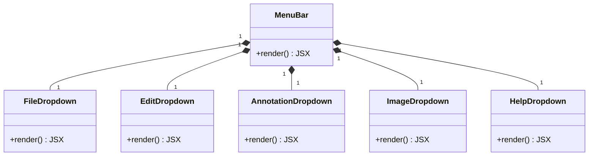
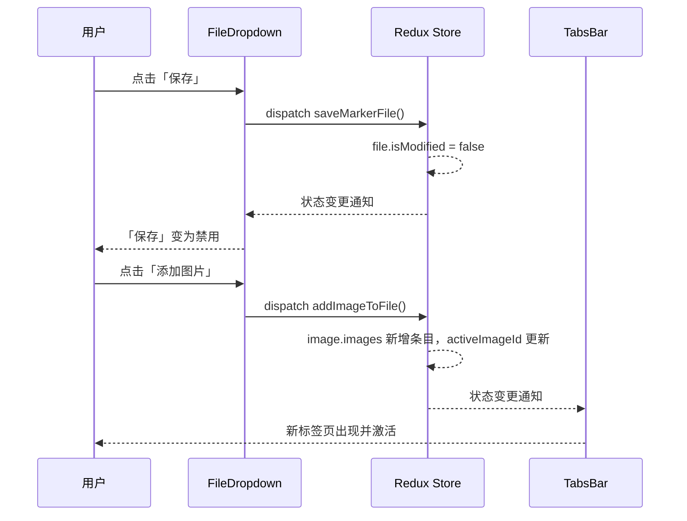
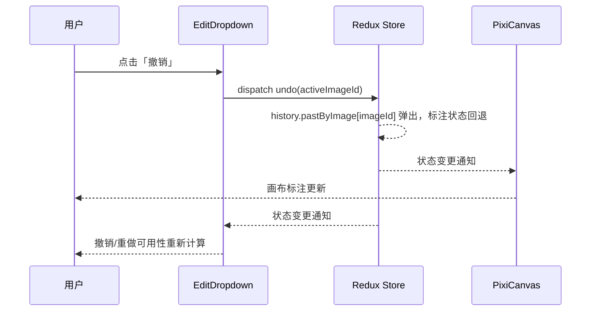
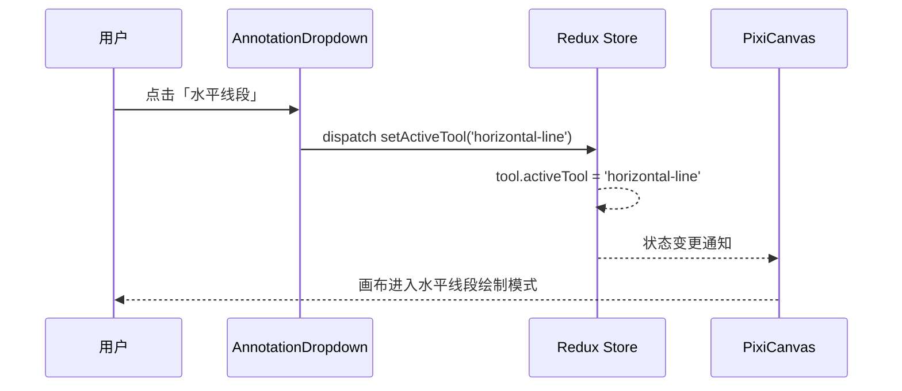
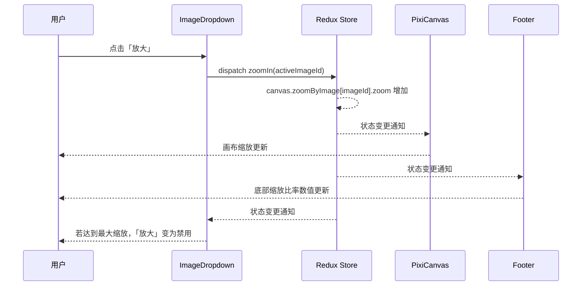
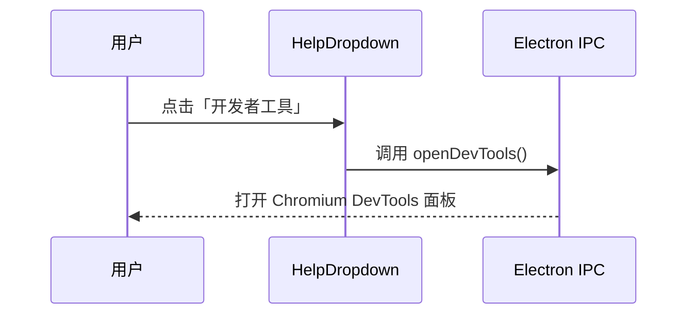
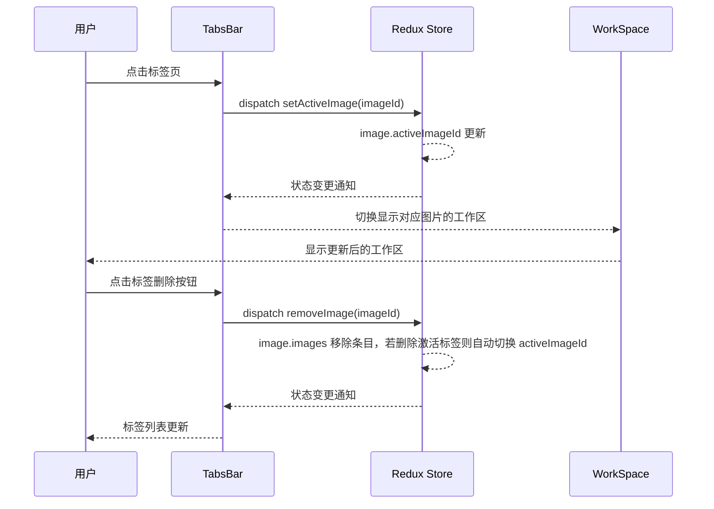
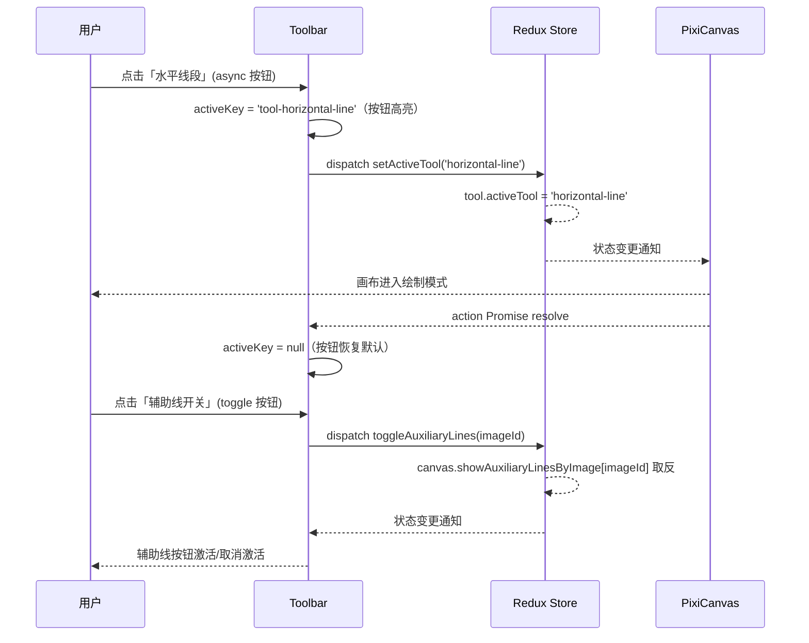
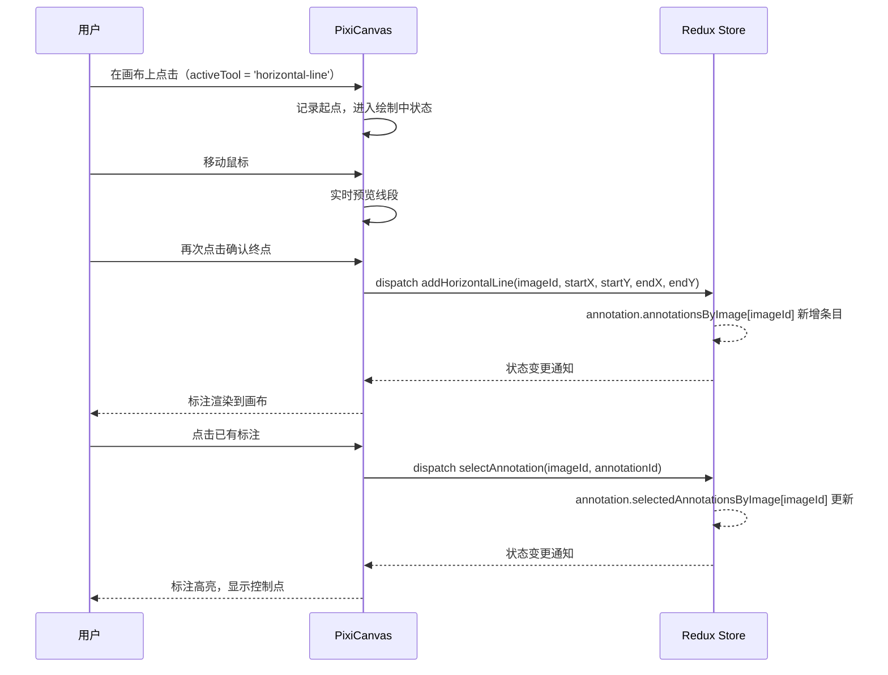

# 表现层设计

## 组件结构概览

根据需求文档，Trae Image Marker 应用采用上中下三部分垂直布局，表现层组件结构如下：

```
App
├── ThemeProvider (主题提供者)
│   ├── StoreProvider (状态管理提供者)
│   │   ├── MenuBar (顶部菜单栏)
│   │   ├── TabsBar (标签页栏)
│   │   │   └── WorkSpace (工作区)
│   │   │       ├── Toolbar (工具栏)
│   │   │       └── PixiCanvas (画布区域)
│   │   │           ├── ImageContainer (图片容器)
│   │   │           └── Annotations (标注层)
│   │   └── Footer (底部状态栏)
```

## 详细组件设计

### ThemeProvider 组件

#### 组件概述

用于定制 Ant Design 主题，确保整个应用使用一致的类似【VSCode Dark+】主题样式。

#### 组件示例

```jsx
<ThemeProvider>
  <App />
</ThemeProvider>
```

#### 组件结构

```
ThemeProvider
└── antd ConfigProvider (theme=vscodeTheme)
    └── children
```

---

### StoreProvider 组件

#### 组件概述

提供应用的 Redux 状态管理上下文，使子组件可以通过 `connect` 访问全局状态。详细设计见：[业务逻辑层设计](./业务逻辑层.md)。

#### 组件示例

```jsx
<StoreProvider>
  <App />
</StoreProvider>
```

#### 组件结构

```
StoreProvider
└── react-redux Provider (store=reduxStore)
    └── children
```

---

### MenuBar 组件

#### 组件概述

提供应用的顶部菜单栏，包含文件、编辑、标注、图片和帮助 5 个下拉菜单入口。MenuBar 本身只负责横向排列各 Dropdown 子组件，不直接处理任何菜单项点击逻辑。

#### 组件示例

```jsx
<MenuBar />
```

#### 组件结构

```
MenuBar
├── FileDropdown
├── EditDropdown
├── AnnotationDropdown
├── ImageDropdown
└── HelpDropdown
```



---

### FileDropdown 组件

#### 组件概述

文件菜单下拉组件，提供新建、打开、保存、另存为、添加图片、删除图片、导出 PNG 等文件操作入口。菜单项的可用性根据文件打开状态和当前激活图片动态计算。

#### 组件示例

```jsx
// 由 MenuBar 内部渲染
<FileDropdown />
```

#### 组件结构

```
FileDropdown
└── antd Dropdown
    └── antd Menu
        ├── MenuItem: 新建        (file-new)
        ├── MenuItem: 打开        (file-open)
        ├── MenuItem: 保存        (file-save)         Ctrl+S
        ├── MenuItem: 另存为      (file-save-as)      Ctrl+Shift+S
        ├── Divider
        ├── MenuItem: 添加图片    (file-add-image)
        ├── MenuItem: 删除图片    (file-remove-image)
        ├── Divider
        └── MenuItem: 导出PNG     (file-export-png)
```

#### 组件 Action

| Action 名 | 调用时机 | 业务逻辑层定义 |
|-----------|----------|----------------|
| `newMarkerFile()` | 点击「新建」 | [文件模块](./业务逻辑层.md#文件模块-file-module) |
| `openMarkerFile()` | 点击「打开」 | [文件模块](./业务逻辑层.md#文件模块-file-module) |
| `saveMarkerFile()` | 点击「保存」 | [文件模块](./业务逻辑层.md#文件模块-file-module) |
| `saveMarkerFileAs()` | 点击「另存为」 | [文件模块](./业务逻辑层.md#文件模块-file-module) |
| `addImageToFile()` | 点击「添加图片」 | [文件模块](./业务逻辑层.md#文件模块-file-module) |
| `removeImageFromFile(imageId)` | 点击「删除图片」 | [文件模块](./业务逻辑层.md#文件模块-file-module) |
| `exportImageFromFile(imageId)` | 点击「导出PNG」 | [文件模块](./业务逻辑层.md#文件模块-file-module) |

#### 组件交互



---

### EditDropdown 组件

#### 组件概述

编辑菜单下拉组件，提供撤销、重做、清除所有标注、删除选中标注等编辑操作入口。菜单项可用性依赖当前激活图片的历史记录状态和标注选中状态。

#### 组件示例

```jsx
<EditDropdown />
```

#### 组件结构

```
EditDropdown
└── antd Dropdown
    └── antd Menu
        ├── MenuItem: 撤销          (edit-undo)             Ctrl+Z
        ├── MenuItem: 重做          (edit-redo)             Ctrl+Y
        ├── Divider
        ├── MenuItem: 清除所有标注  (edit-clear-all)
        └── MenuItem: 删除选中标注  (edit-delete-selected)  Delete
```

#### 组件 Action

| Action 名 | 调用时机 | 业务逻辑层定义 |
|-----------|----------|----------------|
| `undo(imageId)` | 点击「撤销」 | [历史记录模块](./业务逻辑层.md#历史记录模块-history-module) |
| `redo(imageId)` | 点击「重做」 | [历史记录模块](./业务逻辑层.md#历史记录模块-history-module) |
| `clearAllAnnotations(imageId)` | 点击「清除所有标注」 | [标注模块](./业务逻辑层.md#标注模块-annotation-module) |
| `deleteSelectedAnnotations(imageId)` | 点击「删除选中标注」 | [标注模块](./业务逻辑层.md#标注模块-annotation-module) |

#### 组件交互



---

### AnnotationDropdown 组件

#### 组件概述

标注菜单下拉组件，提供各类标注工具的选择入口。菜单项在无文件打开或无激活图片时禁用。

#### 组件示例

```jsx
<AnnotationDropdown />
```

#### 组件结构

```
AnnotationDropdown
└── antd Dropdown
    └── antd Menu
        ├── MenuItem: 水平线段      (tool-horizontal-line)
        ├── MenuItem: 垂直线段      (tool-vertical-line)
        ├── Divider
        ├── MenuItem: 普通量角器    (tool-normal-protractor)
        ├── MenuItem: 水平量角器    (tool-horizontal-protractor)
        └── MenuItem: 垂直量角器    (tool-vertical-protractor)
```

#### 组件 Action

| Action 名 | 调用时机 | 业务逻辑层定义 |
|-----------|----------|----------------|
| `setActiveTool('horizontal-line')` | 点击「水平线段」 | [工具模块](./业务逻辑层.md#工具模块-tool-module) |
| `setActiveTool('vertical-line')` | 点击「垂直线段」 | [工具模块](./业务逻辑层.md#工具模块-tool-module) |
| `setActiveTool('normal-protractor')` | 点击「普通量角器」 | [工具模块](./业务逻辑层.md#工具模块-tool-module) |
| `setActiveTool('horizontal-protractor')` | 点击「水平量角器」 | [工具模块](./业务逻辑层.md#工具模块-tool-module) |
| `setActiveTool('vertical-protractor')` | 点击「垂直量角器」 | [工具模块](./业务逻辑层.md#工具模块-tool-module) |

#### 组件交互



---

### ImageDropdown 组件

#### 组件概述

图片菜单下拉组件，提供放大、缩小、适应窗口、实际大小、顺时针旋转、逆时针旋转、重置旋转等图片视图操作入口。放大/缩小在达到缩放边界时自动禁用。

#### 组件示例

```jsx
<ImageDropdown />
```

#### 组件结构

```
ImageDropdown
└── antd Dropdown
    └── antd Menu
        ├── MenuItem: 放大          (image-zoom-in)           Ctrl++
        ├── MenuItem: 缩小          (image-zoom-out)          Ctrl+-
        ├── Divider
        ├── MenuItem: 适应窗口      (image-fit-window)        Ctrl+0
        ├── MenuItem: 实际大小      (image-actual-size)       Ctrl+1
        ├── Divider
        ├── MenuItem: 顺时针旋转    (image-rotate)            Ctrl+R
        ├── MenuItem: 逆时针旋转    (image-rotate-counter)    Ctrl+Shift+R
        └── MenuItem: 重置旋转      (image-reset-rotation)    Ctrl+Shift+0
```

#### 组件 Action

| Action 名 | 调用时机 | 业务逻辑层定义 |
|-----------|----------|----------------|
| `zoomIn(imageId)` | 点击「放大」 | [画布模块](./业务逻辑层.md#画布模块-canvas-module) |
| `zoomOut(imageId)` | 点击「缩小」 | [画布模块](./业务逻辑层.md#画布模块-canvas-module) |
| `fitWindow(imageId)` | 点击「适应窗口」 | [画布模块](./业务逻辑层.md#画布模块-canvas-module) |
| `actualSize(imageId)` | 点击「实际大小」 | [画布模块](./业务逻辑层.md#画布模块-canvas-module) |
| `setRotation(imageId, angle + 90)` | 点击「顺时针旋转」 | [画布模块](./业务逻辑层.md#画布模块-canvas-module) |
| `setRotation(imageId, angle - 90)` | 点击「逆时针旋转」 | [画布模块](./业务逻辑层.md#画布模块-canvas-module) |
| `setRotation(imageId, 0)` | 点击「重置旋转」 | [画布模块](./业务逻辑层.md#画布模块-canvas-module) |

#### 组件交互



---

### HelpDropdown 组件

#### 组件概述

帮助菜单下拉组件，提供开发者工具入口。菜单项始终可用。

#### 组件示例

```jsx
<HelpDropdown />
```

#### 组件结构

```
HelpDropdown
└── antd Dropdown
    └── antd Menu
        └── MenuItem: 开发者工具 (help-dev-tools)
```

#### 组件交互



---

### TabsBar 组件

#### 组件概述

显示标记文件内的所有图片标签，支持标签切换和删除操作，是连接用户与工作区的桥梁组件。

#### 组件示例

```jsx
<TabsBar />
```

#### 组件 Props

| 属性名 | 类型 | 必填 | 默认值 | 来源 | 说明 |
|--------|------|------|--------|------|------|
| `images` | `ImageInfo[]` | 是 | - | Redux：[`selectImages`](./业务逻辑层.md#图片管理模块-image-module) | 当前标记文件中所有图片的信息列表，每个元素对应一个标签页 |
| `activeImageId` | `string \| null` | 是 | - | Redux：[`selectActiveImageId`](./业务逻辑层.md#图片管理模块-image-module) | 当前激活的图片 ID；无图片时为 `null` |

#### 组件结构

```
TabsBar
└── antd Tabs
    └── WorkSpace (每个 Tab 对应一个)
```

#### 组件 Action

| Action 名 | 调用时机 | 业务逻辑层定义 |
|-----------|----------|----------------|
| `setActiveImage(imageId)` | 用户点击标签页 | [图片管理模块](./业务逻辑层.md#图片管理模块-image-module) |
| `removeImage(imageId)` | 用户点击标签删除按钮 | [图片管理模块](./业务逻辑层.md#图片管理模块-image-module) |

#### 组件交互



---

### WorkSpace 组件

#### 组件概述

工作区容器，包含工具栏和画布区域，管理当前标签页的编辑区域。每个图片标签页对应一个 WorkSpace 实例。

#### 组件示例

```jsx
<WorkSpace imageId={activeImageId} />
```

#### 组件 Props

| 属性名 | 类型 | 必填 | 默认值 | 来源 | 说明 |
|--------|------|------|--------|------|------|
| `imageId` | `string` | 是 | - | 父组件（TabsBar） | 当前工作区对应的图片 ID |

#### 组件结构

```
WorkSpace
├── Toolbar
└── PixiCanvas
```

---

### Toolbar 组件

#### 组件概述

提供常用工具的快速访问，包括标注工具、图片操作工具和辅助线开关。使用 antd FloatButton.Group 实现浮动按钮组。

按钮有两种激活模式：
- async：点击后立即高亮，action 完成（Promise resolve/reject）后恢复默认
- toggle：激活状态与 Redux 状态绑定，状态为 true 时高亮

#### 组件示例

```jsx
<Toolbar imageId={activeImageId} />
```

#### 组件 Props

| 属性名 | 类型 | 必填 | 默认值 | 来源 | 说明 |
|--------|------|------|--------|------|------|
| `imageId` | `string` | 是 | - | 父组件（WorkSpace） | 当前工作区对应的图片 ID，用于 dispatch 需要 imageId 的 action |
| `showAuxiliaryLines` | `boolean` | 是 | - | Redux：`selectShowAuxiliaryLinesByImageId(imageId)` | 当前图片辅助线开关状态，用于 toggle 按钮的激活显示 |

#### 组件 State

| 名称 | 类型 | 默认值 | 说明 |
|------|------|--------|------|
| `activeKey` | `string \| null` | `null` | 当前处于 async 激活状态的按钮 key，action 完成后清除 |

#### 组件结构

```
Toolbar
└── FloatButton.Group
    ├── FloatButton (水平线段)
    ├── FloatButton (垂直线段)
    ├── FloatButton (普通量角器)
    ├── FloatButton (水平量角器)
    ├── FloatButton (垂直量角器)
    ├── FloatButton (放大)
    ├── FloatButton (缩小)
    ├── FloatButton (适应窗口)
    ├── FloatButton (实际大小)
    ├── FloatButton (顺时针旋转)
    ├── FloatButton (重置旋转)
    └── FloatButton (辅助线开关)
```

#### 组件 Action

| Action 名 | 调用时机 | 业务逻辑层定义 |
|-----------|----------|----------------|
| `setActiveTool('horizontal-line')` | 点击「水平线段」 | [工具模块](./业务逻辑层.md#工具模块-tool-module) |
| `setActiveTool('vertical-line')` | 点击「垂直线段」 | [工具模块](./业务逻辑层.md#工具模块-tool-module) |
| `setActiveTool('normal-protractor')` | 点击「普通量角器」 | [工具模块](./业务逻辑层.md#工具模块-tool-module) |
| `setActiveTool('horizontal-protractor')` | 点击「水平量角器」 | [工具模块](./业务逻辑层.md#工具模块-tool-module) |
| `setActiveTool('vertical-protractor')` | 点击「垂直量角器」 | [工具模块](./业务逻辑层.md#工具模块-tool-module) |
| `zoomIn(imageId)` | 点击「放大」 | [画布模块](./业务逻辑层.md#画布模块-canvas-module) |
| `zoomOut(imageId)` | 点击「缩小」 | [画布模块](./业务逻辑层.md#画布模块-canvas-module) |
| `fitWindow(imageId)` | 点击「适应窗口」 | [画布模块](./业务逻辑层.md#画布模块-canvas-module) |
| `actualSize(imageId)` | 点击「实际大小」 | [画布模块](./业务逻辑层.md#画布模块-canvas-module) |
| `setRotation(imageId, angle + 90)` | 点击「顺时针旋转」 | [画布模块](./业务逻辑层.md#画布模块-canvas-module) |
| `setRotation(imageId, 0)` | 点击「重置旋转」 | [画布模块](./业务逻辑层.md#画布模块-canvas-module) |
| `toggleAuxiliaryLines(imageId)` | 点击「辅助线开关」 | [画布模块](./业务逻辑层.md#画布模块-canvas-module) |

#### 组件交互



---

### PixiCanvas 组件

#### 组件概述

基于 PixiJS 的画布组件，负责图片的显示、缩放、旋转，以及标注的渲染和交互编辑。是应用的核心交互区域。

注意：PixiCanvas 直接操作 PixiJS 渲染树，不使用 React DOM 渲染标注元素。

#### 组件示例

```jsx
<PixiCanvas imageId={activeImageId} />
```

#### 组件 Props

| 属性名 | 类型 | 必填 | 默认值 | 来源 | 说明 |
|--------|------|------|--------|------|------|
| `imageId` | `string` | 是 | - | 父组件（WorkSpace） | 当前工作区对应的图片 ID |
| `image` | `ImageInfo` | 是 | - | Redux：[`selectImageById`](./业务逻辑层.md#图片管理模块-image-module) | 当前图片信息，包含路径、尺寸等 |
| `canvasState` | `CanvasState` | 是 | - | Redux：`selectCanvasStateByImageId` | 当前图片的画布状态（zoom、rotation、panX、panY） |
| `annotations` | `Annotation[]` | 是 | - | Redux：`selectAnnotationsByImageId` | 当前图片的所有标注数据 |
| `activeTool` | `ToolType` | 是 | - | Redux：[`selectActiveTool`](./业务逻辑层.md#工具模块-tool-module) | 当前激活的工具类型 |

#### 组件结构

```
PixiCanvas
├── ImageContainer  (PixiJS Sprite，图片显示、缩放、旋转、平移)
└── Annotations     (PixiJS Container，标注渲染与交互)
    ├── HorizontalLineAnnotation (×n)
    ├── VerticalLineAnnotation   (×n)
    └── ProtractorAnnotation     (×n)
```

#### 组件 Action

| Action 名 | 调用时机 | 业务逻辑层定义 |
|-----------|----------|----------------|
| `addHorizontalLine(imageId, ...)` | 完成水平线段绘制 | [标注模块](./业务逻辑层.md#标注模块-annotation-module) |
| `addVerticalLine(imageId, ...)` | 完成垂直线段绘制 | [标注模块](./业务逻辑层.md#标注模块-annotation-module) |
| `addNormalProtractor(imageId, ...)` | 完成普通量角器绘制 | [标注模块](./业务逻辑层.md#标注模块-annotation-module) |
| `addHorizontalProtractor(imageId, ...)` | 完成水平量角器绘制 | [标注模块](./业务逻辑层.md#标注模块-annotation-module) |
| `addVerticalProtractor(imageId, ...)` | 完成垂直量角器绘制 | [标注模块](./业务逻辑层.md#标注模块-annotation-module) |
| `selectAnnotation(imageId, id)` | 点击标注 | [标注模块](./业务逻辑层.md#标注模块-annotation-module) |
| `deselectAnnotation(imageId, id)` | 点击空白区域 | [标注模块](./业务逻辑层.md#标注模块-annotation-module) |
| `updateAnnotation(imageId, id, updates)` | 拖拽移动/调整标注 | [标注模块](./业务逻辑层.md#标注模块-annotation-module) |
| `deleteSelectedAnnotations(imageId)` | 按下 Delete 键 | [标注模块](./业务逻辑层.md#标注模块-annotation-module) |
| `setPan(imageId, panX, panY)` | 拖拽画布平移 | [画布模块](./业务逻辑层.md#画布模块-canvas-module) |

#### 组件交互



---

### Footer 组件

#### 组件概述

底部状态栏，显示当前标记文件名、激活图片的缩放比率、旋转角度和原始尺寸。所有数据只读，无交互操作。

#### 组件示例

```jsx
<Footer />
```

#### 组件 Props

| 属性名 | 类型 | 必填 | 默认值 | 来源 | 说明 |
|--------|------|------|--------|------|------|
| `fileName` | `string \| null` | 是 | - | Redux：`selectCurrentFileName` | 当前打开的标记文件名；未打开时为 `null` |
| `zoom` | `number \| null` | 是 | - | Redux：`selectActiveImageZoom` | 当前激活图片的缩放比率；无激活图片时为 `null` |
| `rotation` | `number \| null` | 是 | - | Redux：`selectActiveImageRotation` | 当前激活图片的旋转角度；无激活图片时为 `null` |
| `imageSize` | `{ width: number; height: number } \| null` | 是 | - | Redux：[`selectImageById`](./业务逻辑层.md#图片管理模块-image-module) | 当前激活图片的原始尺寸；无激活图片时为 `null` |

#### 组件结构

```
Footer
├── span: 文件名
├── span: 缩放比率
├── span: 旋转角度
└── span: 原始尺寸
```
